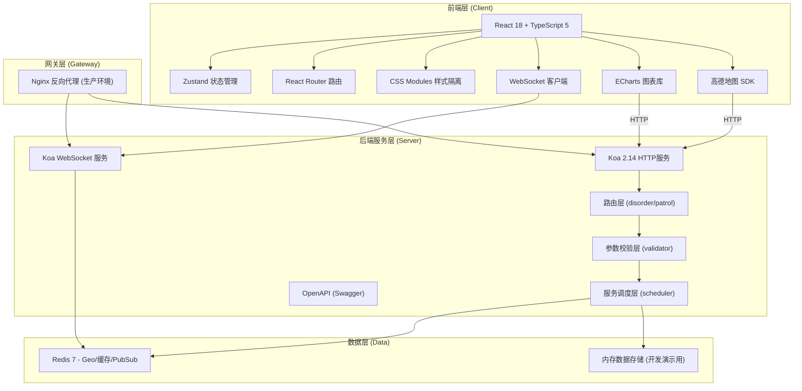
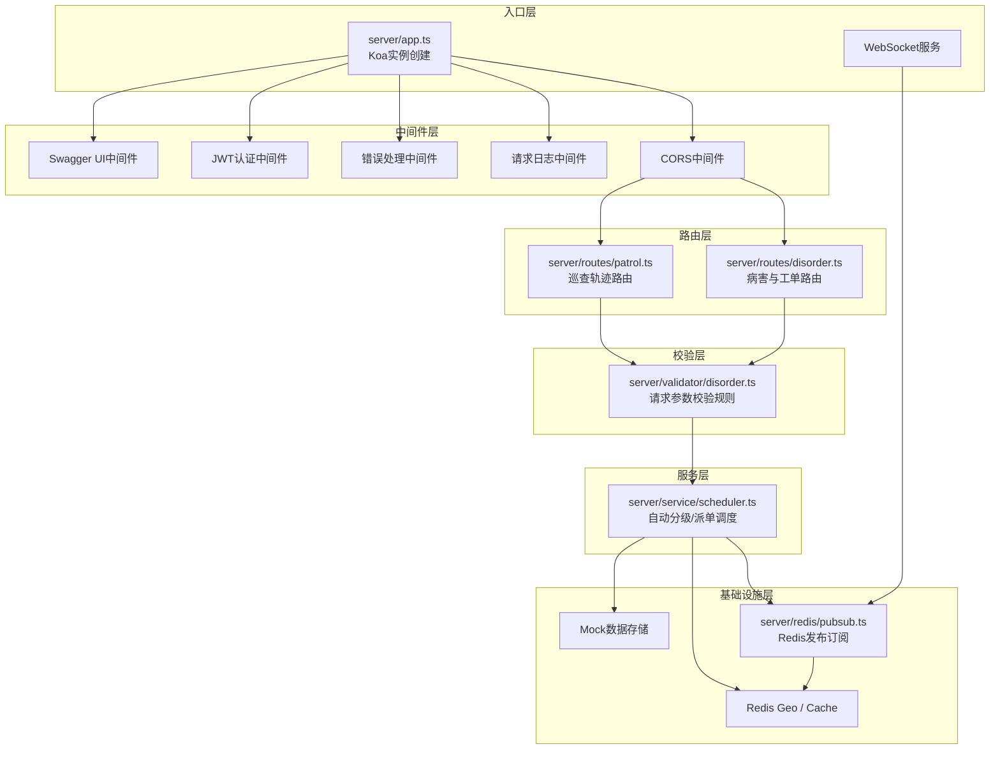
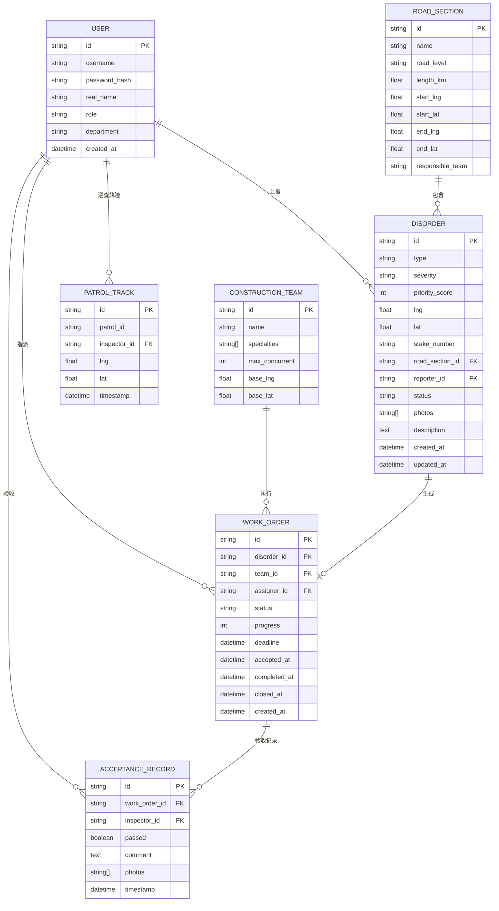

## 1. 架构设计



## 2. 技术描述

### 2.1 前端技术栈
- **框架**: React 18.2 (函数组件 + Hooks)
- **语言**: TypeScript 5.x (strict 模式)
- **构建工具**: Vite 5.x
- **状态管理**: Zustand 4.x (轻量级，支持持久化中间件)
- **路由**: React Router DOM 6.x
- **样式**: CSS Modules (避免样式冲突)
- **地图**: 高德地图 JS API 2.0
- **图表**: ECharts 5.x
- **图标**: lucide-react
- **HTTP客户端**: axios (拦截器统一处理)
- **实时通信**: 原生 WebSocket API (心跳重连机制)

### 2.2 后端技术栈
- **运行时**: Node.js 18.x (LTS)
- **Web框架**: Koa 2.14 (洋葱模型中间件架构)
- **语言**: TypeScript 5.x (ts-node + tsconfig-paths 开发运行)
- **缓存与实时**: Redis 7.x (ioredis客户端)
  - Geo: 存储巡查员轨迹点位
  - Pub/Sub: 工单变更与消息通知
  - Cache: 热点数据缓存（病害列表、统计数据）
- **API文档**: Swagger UI + koa2-swagger-ui
- **参数校验**: joi (声明式校验规则)
- **跨域**: @koa/cors

### 2.3 项目初始化方式
- **前端**: 使用 `npm create vite-init` 基于 react-ts 模板创建，位于 `client/` 目录
- **后端**: 手动搭建 Koa + TypeScript 工程，位于 `server/` 目录
- **根目录**: 使用 npm workspaces 管理 monorepo

## 3. 路由定义

### 3.1 前端路由 (client/src/router/index.tsx)

| 路由路径 | 页面组件 | 说明 |
|----------|----------|------|
| `/` | 重定向至 `/patrol` | 默认首页跳转巡查页 |
| `/patrol` | PatrolPage | 巡查管理页（地图+病害上报） |
| `/workorders` | WorkOrderPage | 工单管理页（看板+拖拽） |
| `/statistics` | StatisticsPage | 统计看板页（图表+指标） |
| `/admin` | AdminPage | 系统管理页（人员+路段） |
| `/login` | LoginPage | 登录页 |
| `*` | NotFoundPage | 404页面 |

### 3.2 后端 API 路由

| 方法 | 路径 | 所属模块 | 说明 |
|------|------|----------|------|
| POST | `/api/disorder/report` | disorder.ts | 病害上报 |
| GET | `/api/disorder/list` | disorder.ts | 病害列表查询 |
| GET | `/api/disorder/:id` | disorder.ts | 病害详情 |
| PUT | `/api/disorder/:id/grade` | disorder.ts | 病害等级审核 |
| POST | `/api/patrol/track` | patrol.ts | 巡查轨迹点上报 |
| GET | `/api/patrol/tracks/:patrolId` | patrol.ts | 获取单次巡查轨迹 |
| GET | `/api/patrol/coverage` | patrol.ts | 巡查覆盖率统计 |
| POST | `/api/workorder/create` | disorder.ts | 创建工单 |
| PUT | `/api/workorder/:id/status` | disorder.ts | 更新工单状态 |
| PUT | `/api/workorder/:id/progress` | disorder.ts | 更新修复进度 |
| POST | `/api/workorder/:id/acceptance` | disorder.ts | 提交验收 |
| GET | `/api/workorder/recommend` | disorder.ts | 智能推荐施工队 |
| GET | `/api/stats/overview` | patrol.ts | 统计概览数据 |
| GET | `/api/stats/trend` | patrol.ts | 病害趋势数据 |
| WS | `/ws/patrol` | WebSocket | 巡查轨迹实时推送 |
| WS | `/ws/notify` | WebSocket | 消息通知实时推送 |

## 4. API 类型定义

### 4.1 病害相关类型

```typescript
// 病害类型
export type DisorderType = 'crack' | 'pothole' | 'bridge_jump' | 'rutting' | 'other';

// 严重程度
export type Severity = 'mild' | 'moderate' | 'severe' | 'critical';

// 病害状态
export type DisorderStatus = 'reported' | 'graded' | 'assigned' | 'repairing' | 'accepting' | 'closed';

// 病害上报请求
export interface ReportDisorderRequest {
  type: DisorderType;
  severity: Severity;
  location: { lng: number; lat: number };
  stakeNumber: string;
  roadSectionId: string;
  photos: string[];
  description: string;
  reporterId: string;
}

// 病害实体
export interface Disorder {
  id: string;
  type: DisorderType;
  severity: Severity;
  priorityScore: number;
  location: { lng: number; lat: number };
  stakeNumber: string;
  roadSectionId: string;
  photos: string[];
  description: string;
  reporterId: string;
  status: DisorderStatus;
  priorityScore: number;
  createdAt: number;
  updatedAt: number;
}
```

### 4.2 工单相关类型

```typescript
// 工单状态
export type WorkOrderStatus = 'pending' | 'assigned' | 'repairing' | 'accepting' | 'closed' | 'rejected';

// 工单实体
export interface WorkOrder {
  id: string;
  disorderId: string;
  teamId: string;
  assignerId: string;
  status: WorkOrderStatus;
  progress: number; // 0-100
  deadline: number;
  acceptedAt?: number;
  completedAt?: number;
  closedAt?: number;
  repairPhotos?: string[];
  acceptanceResult?: {
    passed: boolean;
    comment: string;
    photos: string[];
    inspectorId: string;
    timestamp: number;
  };
  createdAt: number;
  updatedAt: number;
}

// 施工队推荐
export interface TeamRecommendation {
  teamId: string;
  teamName: string;
  distance: number; // 米
  loadScore: number; // 0-100，越高越空闲
  specialtyScore: number; // 0-100
  totalScore: number; // 综合评分
  currentLoad: number; // 当前进行中工单数
}
```

### 4.3 巡查相关类型

```typescript
// 轨迹点
export interface TrackPoint {
  patrolId: string;
  inspectorId: string;
  lng: number;
  lat: number;
  timestamp: number;
  speed?: number;
}

// 覆盖率统计
export interface CoverageStats {
  roadSectionId: string;
  roadSectionName: string;
  totalLength: number; // 公里
  coveredLength: number; // 公里
  coverageRate: number; // 百分比
  lastPatrolTime?: number;
}
```

## 5. 服务端架构图



## 6. 数据模型

### 6.1 实体关系图



### 6.2 Redis 数据结构设计

```
# 巡查员实时位置 Geo (key: patrol:geo:inspector:{date})
GEOADD patrol:geo:inspector:20260615 <lng> <lat> <inspectorId>:<timestamp>

# 单次巡查轨迹列表 (key: patrol:track:{patrolId}, type: LIST)
# 存储序列化后的 TrackPoint JSON
LPUSH patrol:track:patrol_123 '{...}'

# 病害缓存 (key: disorder:{id}, type: HASH)
HSET disorder:dis_001 type "pothole" severity "severe" status "reported" ...

# 施工队当前工单计数 (key: team:load:{teamId}, type: STRING)
INCR team:load:team_001

# Pub/Sub 频道列表
- patrol:track         # 巡查轨迹实时广播
- notify:workorder     # 工单状态变更通知
- notify:alert         # 超时预警通知
- notify:disorder      # 新增病害通知

# 统计缓存 (key: stats:overview:{date}, type: STRING -> JSON)
SET stats:overview:20260615 '{ "totalDisorders": 156, ... }' EX 3600
```

## 7. 目录结构

```
项目根目录/
├── package.json              # monorepo 根配置
├── tsconfig.base.json        # 基础 TypeScript 配置
├── client/                   # 前端工程
│   ├── package.json
│   ├── tsconfig.json
│   ├── vite.config.ts
│   ├── index.html
│   └── src/
│       ├── main.tsx
│       ├── App.tsx
│       ├── router/
│       │   └── index.tsx
│       ├── stores/
│       │   ├── disorderStore.ts
│       │   ├── patrolStore.ts
│       │   └── workorderStore.ts
│       ├── pages/
│       │   ├── Patrol/
│       │   ├── WorkOrder/
│       │   ├── Statistics/
│       │   └── Admin/
│       ├── components/
│       │   ├── Layout/
│       │   ├── Disorder/
│       │   ├── WorkOrder/
│       │   └── common/
│       ├── services/
│       │   ├── api.ts
│       │   └── websocket.ts
│       ├── types/
│       │   └── index.ts
│       └── utils/
└── server/                   # 后端工程
    ├── package.json
    ├── tsconfig.json
    └── src/
        ├── app.ts
        ├── swagger.ts
        ├── routes/
        │   ├── disorder.ts
        │   └── patrol.ts
        ├── validator/
        │   └── disorder.ts
        ├── service/
        │   └── scheduler.ts
        ├── redis/
        │   ├── pubsub.ts
        │   └── client.ts
        ├── middleware/
        ├── mock/
        │   └── data.ts
        └── types/
            └── index.ts
```

## 8. 性能指标保障方案

| 指标 | 目标 | 实现方案 |
|------|------|----------|
| 病害上报接口响应 | ≤200ms | 异步写入Redis+内存，非阻塞返回；Joi校验使用预编译schema |
| WebSocket推送延迟 | ≤500ms | Redis Pub/Sub直接转发；消息批量合并推送；心跳30s |
| 单日轨迹点写入 | ≥50万条 | Redis Geo流水线批量写入；轨迹点只保留7天；Pipeline+Lua减少RTT |
| 并发巡查员 | ≥200人 | WebSocket连接池管理；消息广播使用Room分组；Redis连接复用 |
| Redis缓存命中率 | ≥90% | 统计数据缓存3600s；病害详情缓存60s；施工队负载缓存30s |
| 统计报表查询 | ≤1.5秒 | 预聚合写入Redis；前端懒加载图表；增量计算+定时任务预刷新 |
