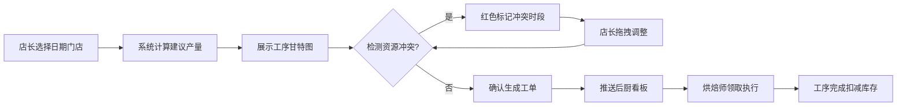
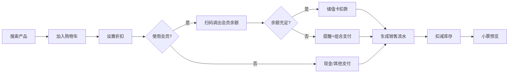

## 1. 产品概述

本产品为区域连锁烘焙工坊的纯前端排产调度与门店营运管理系统，服务5家门店日常生产、销售、调拨、会员及报表全流程管理。基于localStorage实现数据持久化，支持JSON格式数据备份导入导出。

- 解决核心痛点：手写排产产能浪费、前厅缺货与后厨积压并存、跨店调拨记录丢失、会员余额人工对账
- 目标用户：门店店长、烘焙师、前厅导购、运营管理人员

## 2. 核心功能

### 2.1 用户角色

| 角色 | 说明 | 核心权限 |
|------|------|----------|
| 店长 | 门店管理者 | 排产管理、数据报表、调拨审批、会员管理 |
| 烘焙师 | 后厨生产人员 | 领取工单、执行工序、更新生产状态 |
| 导购 | 前厅销售人员 | POS销售、会员充值、库存查询 |
| 运营 | 总部管理人员 | 多店数据汇总、跨店调拨、全店报表 |

### 2.2 功能模块

1. **智能排产页**：日期门店选择、建议产量计算、工序甘特图、资源冲突检测、工单生成
2. **后厨工单看板**：三列拖拽看板（待执行/进行中/已完成）、工单领取计时、库存扣减、超时预警
3. **前厅POS销售**：产品搜索、购物车管理、会员扣款、储值充值、小票预览、库存扣减
4. **多店调拨管理**：跨店调拨单创建、库存冻结、待收确认、状态追溯
5. **会员管理**：会员注册发卡、储值阶梯赠送、消费充值流水、余额提醒
6. **报表分析**：日销售汇总、品类占比、报废率趋势、门店对比、图表导出PNG
7. **数据备份**：JSON导出导入、版本校验、字段迁移

### 2.3 页面详情

| 页面名称 | 模块名称 | 功能描述 |
|----------|----------|----------|
| 智能排产 | 日期门店选择器 | 选择排产日期和目标门店，切换查看 |
| 智能排产 | 建议产量计算 | 基于近14天同星期销量均值+天气标签+节假日因素自动计算 |
| 智能排产 | 工序甘特图 | 横向滚动甘特图，左侧产品列表固定，右侧时间轴可缩放，工单色块按品类区分 |
| 智能排产 | 资源冲突检测 | 红色标记发酵炉和烤箱时段冲突，支持拖拽调整起止时间 |
| 智能排产 | 工单批量生成 | 确认排产后批量生成生产工单推送后厨看板 |
| 工单看板 | 三列拖拽布局 | 待执行、进行中、已完成三列卡片拖拽移动 |
| 工单看板 | 工单领取计时 | 烘焙师点击领取并启动计时器，工序完成自动扣减原料库存 |
| 工单看板 | 超时预警 | 超计划时间未完成工单橙色高亮预警 |
| POS销售 | 产品搜索 | 条码与拼音首字母模糊搜索，200ms内响应 |
| POS销售 | 购物车管理 | 数量修改、整单折扣与单品折扣叠加计算 |
| POS销售 | 会员结算 | 会员卡扫码调出余额，一键扣款，余额不足即时提醒 |
| POS销售 | 储值充值 | 支持充300送30、充500送60阶梯赠送 |
| POS销售 | 小票预览 | 结算后显示小票预览，实时扣减库存生成销售流水 |
| 调拨管理 | 调拨单创建 | 选择调出店和调入店，勾选商品与数量 |
| 调拨管理 | 库存冻结 | 提交后调出店库存冻结标记 |
| 调拨管理 | 待收确认 | 调入店确认收货，双方确认后库存同步变更 |
| 调拨管理 | 状态追溯 | 调拨全程状态可追溯查询 |
| 会员管理 | 会员注册 | 手机号11位校验注册发卡 |
| 会员管理 | 储值余额 | 五店共享余额，充值阶梯赠送 |
| 会员管理 | 流水时间线 | 消费与充值流水按时间线展示 |
| 报表分析 | 筛选条 | 自定义日期范围、门店筛选 |
| 报表分析 | 图表区域 | 日销售汇总、品类占比饼图、报废率趋势折线图、门店对比柱状图 |
| 报表分析 | 图表导出 | 支持Chart.js图表导出PNG |
| 数据备份 | JSON导出 | 一键导出全量JSON备份文件 |
| 数据备份 | JSON导入 | 导入时校验数据版本与完整性，自动迁移字段 |

## 3. 核心流程

### 3.1 排产生产流程

店长选择日期和门店 → 系统基于历史销量+天气+节假日计算建议产量 → 展示工序甘特图 → 检测发酵炉/烤箱资源冲突 → 店长拖拽调整 → 确认生成工单 → 工单推送后厨看板 → 烘焙师领取执行 → 工序完成扣减库存 → 成品入库上架

### 3.2 POS销售流程

导购扫码/搜索产品 → 加入购物车 → 设置折扣 → 选择会员（可选）→ 选择支付方式 → 储值卡扣款/现金找零 → 生成销售流水 → 扣减库存 → 小票预览打印

### 3.3 跨店调拨流程

创建调拨单（选店+选品）→ 提交后调出店库存冻结 → 调入店接收确认 → 双方确认后同步库存 → 完成

## 4. 用户界面设计

### 4.1 设计风格

- **主色调**：暖棕色系（#8B4513 主色），搭配面包金黄（#DAA520 强调色），奶油白底（#FFF8E7），传递烘焙工坊温暖质感
- **按钮风格**：圆角6px，微阴影，hover上浮2px，过渡动画200ms
- **字体**：标题使用思源宋体（Serif）体现烘焙传统感，正文使用思源黑体（Sans-Serif）保证可读性
- **布局风格**：卡片式布局 + 顶部固定导航 + 左侧竖向菜单（大屏）/底部Tab栏（移动端）
- **图标风格**：Bootstrap Icons线性图标，搭配烘焙相关emoji点缀

### 4.2 页面设计概览

| 页面名称 | 模块名称 | UI元素 |
|----------|----------|--------|
| 全局布局 | 顶部导航 | 门店切换下拉、当前班次标识、操作员名称、备份导出按钮 |
| 全局布局 | 侧边菜单 | 图标+文字，选中态暖棕色高亮，hover微动效 |
| 智能排产 | 甘特图 | 横向滚动，左侧产品列表固定，右侧时间轴支持缩放（24h/12h/6h视图），工单色块按5品类配色，冲突红色边框闪烁 |
| 智能排产 | 产品列表 | 折叠展开，展示建议产量、可编辑数量输入框 |
| 工单看板 | 卡片列 | 三列等宽，拖拽时半透明跟随，目标列虚线高亮 |
| 工单看板 | 工单卡片 | 产品名+工序名，实时计时器，计划进度条，超时橙色渐变边框 |
| POS销售 | 产品网格 | 3列产品卡片（图片+品名+价格），点击加入购物车动画 |
| POS销售 | 结算面板 | 右侧1/3宽度，支持折叠展开（滑入动画300ms），显示购物车明细、折扣、应收、找零 |
| 报表分析 | 筛选条 | 日期范围选择器、门店多选下拉 |
| 报表分析 | 图表网格 | 2×2布局Chart.js图表，移动端垂直堆叠，每图右上角导出按钮 |
| 会员管理 | 流水时间线 | 左侧时间线圆点，右侧交易卡片，充值绿色、消费灰色 |

### 4.3 响应式设计

- **Desktop优先**（≥1200px）：左侧竖向菜单+右侧主区域，双栏/三栏布局
- **平板适配**（768px-1199px）：菜单折叠为汉堡按钮，工单看板两列布局
- **移动端**（<768px）：底部Tab栏导航，工单看板单列堆叠，POS产品网格2列，图表垂直堆叠
- **触控优化**：点击区域≥44px，列表项行高56px，滑动手势支持甘特图时间轴缩放

### 4.4 交互微反馈

- 表单校验失败：红色边框+抖动动画+下方提示文字
- 路由切换：未保存表单弹窗确认
- 工单超时：卡片边缘橙色脉冲动画
- 资源冲突：红色边框+每秒闪烁一次
- 购物车添加：飞入动画到结算面板
- 数据加载：骨架屏占位
