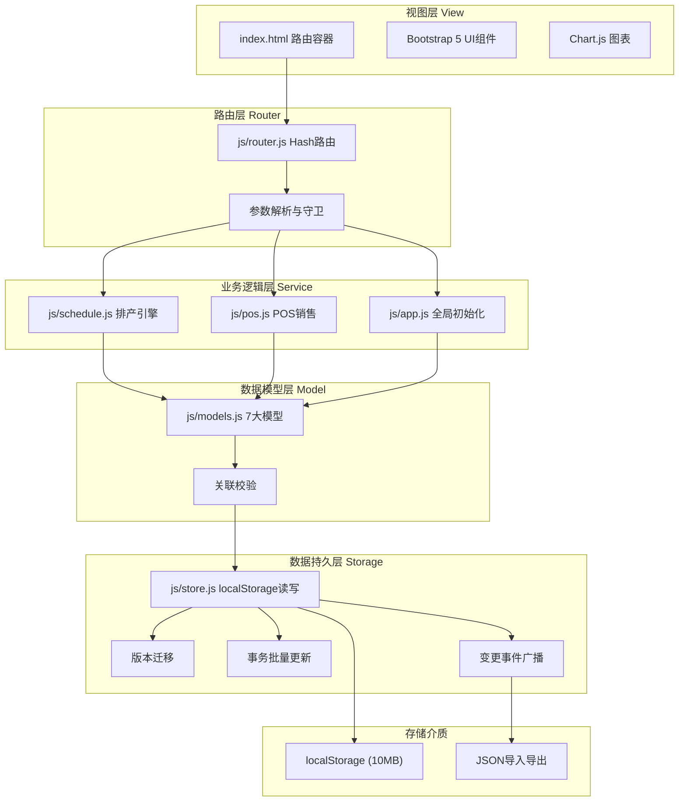
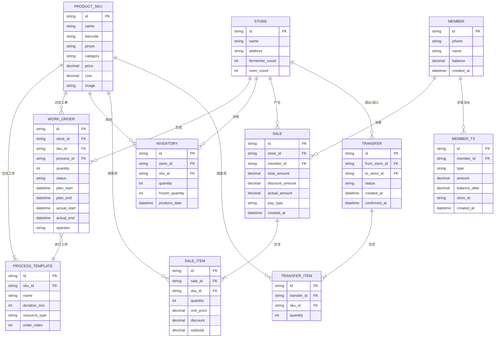

## 1. 架构设计

本系统为纯前端SPA单页应用，采用分层架构设计，所有数据通过localStorage持久化存储，无后端依赖。



## 2. 技术说明

- **前端框架**：jQuery 3.7.1（DOM操作与事件处理）+ Bootstrap 5.3（UI组件与响应式布局）
- **路由方案**：自定义Hash路由（jQuery Router模式），URL格式如 `#/schedule?date=2024-01-15&store=1`
- **图表库**：Chart.js 4.4（饼图、折线图、柱状图）
- **数据存储**：localStorage，预估容量占用 < 5MB（4万条销售记录/月）
- **图标方案**：Bootstrap Icons CDN
- **字体方案**：Google Fonts - Noto Serif SC（标题）+ Noto Sans SC（正文）
- **构建工具**：无，原生HTML/CSS/JS直出，无需编译

### CDN资源清单
```
- https://cdn.jsdelivr.net/npm/jquery@3.7.1/dist/jquery.min.js
- https://cdn.jsdelivr.net/npm/bootstrap@5.3.0/dist/js/bootstrap.bundle.min.js
- https://cdn.jsdelivr.net/npm/bootstrap@5.3.0/dist/css/bootstrap.min.css
- https://cdn.jsdelivr.net/npm/bootstrap-icons@1.11.0/font/bootstrap-icons.css
- https://cdn.jsdelivr.net/npm/chart.js@4.4.0/dist/chart.umd.min.js
```

## 3. 路由定义

| 路由Hash | 页面 | 核心参数 | 说明 |
|----------|------|----------|------|
| `#/dashboard` | 仪表盘首页 | - | 今日概览、快速入口 |
| `#/schedule` | 智能排产 | date, store | 日期与门店参数 |
| `#/workorder` | 后厨工单看板 | store | 门店参数 |
| `#/pos` | POS销售 | store | 门店参数 |
| `#/transfer` | 调拨管理 | - | 列表+创建 |
| `#/member` | 会员管理 | - | 列表+详情 |
| `#/report` | 报表分析 | startDate, endDate, stores | 日期范围与门店筛选 |
| `#/backup` | 数据备份 | - | 导入导出 |

路由守卫规则：
- 所有页面检查localStorage初始化状态，未初始化跳转 `#/backup` 引导导入或初始化默认数据
- 路由切换时检查全局 `dirtyForm` 标记，有未保存变更弹窗 `confirm` 确认

## 4. 文件结构

```
/
├── index.html              # 单页入口：CDN引入 + 导航布局骨架 + 路由容器div#app
├── css/
│   └── style.css           # 全局样式：主题变量、甘特图样式、工单卡片、POS布局、响应式
└── js/
    ├── store.js            # localStorage统一读写层
    ├── models.js           # 7大数据模型定义与校验
    ├── router.js           # Hash路由注册、切换、守卫、参数解析
    ├── schedule.js         # 排产引擎：建议产量、甘特排期、冲突检测、工单生成
    ├── pos.js              # POS销售：产品搜索、购物车、会员结算、小票
    └── app.js              # 全局初始化、事件绑定、公共工具函数
```

加载顺序（index.html底部）：
1. jQuery → 2. Bootstrap → 3. Chart.js → 4. store.js → 5. models.js → 6. router.js → 7. schedule.js → 8. pos.js → 9. app.js

## 5. 数据模型（ER图）



## 6. localStorage键规划

| 键名 | 说明 | 数据量估算 |
|------|------|-----------|
| `bakery_data_version` | 数据版本号，用于迁移 | 10B |
| `bakery_stores` | 5家门店信息 | < 1KB |
| `bakery_products` | 120个SKU + 工序模板 | ~50KB |
| `bakery_workorders` | 生产工单，按日期+门店索引 | ~100条/天 × 30天 = 3000条 ≈ 1MB |
| `bakery_inventory` | 各店各SKU库存批次 | 5店×120SKU = 600条 ≈ 100KB |
| `bakery_members` | 会员信息 | ~1000条 ≈ 200KB |
| `bakery_membertx` | 会员交易流水 | ~5000条 ≈ 500KB |
| `bakery_sales` | 销售流水，按月分桶 | ~4万条/月 ≈ 4MB |
| `bakery_sale_items` | 销售明细 | ~12万条/月 ≈ 6MB |
| `bakery_transfers` | 调拨单+明细 | ~200条/月 ≈ 50KB |
| `bakery_settings` | 当前门店、操作员、班次 | < 1KB |

数据版本迁移策略：`store.js` 启动时读取 `bakery_data_version`，与当前版本对比，缺失或旧版本按迁移函数链逐版本升级。

## 7. 性能优化方案

### 7.1 localStorage读写优化
- **批量写入**：`store.batchUpdate()` 使用对象合并后单次 `setItem`，避免频繁IO
- **索引表**：工单、销售流水建立 `date_store` 复合索引Map，查询O(1)
- **按月分桶**：销售数据按 `bakery_sales_YYYYMM` 分key存储，避免单值过大

### 7.2 甘特图渲染优化
- **虚拟滚动**：仅渲染可视区域工单块，超出范围detach
- **节流拖拽**：拖拽事件使用 `requestAnimationFrame` 节流
- **1秒内渲染200块**：离屏DocumentFragment批量构建后一次性挂载

### 7.3 POS搜索优化
- **倒排索引**：启动时构建 `条码→SKU`、`拼音首字母→SKU[]`、`拼音全拼→SKU[]` 三张Map
- **200ms响应**：防抖150ms + 索引O(1)查找，结果集Limit 50条

### 7.4 图表渲染优化
- **数据聚合**：前端按日/周/月预聚合，1万数据点降维至100点内
- **2秒内完成**：Chart.js `animation: false` 大数据时关闭动画

### 7.5 路由切换优化
- **页面预缓存**：各页面HTML模板使用 `<template>` 标签预存于index.html
- **300ms内渲染**：页面切换仅执行DOM替换 + 最小化事件重绑
