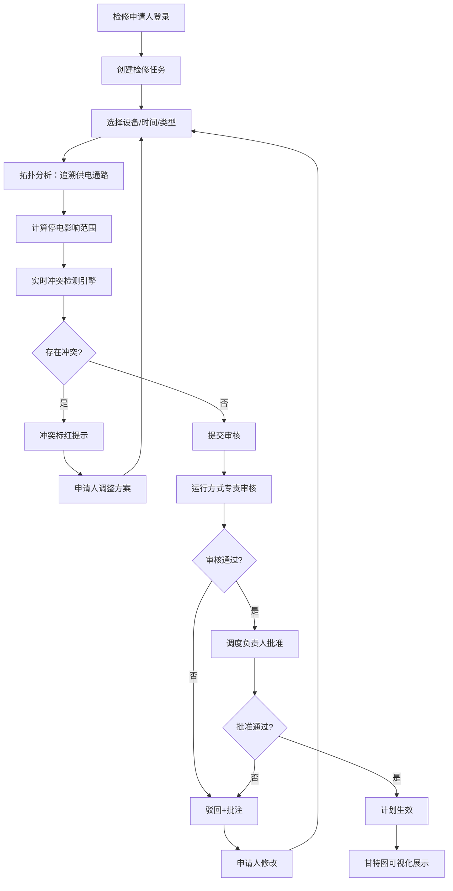

## 1. 产品概述

省级电网调度控制中心检修计划管理系统，面向运行方式处业务场景，解决输变电设备检修计划编排、协调、审批全流程管理问题，替代Excel+微信群的传统低效协作模式。

- 面向用户：调度员、运行方式专责、检修工区、运维部门、管理层
- 核心价值：智能停电范围分析、实时冲突检测、可视化计划编排、规范化协同审批、数据化统计决策
- 管理规模：500kV变电站28座、220kV变电站85座、110kV变电站320座、输电线路12000公里

## 2. 核心功能

### 2.1 用户角色

| 角色 | 注册方式 | 核心权限 |
|------|----------|----------|
| 调度员 | 系统分配 | 计划编排、冲突检测、拓扑分析、负荷转移建议 |
| 运行方式专责 | 系统分配 | 审核计划、批准计划、保供电时段设置 |
| 检修申请人 | 系统分配 | 提交检修申请、查看审批进度、修改被驳回计划 |
| 运维部门 | 系统分配 | 查看本部门检修任务、执行登记 |
| 管理层 | 系统分配 | 统计报表查看、历史数据检索、全局监控 |

### 2.2 功能模块

1. **计划编排页**：筛选条件栏、时间轴甘特图、任务列表表格、检修任务表单
2. **拓扑查看页**：设备树形目录、Canvas电网拓扑图、供电通路高亮、停电影响区域分级标注
3. **冲突分析页**：冲突列表、冲突详情面板、冲突任务对展示、拓扑影响可视化
4. **统计分析页**：KPI指标卡、分类统计图表、同比环比对比、Excel月度计划导出
5. **辅助功能**：三级审批流转、历史记录检索、操作日志、负荷转移方案

### 2.3 页面详情

| 页面名称 | 模块名称 | 功能描述 |
|----------|----------|----------|
| 计划编排页 | 筛选条件栏 | 时间范围、电压等级(500/220/110kV)、设备类型、检修类型、审批状态多维度筛选 |
| 计划编排页 | 甘特图区域 | 水平滚动、时间刻度缩放(日/周/月)、4类检修颜色区分、悬停气泡详情、拖拽调整时间、冲突标红 |
| 计划编排页 | 任务列表表格 | 分页表格、行内编辑入口、审批状态标签、停电时长统计、操作列(编辑/删除/提交) |
| 计划编排页 | 检修任务表单 | Modal弹窗、设备选择、时间选择、检修类型、工作内容、自动计算停电时长与窗口期校验 |
| 拓扑查看页 | 设备树形目录 | 按电压等级→变电站→设备层级展开，搜索过滤，点击定位拓扑节点 |
| 拓扑查看页 | 拓扑画布 | Canvas绘制变电站/线路节点、拖拽平移、滚轮缩放、节点点击高亮供电通路 |
| 拓扑查看页 | 停电影响面板 | 一级/二级/三级停电区域列表、受影响变电站统计、损失供电容量估算 |
| 冲突分析页 | 冲突类型筛选 | 4类冲突类型Tab：设备重复检修/片区多重停电/保供电冲突/高峰负荷冲突 |
| 冲突分析页 | 冲突列表 | 严重程度标识、涉及任务数、发生时间段、一键定位甘特图 |
| 冲突分析页 | 冲突详情 | 任务对时间线对比、重叠时间计算、拓扑影响范围叠加展示 |
| 统计分析页 | 指标概览卡片 | 本月检修任务数、总停电时长、设备停电率、平均检修时长4项KPI |
| 统计分析页 | 分类统计图表 | 按检修类型/电压等级/部门分类的柱状图/饼图、同比环比折线图 |
| 统计分析页 | 报表导出 | 按模板生成Excel格式月度计划表、包含任务明细与统计汇总 |
| 全局功能 | 审批流程条 | 提交→审核→批准三级状态流转、操作人时间戳、驳回批注输入框 |
| 全局功能 | 历史检索 | 设备名称+时间范围+检修类型组合查询、关联检修报告/验收结论展示 |

## 3. 核心流程

### 3.1 检修计划编制主流程

检修申请人登录 → 创建检修任务 → 选择设备与时间 → 系统自动分析停电影响范围 → 实时检测冲突 → 如有冲突调整方案 → 无冲突提交申请 → 运行方式专责审核(可驳回+批注) → 调度负责人批准 → 计划生效进入甘特图

### 3.2 Mermaid流程图

## 4. 用户界面设计

### 4.1 设计风格

- **主色调**：电力行业深蓝 #1E3A8A（调度蓝），搭配专业浅灰背景 #F8FAFC
- **辅助色**：
  - 一次设备停电检修：#DC2626（警示红）
  - 二次设备校验：#2563EB（运行蓝）
  - 线路走廊砍伐：#16A34A（作业绿）
  - 技改工程施工：#D97706（工程橙）
  - 冲突严重：#EF4444 冲突一般：#F59E0B 通过：#10B981
- **字体体系**：
  - 标题：Noto Sans SC 600/700，层级分明
  - 正文：Noto Sans SC 400/500，数据表格使用等宽数字
  - 数据：tabular-nums 数字对齐
- **按钮风格**：圆角6px，扁平化设计，hover过渡0.2s，主按钮带微弱阴影
- **布局风格**：侧边栏+内容区经典企业后台，卡片化信息容器，清晰视觉分隔
- **图标风格**：Lucide线性图标，统一stroke宽度，16/18/20px三档尺寸

### 4.2 页面设计概览

| 页面名称 | 模块名称 | UI元素 |
|----------|----------|--------|
| 计划编排页 | 筛选栏 | 紧凑横向布局，下拉选择器+日期范围+搜索框+重置/查询按钮，淡灰边框分隔 |
| 计划编排页 | 甘特图 | 左侧设备名称列固定，右侧时间轴区域overflow-x-scroll，今日线红色竖线，任务条渐变填充，拖拽时半透明预览 |
| 计划编排页 | 任务表格 | 斑马纹行，状态Tag圆角胶囊样式，操作图标按钮hover背景高亮 |
| 拓扑查看页 | 设备树 | Ant Design Tree组件，展开动画流畅，节点图标区分变电站/线路/开关 |
| 拓扑查看页 | Canvas画布 | 节点圆环渐变填充，连线贝塞尔曲线，选中节点呼吸动画，停电区域红色半透明遮罩 |
| 冲突分析页 | 冲突卡片 | 左侧严重程度色块竖条，卡片阴影hover加深，点击展开详情平滑过渡 |
| 统计分析页 | KPI卡片 | 白色卡片+顶部彩色细边条，数值大号字体，趋势小箭头(↑红↓绿)，下方环比百分比 |
| 统计分析页 | 图表区 | ECharts专业配色，网格线浅灰，tooltip带阴影，图例圆角胶囊 |

### 4.3 响应式适配

- **≥1440px（大屏桌面）**：完整侧边栏240px宽，显示图标+文字标签，内容区最大宽度自适应
- **1024px-1440px（中小屏桌面）**：侧边栏折叠为64px图标模式，hover弹出二级菜单文字提示
- **768px-1024px（平板）**：侧边栏改为顶部横向标签导航，内容区全宽展示
- **<768px（移动）**：顶部汉堡菜单+抽屉式导航，甘特图简化为时间列表视图，表格横向滚动

### 4.4 动效与交互细节

- 页面加载：骨架屏淡入→内容渐显，staggered延迟100ms逐层出现
- 甘特图拖拽：任务条跟随鼠标位置偏移，实时绘制目标位置虚线框
- 拓扑节点：hover描边加粗+发光阴影，点击从节点向外扩散波纹动画
- 冲突提示：新冲突从右侧滑入通知，带震动微动效
- 审批状态流转：状态标签颜色渐变过渡+小勾号弹出动画
