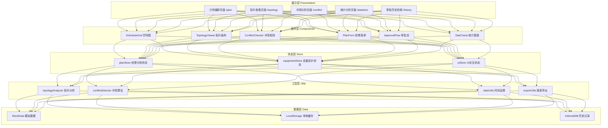
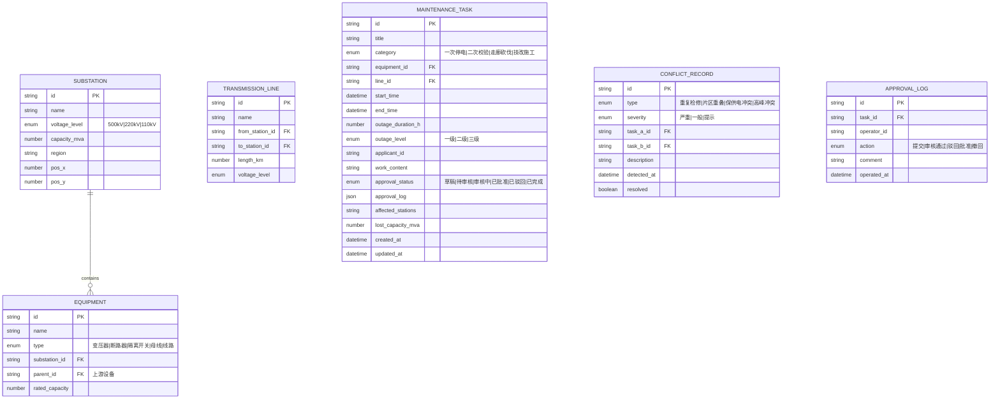

## 1. 架构设计



## 2. 技术选型说明

| 类别 | 技术 | 版本 | 选型理由 |
|------|------|------|----------|
| 构建工具 | Vite | 5.2 | 极速冷启动、HMR毫秒级更新、原生ESM支持 |
| 前端框架 | React | 18.3 | 并发渲染特性、Suspense懒加载、useTransition优化长任务 |
| 类型系统 | TypeScript | 5.4 | strict模式类型安全、模板字面量类型增强业务建模 |
| 路由管理 | React Router | 6.22 | 嵌套路由、useNavigate编程式导航、loader数据预取 |
| 状态管理 | Zustand | 4.5 | 极简API、无Provider嵌套、内置devtools、选择器性能优化 |
| UI组件库 | Ant Design | 5.18 | 企业级组件完备、ConfigProvider主题定制、Tree/Table/G2Plot生态 |
| 样式方案 | TailwindCSS | 3.4 | 原子化CSS、设计token系统、JIT按需编译体积小 |
| 图表可视化 | ECharts | 5.5 | 专业级图表能力、Canvas渲染性能、大数据量优化 |
| 拓扑绘制 | 原生Canvas | - | 千级节点性能可控、自定义绘制供电通路、无额外依赖 |
| 导出能力 | xlsx (SheetJS) | 0.18 | Excel标准格式导出、样式支持、浏览器端纯JS |
| 图标库 | lucide-react | 0.378 | 轻量SVG图标、树摇优化、风格统一现代 |

## 3. 路由定义

| 路由路径 | 页面组件 | 用途说明 |
|----------|----------|----------|
| `/` | `<Navigate to="/plan" />` | 默认重定向至计划编排 |
| `/plan` | `PlanSchedule` | 检修计划编排主页面 |
| `/topology` | `TopologyView` | 电网拓扑与停电影响分析 |
| `/conflict` | `ConflictAnalysis` | 冲突检测与分析处理 |
| `/statistics` | `StatisticsReport` | 统计报表与数据导出 |
| `/history` | `HistorySearch` | 历史检修记录检索 |
| `*` | `NotFound` | 404页面 |

## 4. 数据模型

### 4.1 ER关系图



### 4.2 关键TypeScript类型

```typescript
// 电压等级
type VoltageLevel = '500kV' | '220kV' | '110kV';

// 检修类型
type MaintenanceCategory = 'primary_outage' | 'secondary_calibration' | 'corridor_clearing' | 'technical_reform';

// 审批状态
type ApprovalStatus = 'draft' | 'submitted' | 'reviewing' | 'approved' | 'rejected' | 'completed';

// 停电级别
type OutageLevel = 'level1' | 'level2' | 'level3';

interface Substation {
  id: string;
  name: string;
  voltageLevel: VoltageLevel;
  capacity: number;
  region: string;
  x: number;
  y: number;
}

interface Equipment {
  id: string;
  name: string;
  type: 'transformer' | 'breaker' | 'disconnector' | 'busbar' | 'line';
  substationId: string;
  parentId?: string;
  children?: string[];
  ratedCapacity?: number;
}

interface TransmissionLine {
  id: string;
  name: string;
  fromStationId: string;
  toStationId: string;
  lengthKm: number;
  voltageLevel: VoltageLevel;
}

interface MaintenanceTask {
  id: string;
  title: string;
  category: MaintenanceCategory;
  equipmentId?: string;
  lineId?: string;
  startTime: number;
  endTime: number;
  outageDurationH: number;
  outageLevel: OutageLevel;
  applicant: string;
  department: string;
  workContent: string;
  approvalStatus: ApprovalStatus;
  approvalLog: ApprovalEntry[];
  affectedStationIds: string[];
  lostCapacity: number;
  affectedUserLevel: 'A' | 'B' | 'C';
  loadTransferPlan?: string;
  createdAt: number;
  updatedAt: number;
}

interface ConflictInfo {
  id: string;
  type: 'duplicate_equipment' | 'area_overlap' | 'protection_window' | 'peak_load';
  severity: 'critical' | 'warning' | 'info';
  taskAId: string;
  taskBId?: string;
  overlapStart?: number;
  overlapEnd?: number;
  description: string;
  resolved: boolean;
}
```

## 5. 核心算法设计

### 5.1 供电通路追溯算法（topologyAnalyzer.ts）

```
算法：findPowerSupplyPath(targetId)
输入：目标设备ID
输出：从500kV源点到目标的所有供电路径集合

1. 构建邻接表 adjacencyMap: Map<nodeId, connectedNodeId[]>
   - 变电站<->线路双向连接
   - 变压器上下级连接
2. 初始化visited集合、paths数组、当前path栈
3. DFS深度优先搜索：
   a. 将当前节点压入path
   b. 若当前节点是500kV源变电站，将path快照加入paths
   c. 遍历所有邻接且未访问节点递归
   d. 回溯弹出当前节点
4. 返回所有供电路径，按长度排序优先选最短通路
时间复杂度：O(V+E)，V为节点数，E为边数
性能目标：单设备追溯≤200ms
```

### 5.2 停电影响范围计算

```
算法：calculateOutageScope(equipmentId)
输入：检修设备ID
输出：停电设备集合、停电级别、受影响变电站

1. 调用findPowerSupplyPath获取所有供电路径
2. 标记检修设备为cut_point
3. 对下游所有设备执行反向可达性检测：
   - 若某设备所有供电路径均经过cut_point → 划入一级停电
   - 部分路径经过但存在替代通路 → 划入二级停电（风险）
   - 存在独立供电路径且容量充足 → 划入三级/不受影响
4. 聚合受影响变电站、统计损失容量
5. 返回{outageNodes, level1Nodes, level2Nodes, stations, lostCapacity}
```

### 5.3 冲突检测算法（ConflictChecker）

```
算法：detectConflicts(taskList)
输入：200条以内检修任务列表
输出：冲突信息集合

1. 按时间段构建时间区间树(interval tree)，O(n log n)建树
2. 四类冲突并行校验：

   A. 同一设备重复检修：
      - 按equipmentId分组，每组内时间区间两两求交
      - intersection非空 → duplicate_equipment冲突

   B. 同一供电片区多重停电：
      - 提取任务affectedStationIds集合
      - 时间重叠 + 集合交集≥2 → area_overlap冲突

   C. 保供电时段冲突：
      - 预定义protectionWindows数组（重要节假日/保电期）
      - 任务时间区间与保电窗口重叠 → protection_window冲突

   D. 季节性负荷高峰检修：
      - 配置peakSeasonRules（夏季7-8月/冬季12-1月 每日19-21点）
      - 任务时间落入高峰窗口 → peak_load冲突

3. 计算严重程度：
   - 一级停电+时间完全重叠 → critical
   - 二级停电+部分重叠 → warning
   - 其他情况 → info

性能目标：200条任务≤500ms
```

### 5.4 甘特图渲染优化策略

```
ScheduleGrid性能方案：
1. 虚拟滚动(virtualization)：仅渲染可视区域±缓冲区任务条
2. Canvas分层渲染：
   - 底层：时间刻度网格线（static，数据不变不重绘）
   - 中层：任务矩形色块（requestAnimationFrame批量绘制）
   - 顶层：今日线、选中高亮、拖拽预览（频繁重绘层）
3. 拖拽优化：
   - 鼠标按下记录偏移量offset
   - mousemove仅更新transform: translateX，不触发store更新
   - mouseup时commit到zustand并触发冲突检测(debounced 100ms)
4. 1000条任务渲染目标：首帧≤1s，拖拽FPS≥60
```

## 6. 项目目录结构

```
src/
├── router/
│   └── index.tsx                  # 路由配置
├── store/
│   ├── planStore.ts               # 检修计划状态管理
│   ├── equipmentStore.ts          # 设备拓扑数据管理
│   └── uiStore.ts                 # UI交互状态
├── components/
│   ├── Layout/
│   │   ├── AppLayout.tsx          # 主框架布局
│   │   └── Sidebar.tsx            # 响应式侧边栏
│   ├── ScheduleGrid/
│   │   ├── index.tsx              # 甘特图主组件
│   │   ├── GanttCanvas.tsx        # Canvas渲染层
│   │   ├── TaskBar.tsx            # 任务条交互
│   │   └── TimelineHeader.tsx     # 时间刻度头
│   ├── TopologyViewer/
│   │   ├── index.tsx              # 拓扑查看主组件
│   │   ├── TopologyCanvas.tsx     # Canvas拓扑绘制
│   │   └── EquipmentTree.tsx      # 设备树目录
│   ├── ConflictChecker/
│   │   ├── index.tsx              # 冲突检测主组件
│   │   ├── ConflictList.tsx       # 冲突列表
│   │   └── ConflictDetail.tsx     # 冲突详情
│   ├── PlanForm/
│   │   └── index.tsx              # 检修任务编辑表单
│   ├── ApprovalFlow/
│   │   └── index.tsx              # 审批流程条
│   └── Statistics/
│       ├── KPICards.tsx           # KPI指标卡
│       ├── CategoryCharts.tsx     # 分类统计图
│       └── ExportPanel.tsx        # 导出面板
├── pages/
│   ├── PlanSchedule.tsx           # 计划编排页
│   ├── TopologyView.tsx           # 拓扑查看页
│   ├── ConflictAnalysis.tsx       # 冲突分析页
│   ├── StatisticsReport.tsx       # 统计报表页
│   ├── HistorySearch.tsx          # 历史检索页
│   └── NotFound.tsx               # 404页
├── utils/
│   ├── topologyAnalyzer.ts        # 拓扑分析算法
│   ├── conflictDetector.ts        # 冲突检测算法
│   ├── dateUtils.ts               # 时间运算工具
│   └── exportUtils.ts             # Excel导出工具
├── data/
│   ├── mockSubstations.ts         # 变电站模拟数据
│   ├── mockEquipment.ts           # 设备模拟数据
│   ├── mockLines.ts               # 线路模拟数据
│   └── mockTasks.ts               # 检修任务模拟数据
├── types/
│   └── index.ts                   # 全局类型定义
├── hooks/
│   ├── useVirtualScroll.ts        # 虚拟滚动Hook
│   ├── useDebounce.ts             # 防抖Hook
│   └── useCanvasRenderer.ts       # Canvas渲染Hook
├── App.tsx
├── main.tsx
└── index.css
```

## 7. 性能预算与约束

| 指标 | 目标值 | 实现手段 |
|------|--------|----------|
| 首屏渲染 | ≤1.5s | 路由懒加载+Suspense、关键CSS内联、React 18并发模式 |
| 拓扑数据加载 | ≤2s | Web Worker解析、IndexedDB持久化缓存、增量更新 |
| 甘特图1000条渲染 | ≤1s | 虚拟滚动+Canvas分层、requestAnimationFrame、任务数据memoized |
| 拖拽更新延迟 | ≤100ms | 拖拽期transform预览、mouseup才commit store、debounce冲突检测 |
| 200条任务冲突检测 | ≤500ms | 区间树索引、四类冲突并行计算、Web Worker离线检测 |
| 单设备拓扑追溯 | ≤200ms | 邻接表预处理、DFS剪枝、结果LRU缓存 |
| 并发用户数 | ≥20人 | 乐观锁版本号、操作记录分离、冲突合并策略 |
| 本地缓存 | ≤5000条 | IndexedDB分页存储、LRU淘汰策略、按月份归档 |
