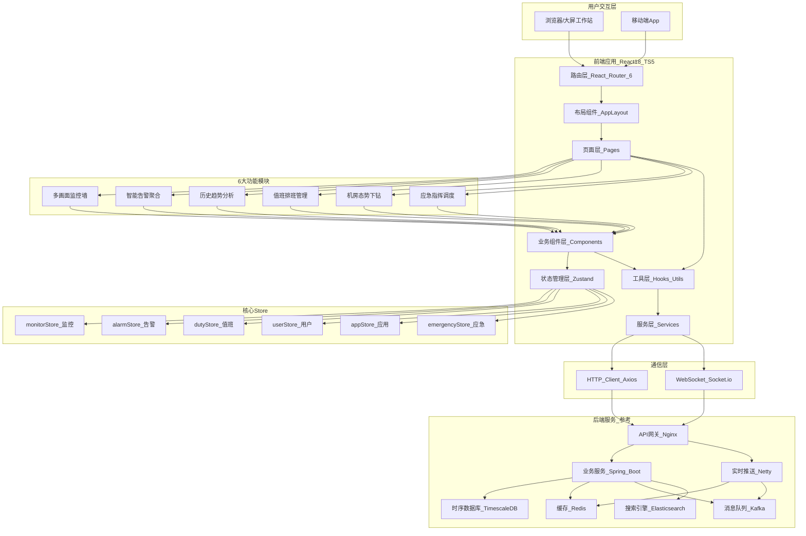
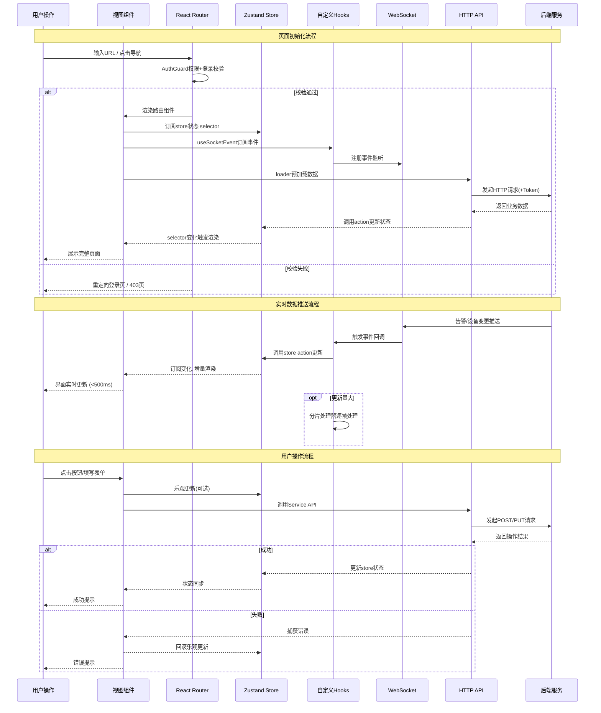

# 技术架构文档

## 文档信息

| 项目名称 | 省级广电网络播出监控系统 |
|---------|----------------------|
| 文档版本 | v1.0 |
| 创建日期 | 2026-06-21 |
| 文档状态 | 正式发布 |

---

## 一、技术选型说明

### 1.1 核心技术栈总览

| 分类 | 技术选型 | 版本要求 | 选型理由 |
|-----|---------|---------|---------|
| **UI框架** | React | ≥ 18.2.0 | 生态成熟，Concurrent Mode支持并发渲染，Hooks复用逻辑方便，团队技术栈统一 |
| **类型系统** | TypeScript | ≥ 5.0.0 | 严格类型检查减少运行时错误，IDE智能提示提升开发效率，大型项目维护性好 |
| **构建工具** | Vite | ≥ 5.0.0 | 原生ESM极速冷启动，HMR毫秒级热更新，Rollup构建产物优化好 |
| **路由管理** | React Router | ≥ 6.8.0 | 官方推荐路由方案，嵌套路由、动态路由、加载器/动作支持完善 |
| **状态管理** | Zustand | ≥ 4.4.0 | 轻量高性能，API简洁，无Provider嵌套，支持Immer中间件 |
| **UI组件库** | Ant Design | ≥ 5.10.0 | 企业级组件完整，Design Token主题系统完善，表格/表单功能强大 |
| **数据可视化** | ECharts | ≥ 5.4.0 | 图表类型丰富，大数据量渲染优化好，Apache社区活跃 |
| **实时通信** | Socket.io Client | ≥ 4.7.0 | 自动降级、重连机制完善，房间/命名空间支持好，跨浏览器兼容 |

---

### 1.2 各技术选型详细说明

#### 1.2.1 React 18

**核心特性使用：**
- **Concurrent Mode**：告警列表、虚拟列表等重渲染场景启用并发更新，避免界面卡顿
- **Automatic Batching**：利用自动批处理减少re-render次数
- **Suspense + lazy()**：路由级别代码分割，配合React Router的loader实现异步数据预加载
- **Transitions**：搜索、筛选等非紧急更新使用startTransition，保持UI响应
- **useId**：生成服务端渲染兼容的唯一ID，用于表单无障碍

**开发规范：**
- 全部使用函数组件，禁止Class组件
- 优先使用内置Hooks（useState、useReducer、useEffect、useMemo、useCallback、useRef）
- 复杂逻辑抽取为自定义Hooks，Hooks命名以use开头
- 组件职责单一原则，单个组件行数不超过300行，超过需拆分

#### 1.2.2 TypeScript 5

**配置策略：**
```json
{
  "compilerOptions": {
    "target": "ES2020",
    "lib": ["ES2020", "DOM", "DOM.Iterable"],
    "module": "ESNext",
    "moduleResolution": "bundler",
    "strict": true,
    "noUnusedLocals": true,
    "noUnusedParameters": true,
    "noFallthroughCasesInSwitch": true,
    "noImplicitReturns": true,
    "baseUrl": ".",
    "paths": {
      "@/*": ["src/*"]
    }
  }
}
```

**类型规范：**
- 禁止使用any类型，特殊场景使用unknown配合类型守卫
- API响应数据使用Zod进行运行时校验，自动推导类型
- 全局类型定义放在src/types/目录，按模块拆分文件
- 组件Props使用interface定义，泛型函数优先使用type

#### 1.2.3 Vite 5

**构建配置要点：**
```typescript
// vite.config.ts
import { defineConfig } from 'vite'
import react from '@vitejs/plugin-react'
import path from 'path'

export default defineConfig({
  plugins: [react()],
  resolve: {
    alias: {
      '@': path.resolve(__dirname, 'src'),
    },
  },
  server: {
    port: 3000,
    proxy: {
      '/api': { target: 'http://backend:8080', changeOrigin: true },
      '/socket.io': { target: 'http://backend:3001', changeOrigin: true, ws: true },
    },
  },
  build: {
    target: 'es2020',
    sourcemap: false,
    rollupOptions: {
      output: {
        manualChunks: {
          'react-vendor': ['react', 'react-dom', 'react-router-dom'],
          'ui-vendor': ['antd', '@ant-design/icons'],
          'chart-vendor': ['echarts', 'echarts-for-react'],
          'state-vendor': ['zustand', 'immer', '@tanstack/react-query'],
        },
      },
    },
    chunkSizeWarningLimit: 1000,
  },
})
```

#### 1.2.4 Zustand 4

**选型优势：**
- 对比Redux：无需Provider、无action/reducer模板代码、体积仅1KB
- 对比MobX：不可变数据模式更易调试、无隐式依赖追踪
- 对比Context：无重渲染问题、选择器精确订阅

**中间件使用：**
- devtools：开发环境Redux DevTools调试
- persist：持久化用户配置、主题、权限等数据到localStorage
- immer：简化嵌套状态更新

---

## 二、目录结构设计

### 2.1 完整目录树

```
src/
├── components/           # 通用可复用组件
│   ├── common/          # 基础通用组件 (Button/Modal/Table/VirtualList...)
│   ├── layout/          # 布局相关组件 (AppLayout/SideNav/TopBar...)
│   └── business/        # 业务通用组件 (MonitorWall/Alarm/Chart/GIS/Room3D...)
├── pages/              # 页面级组件（路由对应）
│   ├── Login/
│   ├── Dashboard/
│   ├── MonitorWall/
│   ├── AlarmCenter/
│   ├── TrendAnalysis/
│   ├── DutySchedule/
│   ├── RoomSituation/
│   ├── EmergencyCommand/
│   ├── SystemManage/
│   └── NotFound/
├── stores/             # Zustand状态管理
│   ├── userStore.ts        # 用户信息、token、权限
│   ├── appStore.ts         # 应用配置、主题、布局
│   ├── monitorStore.ts     # 监控数据：设备状态、实时指标
│   ├── alarmStore.ts       # 告警数据：实时告警、历史告警
│   ├── dutyStore.ts        # 值班数据：排班表、交接班
│   └── emergencyStore.ts   # 应急数据：预案、事件
├── hooks/              # 自定义React Hooks
│   ├── useWebSocket.ts
│   ├── useSocketEvent.ts
│   ├── useVirtualList.ts
│   ├── usePermission.ts
│   └── ...
├── utils/              # 工具函数
│   ├── request.ts          # Axios封装
│   ├── socket.ts           # Socket.io客户端封装
│   ├── storage.ts
│   ├── format.ts
│   └── ...
├── router/             # 路由配置
│   ├── routes.ts           # 路由表
│   ├── AuthGuard.tsx       # 权限守卫
│   └── lazyLoad.tsx        # 懒加载包装
├── assets/             # 静态资源
│   ├── images/
│   ├── styles/            # 全局样式
│   ├── fonts/
│   └── audio/
├── types/              # 全局TypeScript类型定义
│   ├── api.d.ts
│   ├── model.d.ts
│   └── env.d.ts
├── services/           # API服务层
├── App.tsx
├── main.tsx
└── vite-env.d.ts
```

### 2.2 模块间引用规则

```
pages → components / stores / hooks / utils / services / types
components → hooks / utils / types（禁止引用stores）
stores → utils / services / types（禁止引用components）
hooks → stores / utils / services
utils → types（最底层，禁止向上引用）
```

---

## 三、数据流向设计

### 3.1 整体数据流架构

```
                          ┌─────────────────────────────────────────────────────────┐
                          │                        前端应用层                       │
                          │                                                         │
  ┌──────────┐   WSS      │  ┌──────────────┐   订阅    ┌──────────────┐   渲染    │
  │ 后端服务  │──────────────▶│ WebSocket层  │──────────▶│ Zustand Store│──────────▶│ React组件
  │ (推送)   │            │  │ (hooks封装)  │          │ (各业务store)│          │ (订阅局部)│
  └──────────┘            │  └──────────────┘          └──────────────┘          │
       ▲                  │          │                         │                  │
       │ HTTP/REST        │          ▼                         │                  │
  ┌──────────┐            │  ┌──────────────┐          更新/查询                  │
  │ 后端服务  │◀───────────│  │  消息路由层   │──────────────────┘                 │
  │ (请求响应)│            │  └──────────────┘                                    │
  └──────────┘            │          ▲                                           │
                          │          │                                           │
                          │  ┌──────────────┐   跳转      ┌──────────────┐       │
                          │  │ React Router │◀────────────│  页面组件     │       │
                          │  │ (路由守卫)   │────────────▶│  (loader)    │       │
                          │  └──────────────┘  加载/渲染   └──────────────┘       │
                          └─────────────────────────────────────────────────────────┘
```

### 3.2 实时数据流向（WebSocket推送）

**完整链路步骤：**

1. **连接建立**：应用启动时，useWebSocket携带Token建立WSS连接，Socket.io客户端自动处理握手、心跳、断线重连（重连时间<3秒）

2. **事件订阅**：页面加载时，组件通过useSocketEvent hook订阅关注的事件，支持按房间订阅（特定机房/设备组）

3. **消息接收**：Socket层接收后端推送，消息路由器根据event类型分发到对应Store的action

4. **Store更新**：Store的action接收数据，通过setState更新状态，使用Immer简化嵌套更新

5. **组件渲染**：组件通过useStore(selector)精确订阅，selector变化才触发re-render

6. **卸载清理**：组件卸载时，useSocketEvent自动取消事件订阅

**消息协议规范：**
```typescript
interface SocketMessage<T = unknown> {
  event: string;          // 事件名: monitor.deviceUpdate / alarm.new / duty.change
  data: T;                // 业务数据
  timestamp: number;      // 推送时间戳
  traceId: string;        // 链路追踪ID
  version: string;        // 协议版本号
}
```

### 3.3 常规请求数据流向（HTTP/REST API）

```
用户操作 → 页面组件 → Service层(API封装) → request拦截器(+Token+TraceId)
                                                          ↓
                                                   后端HTTP接口
                                                          ↓
UI更新 ← Store action ← response拦截器(统一错误处理) ← 响应返回
```

### 3.4 路由守卫流程

```
用户访问URL
    ↓
AuthGuard检查：
  ├─ 1. 是否已登录（Token存在且未过期）
  │    └─ 未登录 → 重定向 /login?redirect=xxx
  ├─ 2. 是否有路由权限
  │    └─ 无权限 → 展示403页面
  └─ 3. 加载路由meta数据
          ↓
  路由loader预加载数据
          ↓
  页面组件渲染 → 订阅WebSocket → 拉取额外数据
```

---

## 四、状态管理设计

### 4.1 Zustand Store 整体划分

```
┌────────────────────────────────────────────────────────────┐
│                      Zustand Stores                         │
│                                                            │
│  userStore (用户状态)   appStore (应用状态)                 │
│  ├─ token              ├─ theme                            │
│  ├─ userInfo           ├─ sidebarCollapsed                 │
│  └─ permissions        └─ globalMessages                   │
│                                                            │
│  monitorStore (监控)    alarmStore (告警)    dutyStore (值班)│
│  ├─ devices            ├─ realtimeAlarms   ├─ schedule      │
│  ├─ deviceIndex        ├─ alarmHistory     ├─ currentDuty   │
│  ├─ wallLayouts        └─ alarmRules       ├─ handover      │
│  └─ summary                               └─ dutyLogs      │
│                                                            │
│  emergencyStore (应急)                                     │
│  ├─ plans, activeEvent, dispatchStatus                     │
└────────────────────────────────────────────────────────────┘
```

**跨Store交互规则：**
- Store之间通过useStore.getState()直接读取，禁止循环引用
- 跨Store操作通过action参数传递，避免Store互相import

### 4.2 monitorStore（监控状态核心）

**状态结构设计：**
```typescript
interface MonitorState {
  // 设备数据（以ID为key，O(1)查找）
  devices: Record<string, DeviceData>;
  // 索引加速过滤
  deviceIndex: {
    byCity: Record<string, string[]>;
    byType: Record<string, string[]>;
    byRoom: Record<string, string[]>;
    byStatus: Record<Status, string[]>;
  };
  videoStreams: Record<string, VideoStream>;
  wallLayouts: WallLayout[];
  activeLayoutId: string | null;
  summary: {
    totalDevices: number; onlineCount: number;
    alarmCount: number; offlineCount: number; onlineRate: number;
  };
}

interface MonitorActions {
  setDevices(devices: DeviceData[]): void;
  updateDevice(device: Partial<DeviceData> & { id: string }): void;
  batchUpdateDevices(updates: PartialDevice[]): void;
  getDevicesByCity(city: string): DeviceData[];
  searchDevices(keyword: string): DeviceData[];
  saveLayout(layout: WallLayout): void;
  fetchDevices(): Promise<void>;
  _rebuildIndex(): void;    // 内部：重建索引
  _updateSummary(): void;   // 内部：更新汇总
}
```

**组件订阅模式：**
```typescript
// 方式1：精确订阅
const devices = useMonitorStore(s => s.devices);

// 方式2：多字段浅比较
const { onlineCount, alarmCount } = useMonitorStore(
  useShallow(s => ({
    onlineCount: s.summary.onlineCount,
    alarmCount: s.summary.alarmCount,
  }))
);

// 方式3：派生数据
const urgentDevices = useMonitorStore(s =>
  Object.values(s.devices).filter(d => d.alarmCount?.urgent > 0)
);
```

### 4.3 dutyStore（值班状态）

**状态结构设计：**
```typescript
interface DutyState {
  scheduleRecords: Record<string, DutyRecord[]>;  // key: YYYY-MM-DD
  currentMonth: string;
  currentDuty: DutyRecord | null;
  nextDuty: DutyRecord | null;
  currentHandover: HandoverRecord | null;
  handoverHistory: HandoverRecord[];
  dutyLogs: Record<string, DutyLogEntry[]>;       // key: dutyId
  dutyUsers: DutyUser[];
  loading: boolean;
}

interface DutyActions {
  fetchSchedule(yearMonth: string): Promise<void>;
  saveSchedule(records: DutyRecord[]): Promise<void>;
  fetchCurrentDuty(): Promise<void>;
  createHandover(): HandoverRecord;
  submitHandover(record: HandoverRecord): Promise<void>;
  confirmHandover(id: string): Promise<void>;
  addLog(entry: Omit<DutyLogEntry, 'id' | 'timestamp'>): void;
}
```

---

## 五、核心模块架构

### 5.1 模块一：多画面监控墙

**组件树：**
```
MonitorWall
├── WallHeader (布局选择/轮巡/截图/全屏)
├── WallCanvas (画布主体)
│   ├── LayoutGrid (栅格容器, CSS Grid)
│   │   └── WallSlot (每个槽位)
│   │       ├── VideoCell (视频画面: hls.js/flv.js解码)
│   │       ├── DeviceCell (设备状态卡)
│   │       └── EmptySlot (空槽位, 可拖拽)
│   └── DragOverlay (拖拽遮罩)
├── LayoutEditorDrawer (布局编辑抽屉)
└── RotationConfigModal (轮巡配置)
```

**关键技术点：**
- 布局拖拽：@dnd-kit/core
- 视频解码：hls.js播放HLS，flv.js播放FLV，WebCodecs硬解
- 轮巡切换：预加载+CSS Transition，避免切换白屏

### 5.2 模块二：智能告警聚合

**组件树：**
```
AlarmCenter
├── RealtimeAlarms (实时告警)
│   ├── AlarmFilterBar (筛选栏)
│   ├── AlarmStatHeader (统计头部)
│   ├── AlarmVirtualList (虚拟列表: @tanstack/react-virtual)
│   │   └── AlarmRow (级别色块/内容/操作按钮)
│   └── AlarmDetailDrawer (详情抽屉: 指标时序/关联告警/处理记录)
├── AlarmHistory (告警历史: 查询/表格/统计分析)
└── RuleConfig (规则配置: 规则编辑/条件构建器/通知策略)
```

**关键技术点：**
- 虚拟列表支持1000+条流畅滚动
- 告警聚合：前端按规则合并，树状展示根源/衍生关系
- 实时更新：requestAnimationFrame批量处理WebSocket推送

### 5.3 模块三：历史趋势分析

**组件树：**
```
TrendAnalysis
├── DataQuery (数据查询)
│   ├── QueryConditionPanel (时间/地域/设备/指标维度)
│   ├── ChartArea (图表区)
│   │   ├── LineChart (折线图: LTTB降采样, 10w+数据点)
│   │   ├── HeatmapChart (热力图)
│   │   └── DataZoom (范围缩放)
│   └── DataTableView (数据表格)
├── ReportCenter (报表中心: 日/周/月报, 定时任务)
└── CustomDashboard (自定义看板: 拖拽画布/组件面板/数据源)
```

**关键技术点：**
- 大数据渲染：ECharts large模式 + LTTB降采样算法
- 导出：jspdf+html2canvas生成PDF，xlsx生成Excel
- 看板编辑器：react-grid-layout拖拽定位

### 5.4 模块四：值班排班管理

**组件树：**
```
DutySchedule
├── ScheduleCalendar (排班日历)
│   ├── MonthView (月视图: 拖拽调整班次)
│   ├── WeekView (周视图: 时间轴)
│   ├── ScheduleEditorDrawer (编辑: 批量分配/冲突检测)
│   └── AdjustRequestModal (调班申请)
├── ShiftHandover (交接班)
│   ├── HandoverStatus (状态卡片+倒计时)
│   ├── HandoverForm (告警汇总/待办/重要事项/附件)
│   └── SignConfirmPanel (Canvas电子签名)
└── DutyLog (值班日志: 时间轴/搜索)
```

**关键技术点：**
- 日历：@fullcalendar/react或自研
- 电子签名：Canvas签名板，导出为图片
- 冲突检测：前端即时校验排班冲突

### 5.5 模块五：机房态势下钻

**组件树：**
```
RoomSituation
├── DrillBreadcrumb (全省→地市→机房→机架→设备)
├── GISMapView (GIS地图)
│   ├── MapContainer (Cesium/Mapbox)
│   │   ├── RoomMarkerLayer (机房标记, 状态着色)
│   │   ├── CableRouteLayer (光缆路由)
│   │   └── HeatmapOverlay (分布热力)
│   └── MapSidePanel (区域统计/机房列表)
├── Room3DView (3D机房)
│   ├── RoomViewer3D (Three.js+GLTF模型)
│   │   ├── RackObject (机柜+U位)
│   │   └── TemperatureCloud (温度云图)
│   └── RackDetailDrawer (机架详情)
└── ResourceManager (资源管理: 搜索/表格/设备详情Tab)
```

**关键技术点：**
- GIS渲染：Cesium 3D地球或Mapbox GL矢量瓦片
- 3D机房：Three.js InstancedMesh优化批量机柜
- 大数据标记点：SuperCluster聚合，10w点顺畅交互

### 5.6 模块六：应急指挥调度

**组件树：**
```
EmergencyCommand
├── PlanLibrary (预案库)
│   ├── PlanCategoryTree (分类树)
│   ├── PlanList (预案列表)
│   └── PlanEditorDrawer (流程图编辑器: 节点/连线/任务模板)
├── CommandCenter (指挥台)
│   ├── EmergencyStatusBanner (事件级别+处置进度)
│   ├── CommandMainArea (三栏布局)
│   │   ├── ImpactScopePanel (左: 影响范围地图+设备)
│   │   ├── DisposalFlowPanel (中: 流程时间轴+当前步骤)
│   │   │   └── ControlButtons (一键切换/旁路操作)
│   │   └── DispatchPanel (右: 人员调度/通讯面板)
│   └── ControlLockPanel (双人复核弹窗)
└── EventReview (事件复盘: 时间轴播放器/KPI统计/报告生成)
```

**关键技术点：**
- 流程引擎：前端状态机管理处置流程
- 双人复核：关键操作二次确认，操作留痕
- 录制回放：操作快照存储，时间轴还原全流程

---

## 六、性能优化策略

### 6.1 虚拟列表实现

**适用场景：**
- 告警列表（>1000条）
- 设备列表（>8500条）
- 历史记录查询（>10000条）

**useVirtualList核心设计：**
1. **范围计算**：根据scrollTop和容器高度计算startIndex/endIndex
2. **二分查找**：动态高度时使用前缀和数组+二分定位
3. **RAF节流**：滚动事件requestAnimationFrame节流，避免高频计算
4. **Overscan**：上下额外渲染N条，避免快速滚动白屏
5. **绝对定位**：虚拟项position: absolute + top: offsetY

**性能指标：**
- 1000条数据滚动帧率≥60FPS
- 仅渲染可见DOM节点（约20-50个）
- 初始化时间<100ms

### 6.2 数据分片策略

**6.2.1 WebSocket消息分片**
```
问题：后端批量推送1000台设备更新，一次性处理导致主线程阻塞50ms+
方案：分片处理器，每帧处理一批，每帧预算8ms（一帧16ms留一半给渲染）
```
实现：创建BatchedProcessor，入队后通过requestAnimationFrame逐帧处理，每帧处理不超过frameBudget时间。

**6.2.2 图表数据降采样（LTTB算法）**
```
场景：查询1年分钟级数据 = 525,600点
问题：直接渲染卡顿或崩溃
方案：LTTB(Largest-Triangle-Three-Buckets)算法降采样至1000点以内，保留极值和趋势
```
ECharts集成：开启`sampling: 'lttb'`，DataZoom缩放时动态重采样，细节级别切换原始数据。

**6.2.3 HTTP请求分页与懒加载**
| 场景 | 策略 |
|-----|------|
| 列表页 | 服务端游标分页，每页20/50/100条，避免深翻页 |
| 历史数据 | 按时间分段拉取，先拉最近1小时，滚动加载更多 |
| 地图标记 | 按Zoom级别加载，低缩放只加载聚合点 |
| 树形结构 | 懒加载子节点，展开时才请求 |

### 6.3 懒加载策略

**6.3.1 路由级别代码分割**
```typescript
export function lazyLoad<T>(factory: () => Promise<{ default: T }>) {
  const LazyComponent = lazy(factory);
  return (props: ComponentProps<T>) => (
    <Suspense fallback={<Spin />}>
      <LazyComponent {...props} />
    </Suspense>
  );
}
// routes.ts使用
{ path: '/monitor-wall', Component: lazyLoad(() => import('@/pages/MonitorWall')) }
```

**6.3.2 组件级别懒加载**
适用场景：大体积组件（3D机房、GIS地图、视频播放器）、低频组件（设置弹窗、高级筛选）、Tab面板非激活内容

实现：IntersectionObserver进入视口渲染；import()动态import；requestIdleCallback空闲预加载

**6.3.3 资源懒加载**
| 资源类型 | 策略 |
|---------|------|
| 图片 | loading="lazy" + 骨架图 + WebP |
| 图标 | @ant-design/icons按需tree-shaking |
| 字体 | font-display: swap，子集预加载 |
| ECharts | 按需引入图表类型，不引入全量 |

### 6.4 渲染性能优化

**6.4.1 避免不必要Re-render**
- Zustand选择器精确订阅，配合useShallow
- 频繁渲染的列表项使用React.memo
- 复杂计算useMemo，函数useCallback
- 列表使用稳定的业务ID作为key，不用index
- React 18：startTransition包裹搜索/筛选/分页等非紧急更新；useDeferredValue防抖输入

**6.4.2 CSS优化**
- 动画属性只使用transform和opacity，触发GPU合成
- 避免深层嵌套选择器，CSS Modules隔离
- 批量修改DOM，减少重绘重排

---

## 七、安全与权限

### 7.1 路由守卫

**AuthGuard检查流程：**
1. **登录检查**：requiresAuth=true的路由校验Token存在且未过期
2. **权限检查**：permissions数组逐项校验功能权限
3. **角色检查**：roles数组校验角色包含关系
4. **数据范围检查**：dataScopes校验地市/机房数据权限

**细粒度权限控制：**
```typescript
function usePermission() {
  const permissions = useUserStore(s => s.permissions);
  const hasPermission = useCallback(
    (code: string | string[]) => Array.isArray(code)
      ? code.every(c => permissions.includes(c))
      : permissions.includes(code),
    [permissions]
  );
  return { hasPermission };
}

// 权限按钮：无权限返回null不渲染
<AuthButton permission="alarm:dispatch">派单</AuthButton>
// 权限包裹：无权限渲染替代内容
<AuthWrap permission="emergency:control" fallback={<Button disabled>需高级权限</Button>}>
  <Button danger>远程切换</Button>
</AuthWrap>
```

### 7.2 Token管理

**存储与生命周期：**
| Token类型 | 存储位置 | 有效期 | 说明 |
|----------|---------|--------|------|
| Access Token | 内存（Zustand Store） | 2小时 | 不存localStorage，防XSS |
| Refresh Token | HttpOnly Secure Cookie | 7天 | 后端设置，JS不可读 |
| 滑动过期 | - | - | Refresh使用时自动续期 |

**Token自动刷新流程：**
```
请求返回401
    ↓
检查refreshTokenPromise是否存在（防并发刷新）
    ├─ 是 → 等待该Promise完成，用新Token重试
    └─ 否 → 发起 /auth/refresh 请求
            ↓
        刷新成功？
         ├─ 是 → 更新内存Token → 重试原请求
         └─ 否 → logout清理 → 跳转登录
```

**安全加固：**
| 风险 | 防护措施 |
|-----|---------|
| XSS窃取Token | 不存localStorage，DOMPurify净化富文本，CSP策略 |
| CSRF攻击 | SameSite Cookie，自定义Header校验 |
| 暴力破解 | 登录失败次数限制+验证码，IP黑名单 |
| 会话劫持 | 异地登录提醒，并发会话上限，强制下线机制 |

### 7.3 其他安全措施

- **XSS防护**：输入输出HTML转义，React默认JSX转义
- **敏感数据脱敏**：手机号/身份证部分掩码，密级标签控制
- **操作留痕**：所有写操作记录审计日志（操作人、时间、IP、内容）
- **接口防重放**：关键接口携带nonce+timestamp
- **文件上传**：白名单类型/大小限制，后端病毒扫描

---

## 八、Mermaid架构图

### 8.1 组件关系图



### 8.2 数据流向图



---

*文档结束*
