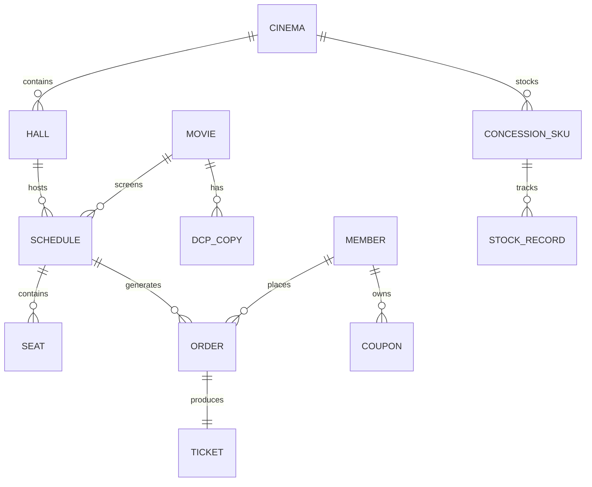

# 光影院线运营管理平台 - 技术架构文档

## 1. 架构设计

前端采用 Vue3 单页应用，通过 Mock 数据服务层模拟后端 PHP/Symfony/MongoDB 的 API 行为。Mock 层按真实控制器职责划分模块（Movie/Schedule/Booking/Member/Concession/Dashboard），返回 OpenAPI 风格 JSON，便于未来无缝替换为真实后端。

```mermaid
flowchart TD
    "Vue3 前端应用" --> "Pinia 状态管理"
    "Vue3 前端应用" --> "Vue Router 路由"
    "Vue3 前端应用" --> "Axios 请求层"
    "Axios 请求层" --> "Mock 服务适配层"
    "Mock 服务适配层" --> "影片/排片模块"
    "Mock 服务适配层" --> "售票/会员模块"
    "Mock 服务适配层" --> "卖品/看板模块"
    "影片/排片模块" --> "内存数据集"
    "售票/会员模块" --> "内存数据集"
    "卖品/看板模块" --> "内存数据集"
    "内存数据集" --> "模拟MongoDB文档"
```

## 2. 技术说明

- **前端框架**：Vue@3.4 + TypeScript@5.2
- **构建工具**：Vite@5.0
- **状态管理**：Pinia@2.1
- **路由**：Vue Router@4.2
- **UI 组件库**：Element Plus@2.5（按需引入 + 暗色主题定制）
- **图表库**：ECharts@5.4（暗金主题）
- **HTTP**：Axios@1.6（封装请求拦截，对接 Mock 适配层）
- **拖拽**：vuedraggable@4 用于排片拖拽
- **初始化工具**：vite init（vue-ts 模板）
- **后端**：Mock 数据服务层模拟 PHP8.2+Symfony6.4 控制器，未来可替换为真实后端
- **数据库**：内存数据集模拟 MongoDB 7.0 文档集合

## 3. 路由定义

| 路由 | 页面名称 | 用途 |
|------|---------|------|
| `/` | 工作台首页 | 重定向至 dashboard |
| `/dashboard` | 票房数据中心看板 | 院线核心指标、趋势、预警 |
| `/schedule` | 智能排片 | 拖拽日历排片、冲突检测 |
| `/booking` | 在线选座购票 | 场次列表、SVG座位图、订单 |
| `/dcp` | DCP调度追踪 | 拷贝流转、状态、预警 |
| `/member` | 会员通兑体系 | 会员档案、积分、优惠券 |
| `/concession` | 卖品进销存 | 库存看板、单据管理 |
| `/analytics` | 票房数据中心 | 多维分析、报表 |
| `/monitor` | 影厅状态监控 | 影厅状态、设备告警 |

## 4. API 定义（Mock 适配层）

Mock 适配层按真实控制器划分，返回 Promise 模拟异步请求。以下为关键接口契约（TypeScript 类型）：

```typescript
// 排片相关
interface ScheduleItem {
  id: string
  movieId: string
  movieName: string
  cinemaId: string
  hallId: string
  hallName: string
  startTime: string
  endTime: string
  price: number
  status: 'planned' | 'on_sale' | 'sold_out' | 'finished'
}

// 选座相关
interface Seat {
  id: string
  row: number
  col: number
  area: string
  status: 'available' | 'locked' | 'sold' | 'selected'
}

// DCP调度
interface DCPCopy {
  id: string
  movieId: string
  movieName: string
  cinemaId: string
  status: 'in_stock' | 'in_transit' | 'screening' | 'returned'
  location: string
  premiereDate: string
  borrowHistory: BorrowRecord[]
}

// 会员
interface Member {
  id: string
  name: string
  level: 'silver' | 'gold' | 'platinum' | 'diamond'
  points: number
  balance: number
  coupons: Coupon[]
}

// 卖品
interface ConcessionSKU {
  id: string
  name: string
  category: string
  stock: number
  unit: string
  costPrice: number
  salePrice: number
  threshold: number
}
```

## 5. 服务端架构图（Mock 模拟真实分层）

```mermaid
flowchart TD
    "前端请求" --> "Axios 封装层"
    "Axios 封装层" --> "Mock 路由分发"
    "Mock 路由分发" --> "ScheduleController 模拟"
    "Mock 路由分发" --> "BookingController 模拟"
    "Mock 路由分发" --> "MemberController 模拟"
    "Mock 路由分发" --> "ConcessionController 模拟"
    "Mock 路由分发" --> "DashboardController 模拟"
    "ScheduleController 模拟" --> "Service 业务逻辑"
    "BookingController 模拟" --> "Service 业务逻辑"
    "MemberController 模拟" --> "Service 业务逻辑"
    "ConcessionController 模拟" --> "Service 业务逻辑"
    "DashboardController 模拟" --> "Service 业务逻辑"
    "Service 业务逻辑" --> "Repository 文档操作"
    "Repository 文档操作" --> "内存文档集合"
```

## 6. 数据模型

### 6.1 数据模型定义



### 6.2 关键文档结构

- **cinema（影院）**：id, name, address, hallCount, screenCount, manager
- **hall（影厅）**：id, cinemaId, name, capacity, type, seatLayout
- **movie（影片）**：id, name, poster, duration, genre, releaseDate, dcpCount
- **schedule（排片场次）**：id, movieId, cinemaId, hallId, startTime, endTime, price, status
- **dcp（数字拷贝）**：id, movieId, cinemaId, status, location, premiereDate, borrowHistory[]
- **member（会员）**：id, name, level, points, balance, coupons[], birthday
- **concession_sku（卖品）**：id, cinemaId, name, category, stock, costPrice, salePrice, threshold
- **order（订单）**：id, scheduleId, memberId, seats[], totalAmount, payTime, status
```
