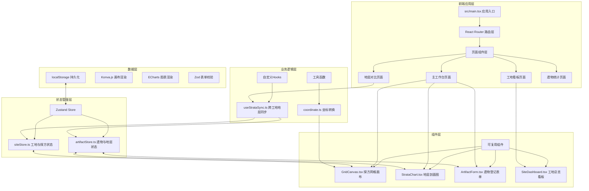

## 1. 架构设计


## 2. 技术描述
- **前端框架**: React 18.x + TypeScript 5.x
- **构建工具**: Vite 5.x
- **状态管理**: Zustand 4.x
- **UI组件库**: Ant Design 5.x
- **画布渲染**: Konva.js + react-konva
- **图表库**: ECharts 5.x
- **表单校验**: Zod 3.x
- **路由**: React Router 6.x
- **图标**: lucide-react
- **数据持久化**: localStorage API
- **初始化工具**: vite-init react-ts 模板

## 3. 路由定义
| 路由路径 | 页面组件 | 用途 |
|---------|---------|------|
| / | 主工作台页面 | 探方网格、地层剖面、遗物录入核心工作区 |
| /dashboard | 工地看板页面 | 进度甘特图、多工地概览 |
| /comparison | 地层对比页面 | 跨工地地层序列对比分析 |
| /statistics | 遗物统计页面 | 多维度检索、图表展示、数据导出 |

## 4. 数据模型

### 4.1 ER图

```mermaid
erDiagram
    SITE ||--o{ GRID : contains
    GRID ||--o{ STRATUM : has
    STRATUM ||--o{ ARTIFACT : contains
    SITE {
        string id PK
        string name
        string location
        string managerId
        date startDate
        date endDate
        string status
    }
    GRID {
        string id PK
        string siteId FK
        number row
        number col
        number x
        number y
        number width
        number height
        string status
        string recorderId
    }
    STRATUM {
        string id PK
        string gridId FK
        number layerIndex
        string name
        string soilType
        string soilColor
        number thickness
        number depthTop
        number depthBottom
        string period
        string description
    }
    ARTIFACT {
        string id PK
        string stratumId FK
        string gridId FK
        string siteId FK
        string name
        string category
        string subcategory
        number quantity
        string condition
        number depth
        number offsetX
        number offsetY
        string period
        string notes
        datetime createdAt
    }
```


### 4.2 TypeScript 类型定义
```typescript
// 工地
interface Site {
  id: string;
  name: string;
  location: string;
  managerId: string;
  startDate: string;
  endDate: string;
  status: 'planning' | 'excavating' | 'completed';
  gridRows: number;
  gridCols: number;
}

// 探方
interface Grid {
  id: string;
  siteId: string;
  row: number;
  col: number;
  x: number;
  y: number;
  width: number;
  height: number;
  status: 'unexcavated' | 'excavating' | 'completed';
  recorderId: string;
  artifactCount: number;
}

// 地层
interface Stratum {
  id: string;
  gridId: string;
  layerIndex: number;
  name: string;
  soilType: string;
  soilColor: string;
  thickness: number;
  depthTop: number;
  depthBottom: number;
  period: string;
  description: string;
  photoUrl?: string;
}

// 遗物
interface Artifact {
  id: string;
  stratumId: string;
  gridId: string;
  siteId: string;
  name: string;
  category: string;
  subcategory: string;
  quantity: number;
  condition: string;
  depth: number;
  offsetX: number;
  offsetY: number;
  period: string;
  notes: string;
  createdAt: string;
}

// 用户
interface User {
  id: string;
  name: string;
  role: 'manager' | 'recorder' | 'researcher';
}
```

### 4.3 Zod 校验 Schema
```typescript
// 遗物表单校验
const artifactSchema = z.object({
  name: z.string().min(1, '遗物名称不能为空'),
  category: z.string().min(1, '请选择类别'),
  subcategory: z.string().min(1, '请选择子类'),
  quantity: z.number().int().min(1, '数量至少为1'),
  condition: z.string().min(1, '请选择保存状况'),
  depth: z.number().min(0).max(10, '深度范围0-10米'),
  offsetX: z.number().min(0).max(5, 'X偏移超出探方范围'),
  offsetY: z.number().min(0).max(5, 'Y偏移超出探方范围'),
  period: z.string().optional(),
  notes: z.string().optional()
});

// 地层校验
const stratumSchema = z.object({
  name: z.string().min(1, '地层名称不能为空'),
  thickness: z.number().min(0.01, '厚度至少0.01米'),
  soilType: z.string().min(1, '请输入土质'),
  soilColor: z.string().min(1, '请输入土色')
});
```

## 5. 目录结构
```
src/
├── main.tsx                 # 应用入口
├── App.tsx                  # 根组件
├── index.css                # 全局样式
├── pages/                   # 页面组件
│   ├── Workbench.tsx        # 主工作台
│   ├── Dashboard.tsx        # 工地看板
│   ├── StrataComparison.tsx # 地层对比
│   └── Statistics.tsx       # 遗物统计
├── components/              # 可复用组件
│   ├── GridCanvas.tsx       # 探方网格画布
│   ├── StrataChart.tsx      # 地层剖面图
│   ├── ArtifactForm.tsx     # 遗物登记表单
│   ├── SiteDashboard.tsx    # 工地总览看板
│   ├── SiteList.tsx         # 工地列表面板
│   ├── TopNavbar.tsx        # 顶部导航栏
│   └── ArtifactDrawer.tsx   # 遗物抽屉
├── stores/                  # Zustand状态
│   ├── siteStore.ts         # 工地与探方状态
│   └── artifactStore.ts     # 遗物与地层状态
├── hooks/                   # 自定义Hooks
│   └── useStrataSync.ts     # 跨工地地层同步
├── utils/                   # 工具函数
│   ├── coordinate.ts        # 坐标转换计算
│   ├── storage.ts           # localStorage封装
│   └── color.ts             # 地层颜色生成
├── types/                   # TypeScript类型
│   └── index.ts             # 类型定义
├── validation/              # Zod校验
│   └── schemas.ts           # 校验Schema
├── mock/                    # Mock数据
│   └── seed.ts              # 初始演示数据
└── router/                  # 路由配置
    └── index.tsx            # 路由定义
```

## 6. 性能优化策略

### 6.1 Konva 画布优化
- 使用 `useStrictMode(false)` 禁止严格模式下的双重渲染
- 探方格子使用 `Shape` 组件配合 `cache()` 进行缓存
- 缩放平移使用 `stage.dragDistance` 优化拖拽检测
- 100个格子渲染时使用批量更新 `batchDraw()`

### 6.2 状态管理优化
- Zustand 使用 `shallow` 比较避免不必要重渲染
- 拆分 siteStore 和 artifactStore 减少状态订阅范围
- 选择器函数提取所需状态片段

### 6.3 渲染优化
- React.memo 包裹纯展示组件
- useMemo/useCallback 缓存计算结果与回调
- 虚拟滚动处理大量遗物列表
- 防抖处理搜索输入

### 6.4 内存管理
- `useEffect` 清理 Konva 舞台事件监听
- 组件卸载时调用 `stage.destroy()`
- 移除 ECharts 实例 `chart.dispose()`
- 清除定时器和事件订阅

## 7. 安全约束
- localStorage 数据加密存储敏感信息
- 表单校验前后端双重验证
- 文件导入类型校验，禁止可执行文件
- XSS防护，对用户输入进行转义
- 最大文件上传限制 10MB
