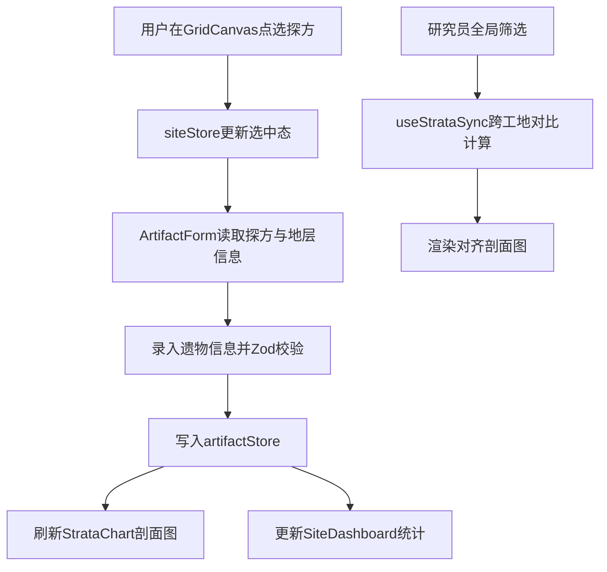

## 1. 产品概述
省级文物考古发掘管理系统，为考古研究所提供数字化的工地管理、探方记录、遗物登记与地层分析一体化解决方案，解决传统纸质记录效率低下、数据割裂、跨工地对比困难等痛点。
- 服务于考古工地负责人、记录员、研究员三类核心用户
- 实现探方网格数字化、地层剖面可视化、遗物登记标准化、多工地管理集中化
- 提升考古发掘工作效率30%以上，消除遗物归位错误，支持跨工地地层序列对比研究

## 2. 核心功能

### 2.1 用户角色
| 角色 | 注册方式 | 核心权限 |
|------|---------|----------|
| 工地负责人 | 系统分配 | 创建发掘工地、划定探方网格、分配发掘任务、查看全局进度 |
| 记录员 | 系统分配 | 按探方逐层录入出土遗物信息、绘制地层剖面、编辑探方信息 |
| 研究员 | 系统分配 | 跨工地检索同类遗物、对比地层序列、生成统计报表、导出数据 |

### 2.2 功能模块
1. **工地总览看板**：工地列表、进度甘特图、全局筛选与搜索
2. **探方网格画布**：5x5米标准探方渲染、缩放平移、选中高亮、快速登记浮层、探方拆分合并
3. **地层剖面图**：土层叠压关系展示、拖拽调整厚度、双击编辑描述、照片背景对齐
4. **遗物登记表单**：Zod校验、类别联动、批量快速录入
5. **跨工地地层对比**：多工地地层年代对齐、差异高亮、一致性评分
6. **遗物检索统计**：全文检索、多维度聚合、ECharts可视化、JSON导出
7. **数据持久化**：localStorage存储、整库导入导出

### 2.3 页面详情
| 页面名称 | 模块名称 | 功能描述 |
|---------|---------|----------|
| 主工作台 | 左侧工地列表面板 | 工地列表展示、工地切换、新建工地入口 |
| 主工作台 | 顶部导航栏 | 全局搜索、用户信息、数据导入导出 |
| 主工作台 | 探方网格画布 | Konva渲染探方网格、缩放平移、点击选中、长按快速登记 |
| 主工作台 | 地层剖面图 | 纵轴土层展示、拖拽调整、照片背景、实时重绘 |
| 主工作台 | 右侧遗物抽屉 | 遗物详情查看、表单录入、批量录入模式 |
| 工地看板 | 进度甘特图 | 各工地发掘进度、探方完成率着色、逾期标记、筛选功能 |
| 地层对比 | 对比剖面图 | 多工地地层对齐、差异高亮、一致性评分输出 |
| 遗物统计 | 统计图表 | ECharts柱状图、饼图、多维度聚合、数据导出 |

## 3. 核心流程

### 3.1 主要用户流程
1. 工地负责人创建新发掘工地，划定探方网格，分配记录员
2. 记录员进入工地，在网格画布上点选探方，查看当前探方状态
3. 记录员逐层发掘，录入每层出土遗物信息，绘制地层剖面图
4. 研究员通过全局筛选检索同类遗物，选择多个工地进行地层对比分析
5. 研究员生成统计报表，导出数据用于学术研究

### 3.2 数据流图

## 4. 用户界面设计

### 4.1 设计风格
- **主色调**：考古暖灰色系（#F5F2ED 背景，#8B4513 赭石强调色，#D4AF37 金色选中边框）
- **色彩系统**：地层按土质自动着色（黄褐色、灰褐色、红褐色等），逾期红色标记（#DC2626）
- **字体**：标题使用"STZhongsong"宋体，正文使用"PingFang SC"苹方，体现学术严谨性
- **布局**：左侧固定240px工地面板，中部双栏（上画布下图），右侧380px抽屉式表单
- **动效**：选中边框过渡0.2秒，地层拖拽实时重绘，抽屉滑入滑出动画
- **交互**：探方hover效果0.15秒过渡，按钮按压态缩放0.98

### 4.2 页面设计概述
| 页面名称 | 模块名称 | UI元素 |
|---------|---------|--------|
| 主工作台 | 探方网格画布 | Konva舞台、5x5米网格、选中金色边框、遗物数量角标、缩放控件 |
| 主工作台 | 地层剖面图 | 纵轴刻度、土层矩形块、拖拽手柄、照片背景层、土质标注 |
| 主工作台 | 遗物登记表单 | Ant Design表单组件、类别级联选择、Zod校验提示、批量录入切换 |
| 工地看板 | 进度甘特条 | 彩色进度条（绿/黄/红）、负责人标签、工期范围、筛选面板 |
| 地层对比 | 对比剖面图 | 多工地并排土层、年代对齐线、差异高亮、评分仪表盘 |
| 遗物统计 | 统计图表 | ECharts柱状图、饼图、筛选维度切换、导出按钮 |

### 4.3 响应式设计
- **桌面端（≥1366px）**：三栏布局，左240px + 自适应中部 + 右380px抽屉
- **平板端（768px-1366px）**：右侧抽屉改为底部弹层，保持左面板与中部区域
- **移动端（<768px）**：左面板折叠为汉堡菜单，画布与剖面图上下堆叠，底部弹层表单
- **触控优化**：探方点击区域扩大至44x44px，长按手势识别500ms阈值，支持双指缩放

## 5. 性能约束
- 100个探方格子首帧渲染 ≤ 200毫秒
- 地层拖拽重绘帧率 ≥ 30fps
- 5000条遗物检索响应 ≤ 300毫秒
- localStorage单库容量 ≤ 5MB
- 组件卸载时清理Konva舞台与事件监听，避免内存泄漏
