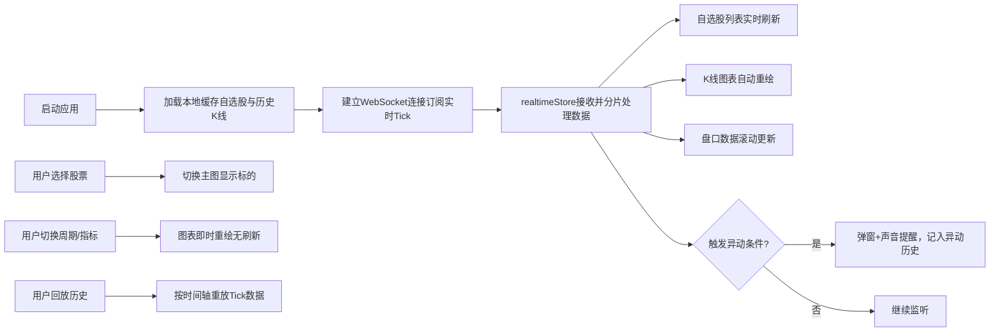

## 1. 产品概述

面向证券营业部职业短线交易员的专业看盘分析平台，支持实时行情监控、多周期K线分析、五档盘口追踪、自选股分组管理、异动提醒与历史回放，帮助交易员在秒级行情中高效捕捉短线交易机会。

- 目标用户：50名职业短线交易员，每人同时监控15-30只个股
- 核心价值：高信息密度、极速响应、流畅交互，减少多窗口切换与操作打断

## 2. 核心功能

### 2.1 功能模块

1. **行情主视图（StockChart）**：分时图/日K/周K/月K切换、缩放拖拽平移、十字光标、自动滚动至最新K线
2. **技术指标叠加**：MA5/10/20/60、MACD、KDJ、BOLL、RSI、VOL等12种指标，参数实时调整
3. **五档盘口（OrderBook）**：买一至买五、卖一至卖五价量实时刷新，买卖力度颜色标识
4. **自选股管理（TickerList）**：分组创建、拖拽排序、批量删除、搜索添加、快速切换
5. **盘中异动监控**：涨跌幅/换手率/成交量阈值监控、自定义条件、弹窗+声音提醒、异动历史
6. **历史回放功能**：任意交易日分时走势与Tick数据回放，复盘训练
7. **画线工具**：趋势线、平行线、黄金分割、矩形框，本地存储

### 2.2 页面详情

| 页面名称 | 模块名称 | 功能描述 |
|---------|---------|---------|
| 主看盘页面 | 左侧自选股面板 | 300px固定宽度，分组标签、搜索栏、股票列表（代码/名称/现价/涨跌幅），红涨绿跌闪烁 |
| 主看盘页面 | 中部K线主图 | ECharts渲染，分时/K线切换，十字光标跟随，缩放拖拽平移，指标副图（MACD/VOL） |
| 主看盘页面 | 右侧盘口面板 | 200px宽度，五档买卖盘口、个股基本信息、盘口力度颜色标识 |
| 主看盘页面 | 底部异动消息栏 | 80px高度，滚动展示最新异动信号，点击查看详情 |
| 历史回放页面 | 回放控制区 | 日期选择、播放/暂停、速度调节、进度条拖拽 |
| 异动设置页面 | 条件配置区 | 异动条件增删改、阈值设置、提醒方式选择 |

## 3. 核心流程

## 4. 用户界面设计

### 4.1 设计风格

- **主色调**：深色专业金融主题
  - 背景色：`#0d1117`（主背景）、`#161b22`（面板背景）、`#21262d`（次级面板）
  - 文字色：`#c9d1d9`（主文字）、`#8b949e`（次要文字）、`#6e7681`（注释文字）
  - 涨跌色：`#f85149`（涨-红）、`#3fb950`（跌-绿）
  - 强调色：`#58a6ff`（选中/链接）、`#d29922`（警告/异动）

- **字体方案**：
  - 数字/行情：`JetBrains Mono`、`SF Mono`（等宽字体，价格对齐）
  - 标题/正文：`PingFang SC`、`Microsoft YaHei`

- **动画**：
  - 图表缩放过渡：300ms ease-out
  - 数据刷新渐隐：150ms opacity过渡
  - 涨跌闪烁：500ms背景色高亮脉冲

### 4.2 页面设计概览

| 页面名称 | 模块名称 | UI元素 |
|---------|---------|--------|
| 主看盘页面 | 布局 | 三栏布局：左300px + 中自适应 + 右200px，底部80px异动栏 |
| 主看盘页面 | 自选股列表 | 卡片式股票项，现价大号等宽字体，涨跌幅带色背景条，hover高亮，选中左侧蓝色边条 |
| 主看盘页面 | K线主图 | 深色画布、网格细线、蜡烛图红涨绿跌、指标线多色区分、十字光标跟随显示浮窗 |
| 主看盘页面 | 五档盘口 | 表格布局，买方左对齐价右对齐量，卖方反向，量柱宽度表示占比 |
| 主看盘页面 | 异动栏 | 横向滚动文字，异动类型标签（涨幅/跌幅/放量），点击可展开历史列表 |

### 4.3 响应式

- Desktop-first 设计
- `>= 1920px`：自选股面板显示三列布局
- `1366px - 1920px`：标准三栏布局
- `< 1366px`：隐藏右侧盘口面板，主图区域自适应
- 触控设备：图表支持双指缩放、滑动平移
