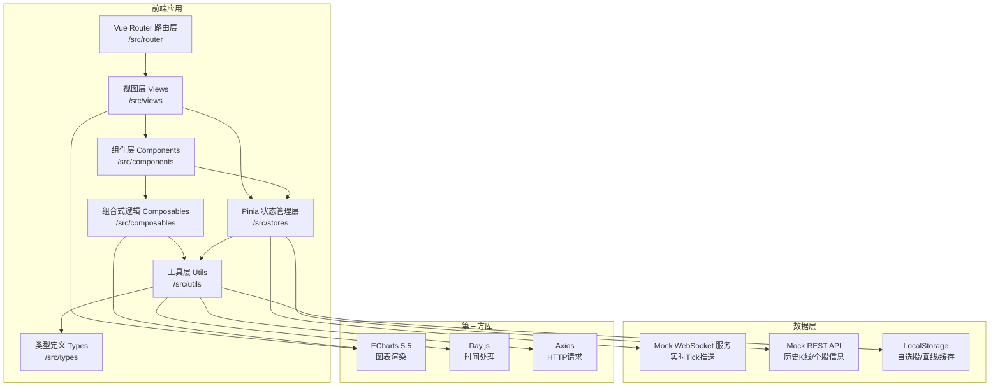

## 1. 架构设计



## 2. 技术描述

- **前端框架**：Vue 3.4+ Composition API + TypeScript 5.3+
- **构建工具**：Vite 5.0+
- **路由**：Vue Router 4.2+
- **状态管理**：Pinia 2.1+
- **图表库**：ECharts 5.5+
- **时间处理**：Day.js
- **HTTP请求**：Axios（封装Mock请求）
- **样式方案**：Tailwind CSS 3.x + CSS Variables（深色主题）
- **数据模拟**：自研Mock服务（模拟WebSocket Tick推送 + REST历史数据）

## 3. 路由定义

| 路由路径 | 页面组件 | 用途 |
|---------|---------|------|
| `/` | `Dashboard.vue` | 主看盘页面（默认入口） |
| `/replay` | `Replay.vue` | 历史盘面回放页面 |
| `/settings/alert` | `AlertSettings.vue` | 异动条件配置页面 |

## 4. 核心数据模型

### 4.1 TypeScript 类型定义

```typescript
// src/types/stock.d.ts

// 股票基础信息
interface StockInfo {
  code: string;           // 股票代码 如 '600519'
  name: string;           // 股票名称 如 '贵州茅台'
  exchange: 'SH' | 'SZ';  // 交易所
  industry?: string;      // 所属行业
  totalShares?: number;   // 总股本
  floatShares?: number;   // 流通股本
}

// K线数据
interface KLineData {
  time: number;      // 时间戳 (ms)
  open: number;      // 开盘价
  close: number;     // 收盘价
  high: number;      // 最高价
  low: number;       // 最低价
  volume: number;    // 成交量（手）
  amount?: number;   // 成交额（元）
}

// Tick逐笔数据
interface TickData {
  time: number;         // 时间戳
  price: number;        // 成交价
  volume: number;       // 成交量
  direction: 'BUY' | 'SELL' | 'NEUTRAL'; // 买卖方向
}

// 盘口档位
interface OrderBookLevel {
  price: number;   // 价格
  volume: number;  // 挂单量（手）
  orders?: number; // 挂单笔数
}

// 五档盘口
interface OrderBook {
  asks: OrderBookLevel[];  // 卖一至卖五 (倒序)
  bids: OrderBookLevel[];  // 买一至买五
}

// 实时行情快照
interface StockQuote {
  code: string;
  name: string;
  lastPrice: number;       // 最新价
  prevClose: number;       // 昨收价
  openPrice: number;       // 今开
  highPrice: number;       // 最高
  lowPrice: number;        // 最低
  change: number;          // 涨跌额
  changePercent: number;   // 涨跌幅 (%)
  volume: number;          // 成交量（手）
  amount: number;          // 成交额（元）
  turnoverRate?: number;   // 换手率 (%)
  amplitude?: number;      // 振幅 (%)
  orderBook: OrderBook;    // 五档盘口
  tick?: TickData;         // 最新Tick
}

// 自选股分组
interface WatchlistGroup {
  id: string;
  name: string;
  stocks: string[];  // 股票代码列表
}

// 异动条件
interface AlertCondition {
  id: string;
  name: string;
  enabled: boolean;
  type: 'PRICE_CHANGE' | 'TURNOVER' | 'VOLUME_BREAK' | 'PRICE_LEVEL';
  threshold: number;       // 阈值
  operator: '>' | '<' | '>=' | '<=' | '==';
  targetCodes?: string[];  // 监控标的，空表示全部自选
}

// 异动记录
interface AlertRecord {
  id: string;
  time: number;
  code: string;
  name: string;
  conditionId: string;
  type: string;
  message: string;
  value: number;
}

// 技术指标参数
interface IndicatorParams {
  MA: { periods: number[] };       // [5, 10, 20, 60]
  MACD: { fast: number; slow: number; signal: number };
  KDJ: { n: number; m1: number; m2: number };
  BOLL: { period: number; stdDev: number };
  RSI: { periods: number[] };
  VOL: {};
}

// 画线数据
interface DrawingItem {
  id: string;
  type: 'TRENDLINE' | 'PARALLEL' | 'FIBONACCI' | 'RECTANGLE';
  code: string;        // 所属股票
  points: { x: number; y: number }[];  // K线索引/价格坐标
  color: string;
  lineWidth: number;
}
```

## 5. 目录结构

```
src/
├── components/
│   ├── TickerList.vue          # 自选股列表面板
│   ├── TickerItem.vue          # 单只股票行组件
│   ├── OrderBook.vue           # 五档盘口面板
│   ├── StockInfo.vue           # 个股基本信息
│   ├── AlertBar.vue            # 底部异动消息栏
│   ├── IndicatorSelector.vue   # 指标选择器
│   ├── PeriodSwitcher.vue      # 周期切换器
│   ├── ChartToolbar.vue        # 图表工具栏（画线等）
│   ├── CrosshairInfo.vue       # 十字光标信息浮窗
│   └── AlertModal.vue          # 异动弹窗
├── views/
│   ├── StockChart.vue          # K线/分时图主视图
│   ├── Dashboard.vue           # 主看盘工作台
│   ├── Replay.vue              # 历史回放页面
│   └── AlertSettings.vue       # 异动配置页面
├── stores/
│   ├── realtimeStore.ts        # 实时行情状态（WebSocket推送处理）
│   ├── watchlistStore.ts       # 自选股分组状态
│   ├── alertStore.ts           # 异动监控与历史
│   ├── drawingStore.ts         # 画线数据状态
│   └── replayStore.ts          # 历史回放控制
├── composables/
│   ├── useTechnicalIndicator.ts # 技术指标MA/MACD/KDJ/BOLL/RSI计算
│   ├── useChartInteraction.ts  # 图表交互（缩放/平移/十字光标）
│   ├── useRealtimeTick.ts      # Tick数据订阅与处理
│   └── useDrawingTools.ts      # 画线工具逻辑
├── utils/
│   ├── dataAdapter.ts          # 第三方行情数据格式转换
│   ├── mockData.ts             # Mock数据生成器
│   ├── mockWebSocket.ts        # Mock WebSocket服务
│   ├── request.ts              # Axios请求封装
│   ├── format.ts               # 数字/时间格式化
│   └── storage.ts              # LocalStorage封装
├── types/
│   └── stock.d.ts              # 股票行情相关类型定义
├── router/
│   └── index.ts                # Vue Router配置
├── assets/
│   └── styles/
│       └── globals.css         # 全局样式与CSS变量
├── App.vue
└── main.ts
```

## 6. 性能约束实现策略

| 性能指标 | 实现方案 |
|---------|---------|
| 1000根K线渲染 < 150ms | ECharts `appendData`增量更新、`dataZoom`滑块模式、关闭不必要的动画 |
| 30只自选股刷新 ≥ 50fps | `requestAnimationFrame`批量更新DOM、CSS transform替代重排、虚拟列表（如>50只） |
| 100Tick/秒无卡顿 | Tick数据分片缓冲（16ms窗口聚合）、Web Worker计算指标、`shallowRef`减少响应式开销 |
| 内存占用 ≤ 400MB | 历史K线LRU缓存（最多30交易日）、ECharts实例复用、离屏数据定时GC |
| 首屏可交互 ≤ 2.5s | 路由懒加载、骨架屏、首屏数据LocalStorage优先、ECharts按需引入模块 |
