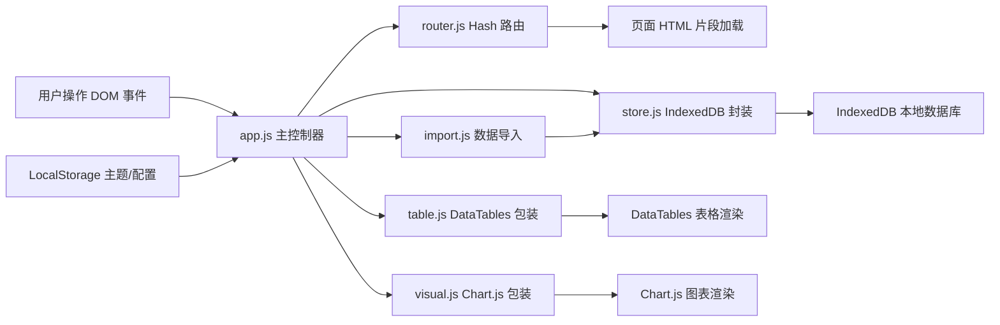

## 1. 架构设计



## 2. 技术描述

- **前端框架**：无框架，原生 JavaScript + jQuery 3.7.x
- **UI 组件库**：Bootstrap 5.3.x（卡片/模态框/表单/导航/栅格）
- **交互增强**：jQuery UI 1.13.x（autocomplete 自动补全 / sortable 列拖拽 / draggable 元素拖拽）
- **表格组件**：DataTables 1.13.x（高性能大列表、排序、过滤、分页、列重排）
- **图表库**：Chart.js 4.x（饼图/柱状图/折线图）
- **本地数据库**：IndexedDB 原生 API 封装（大容量离线存储，支持 50MB+）
- **配置存储**：LocalStorage（主题偏好、用户设置、最近访问记录）
- **构建工具**：无需构建，纯静态 HTML/CSS/JS，CDN 引入依赖
- **初始化工具**：无需，直接浏览器打开 index.html 即可运行

## 3. 路由定义

| 路由 (Hash) | 页面模板 | 用途 |
|-------------|----------|------|
| #/dashboard | dashboard.html | 首页仪表盘，数据概览与快捷入口 |
| #/inventory | inventory.html | 零件库检索与管理 |
| #/sets | sets.html | 套装登记与管理 |
| #/moc | moc.html | MOC 作品档案 |
| #/auction | auction.html | 拍卖价格追踪 |
| #/valuation | valuation.html | 库存估值可视化 |
| #/lug | lug.html | 社区活动日历 |
| #/import | import.html | CSV/XML 批量数据导入 |

## 4. 数据模型

### 4.1 数据模型 ER 图

```mermaid
erDiagram
    PART {
        string id PK "零件ID (UUID)"
        string partNumber "零件编号 (如 3001)"
        string name "零件名称"
        string color "颜色"
        string category "类别"
        string shape "形状"
        integer quantity "库存数量"
        float unitPrice "BrickLink 均价"
        string location "存放位置"
        string imageUrl "缩略图URL"
        datetime createdAt "创建时间"
        datetime updatedAt "更新时间"
    }

    SETS {
        string id PK "套装ID (UUID)"
        string setNumber "Set 编号 (如 10255-1)"
        string name "套装名称"
        string status "状态: sealed/built/moced"
        string imageUrl "封面图URL"
        integer pieceCount "零件总数"
        float purchasePrice "购入价格"
        date purchaseDate "购入日期"
        text notes "备注"
        datetime createdAt "创建时间"
    }

    SET_PART {
        string id PK
        string setId FK "关联套装ID"
        string partId FK "关联零件ID"
        integer quantity "数量"
    }

    MOC {
        string id PK "MOC ID (UUID)"
        string name "作品名称"
        string description "描述"
        integer progress "进度 0-100"
        text colorPalette "配色方案 JSON"
        datetime createdAt "创建时间"
    }

    MOC_TIMELINE {
        string id PK
        string mocId FK "关联MOC ID"
        string title "里程碑标题"
        date date "日期"
        text description "描述"
        string imageUrl "照片"
    }

    MOC_MOD_LOG {
        string id PK
        string mocId FK
        date date
        text content
    }

    MOC_PART {
        string id PK
        string mocId FK
        string partId FK
        integer quantity
    }

    AUCTION {
        string id PK
        string platform "bricklink/ebay/vinted"
        string itemId "平台商品ID"
        string title "商品标题"
        string url "商品链接"
        string status "watching/won/lost/ended"
        float currentPrice "当前价格"
        float targetPrice "目标价"
        datetime endTime "结拍时间"
        boolean notified "是否已提醒"
    }

    AUCTION_PRICE {
        string id PK
        string auctionId FK
        float price
        datetime recordedAt
    }

    EVENT {
        string id PK
        string type "lug/brickfair"
        string title "活动名称"
        date startDate
        date endDate
        string location "地点"
        text description
        string url "活动链接"
    }
```



### 4.2 IndexedDB Object Store 定义

```javascript
// 数据库名: BrickVaultDB, 版本: 1
// stores 配置:
{
  parts: { keyPath: 'id', indexes: ['partNumber', 'color', 'category', 'shape'] },
  sets: { keyPath: 'id', indexes: ['setNumber', 'status'] },
  setParts: { keyPath: 'id', indexes: ['setId', 'partId'] },
  mocs: { keyPath: 'id', indexes: ['createdAt'] },
  mocTimelines: { keyPath: 'id', indexes: ['mocId'] },
  mocModLogs: { keyPath: 'id', indexes: ['mocId', 'date'] },
  mocParts: { keyPath: 'id', indexes: ['mocId', 'partId'] },
  auctions: { keyPath: 'id', indexes: ['platform', 'status', 'endTime'] },
  auctionPrices: { keyPath: 'id', indexes: ['auctionId', 'recordedAt'] },
  events: { keyPath: 'id', indexes: ['type', 'startDate'] },
  config: { keyPath: 'key' }
}
```

## 5. 目录结构

```
/
├── index.html              # 主入口 + 路由容器 + 全局导航
├── css/
│   └── theme.css           # 自定义主题（乐高配色、暗色模式、响应式）
├── js/
│   ├── app.js              # 主控制器，事件聚合、页面初始化、全局状态
│   ├── router.js           # Hash 路由解析、页面切换、视图懒加载
│   ├── store.js            # IndexedDB Promise 封装（CRUD + 索引查询 + 事务）
│   ├── table.js            # DataTables 统一配置、列拖拽、批量导出
│   ├── import.js           # CSV/XML 解析、BrickLink 格式兼容、字段映射
│   └── visual.js           # Chart.js 工厂函数、统一配色、动画配置
├── views/
│   ├── dashboard.html      # 仪表盘
│   ├── inventory.html      # 零件库
│   ├── sets.html           # 套装管理
│   ├── moc.html            # MOC 档案
│   ├── auction.html        # 拍卖追踪
│   ├── valuation.html      # 估值可视化
│   ├── lug.html            # 社区日历
│   └── import.html         # 数据导入
└── data/
    └── seed.json           # 初始化示例数据（可选首次使用）
```

## 6. 性能约束实现方案

| 约束指标 | 目标 | 实现手段 |
|----------|------|----------|
| 5000 行零件查询 | < 300ms | IndexedDB 索引查询 + DataTables `deferRender` + 虚拟滚动 |
| IndexedDB 读写 | < 100ms | Promise 批量事务 + 索引命中 + 避免全表扫描 |
| 图表渲染 | < 500ms | Chart.js `responsive:false` 固定尺寸 + 数据点降采样 |
| 离线容量 | ≥ 50MB | IndexedDB Blob 存储 + 配额检测提示 |
| 路由切换 | < 200ms | 视图 HTML 片段预缓存 + 局部替换而非整页刷新 |
