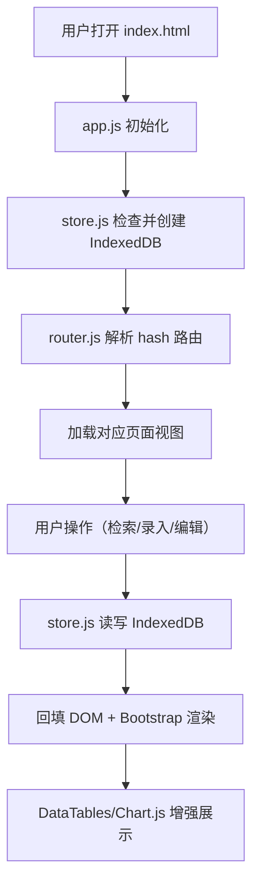

## 1. 产品概述

BrickVault 是一款面向资深乐高玩家（AFOL）的纯前端离线收藏管理工具，一站式解决零件库存检索、套装登记、MOC作品档案、拍卖价格追踪、库存估值可视化、社区活动日历等核心痛点。目标用户为拥有大量零件库存和套装的成人乐高爱好者，产品价值在于提供全离线、高性能、本地化的乐高收藏管理体验。

## 2. 核心功能

### 2.1 用户角色

| 角色 | 注册方式 | 核心权限 |
|------|----------|----------|
| 玩家用户 | 本地首次使用自动初始化 | 全部功能，数据仅存储于本地浏览器 IndexedDB |

### 2.2 功能模块

1. **零件库检索**：多维过滤（零件号/颜色/类别/形状）、秒级查询、列拖拽排序、批量勾选导出CSV
2. **套装管理**：Set编号录入自动补全、三种状态标记（未拆封/已散件/已MOC化）、一键散件入库
3. **MOC作品档案**：搭建进度时间线、改造日志、配色矩阵、零件消耗清单
4. **拍卖追踪**：多平台条目管理（BrickLink/eBay/Vinted）、价格历史折线图、逾期提醒
5. **库存估值可视化**：颜色饼图、类别柱状图、年度购置折线图、BrickLink均价估算
6. **社区活动日历**：LUG聚会和BRICKFAIR展会管理、ICS导出订阅
7. **批量导入**：兼容BrickLink CSV/XML格式数据导入

### 2.3 页面详情

| 页面名称 | 模块名称 | 功能描述 |
|----------|----------|----------|
| 首页仪表盘 | 数据概览卡片 | 库存总量、套装数量、MOC数量、估值总览 |
| 首页仪表盘 | 快捷入口 | 各功能模块快速导航 |
| 首页仪表盘 | 近期活动 | 最近操作记录、即将到来的活动 |
| 零件库 | 多维筛选器 | 零件号搜索、颜色下拉、类别选择、形状过滤 |
| 零件库 | DataTables表格 | 5000+行秒级响应、列拖拽、排序、分页 |
| 零件库 | 批量操作 | 勾选导出CSV、批量编辑属性 |
| 套装管理 | Set录入表单 | 自动补全封面、零件表、状态标记 |
| 套装管理 | 套装列表卡片 | 封面缩略图、状态标签、散件入库按钮 |
| MOC档案 | 作品时间线 | 里程碑节点、照片上传、进度百分比 |
| MOC档案 | 改造日志 | 按日期记录改模过程、版本对比 |
| MOC档案 | 配色矩阵 | 取色盘展示主配色方案 |
| MOC档案 | 零件清单 | 自动统计消耗零件、对比库存 |
| 拍卖追踪 | 条目列表 | 多平台条目、当前价格、状态标签 |
| 拍卖追踪 | 价格图表 | Chart.js折线图展示历史价格走势 |
| 拍卖追踪 | 提醒中心 | 逾期未结拍条目高亮提醒 |
| 估值可视化 | 颜色分布饼图 | 按零件颜色统计数量占比 |
| 估值可视化 | 类别柱状图 | 按零件类别统计数量分布 |
| 估值可视化 | 年度折线图 | 按购置年份统计投入趋势 |
| 估值可视化 | 估值卡片 | BrickLink均价估算总价值 |
| 社区日历 | 月视图日历 | LUG聚会、BRICKFAIR展会标记 |
| 社区日历 | 活动表单 | 增删改活动信息、地点、时间 |
| 社区日历 | ICS导出 | 生成ICS文件供日历应用订阅 |
| 数据导入 | 文件上传 | CSV/XML文件拖拽上传 |
| 数据导入 | 预览映射 | 字段映射预览、数据校验 |

## 3. 核心流程

用户打开应用 → 初始化 IndexedDB 数据库 → 通过侧边栏导航进入功能模块 → 操作数据（增删改查）→ 数据写入本地 IndexedDB → 页面回填渲染 → 导出数据时生成 CSV/ICS 文件下载

## 4. 用户界面设计

### 4.1 设计风格

- **主色调**：乐高经典红 (#E3000B) 搭配乐高黄 (#FFD700) 作为点缀，中性色采用深灰 (#2C2C2C) 到浅灰 (#F5F5F5) 渐变
- **按钮风格**：圆角 8px，乐高红主按钮配白色文字，悬停时颜色加深 15%，带微阴影提升立体感
- **字体**：标题使用 "Bricolage Grotesque"（粗旷几何感），正文使用 "Inter"（高可读性）
- **布局风格**：Bootstrap 5 卡片化布局，桌面三栏（导航/筛选/列表），平板两栏，手机单栏抽屉导航
- **图标/emoji**：使用 Font Awesome 乐高风格图标，配合 🧱 🔴 🟡 🟢 🔵 🟡 等色块 emoji 增加趣味性

### 4.2 页面设计概览

| 页面名称 | 模块名称 | UI 元素 |
|----------|----------|---------|
| 首页仪表盘 | 数据概览卡片 | 渐变色卡片背景、数字动画计数、乐高色块图标 |
| 零件库 | 筛选器区域 | 紧凑排列的多维度下拉框、搜索框带 autocomplete |
| 零件库 | 数据表格 | 斑马纹行、悬停高亮、行内操作按钮 |
| 套装管理 | 卡片网格 | 等高封面缩略图 (object-fit: cover)、状态角标 |
| MOC档案 | 时间线 | 垂直时间线节点、照片缩略图轮播 |
| 拍卖追踪 | 价格图表 | 深色背景画布、乐高红数据线、悬停数据点 |
| 估值可视化 | 图表区域 | 三色图表卡片网格、统一图例风格 |
| 社区日历 | 月历视图 | 色块事件标记、模态框详情编辑 |

### 4.3 响应式

- **桌面优先（xl/lg）**：三栏布局，左侧 250px 固定导航，中部 300px 筛选面板，右侧自适应列表区
- **平板（md）**：两栏布局，筛选面板折叠为顶部可展开区域
- **手机（sm/xs）**：单栏布局，导航抽屉式 offcanvas，筛选器折叠为 accordion
- **触摸优化**：所有可点击元素最小 44px，表格支持横向滚动

### 4.4 动效与交互

- 页面路由切换使用 200ms 淡入淡出
- 卡片悬停 8px 上浮 + 阴影增强
- 数据加载显示骨架屏 + Spinner
- 按钮点击微缩放反馈
- 图表数据点渐入动画
