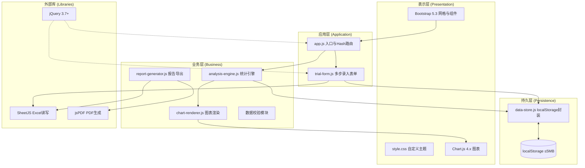
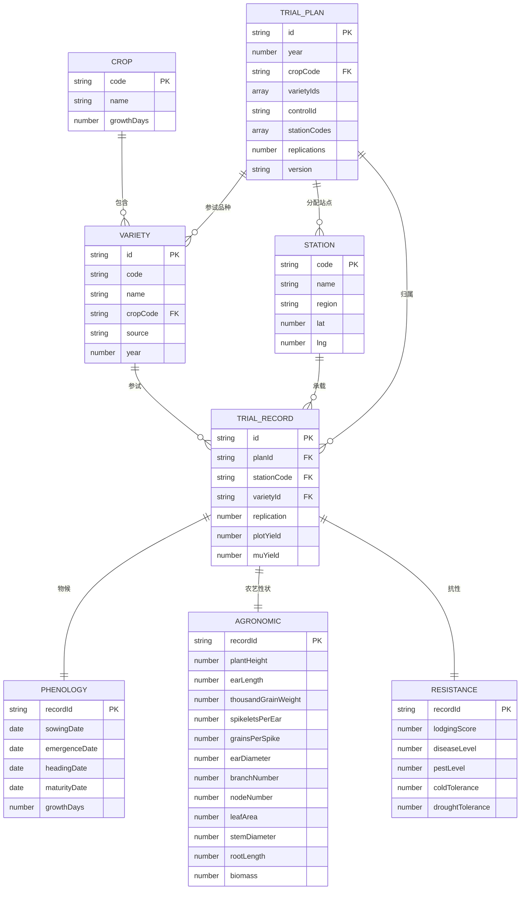

# 农作物品种区域试验管理系统 - 技术架构文档

## 1. 架构设计



**分层职责**：
- **表示层**：Bootstrap 提供响应式网格与基础组件，style.css 覆盖主题色与科研气质，Chart.js 负责图表绘制
- **应用层**：app.js 实现自研 Hash 路由分发与全局状态管理，trial-form.js 处理多步录入交互与校验
- **业务层**：analysis-engine.js 实现方差分析、变异系数、Shukla稳定性方差、AMMI双标图计算；chart-renderer.js 封装 Chart.js 配置；report-generator.js 组合 jsPDF 与 SheetJS 导出
- **持久层**：data-store.js 封装 localStorage 的品种、站点、试验数据 CRUD，按5MB上限设计3年数据共存策略

## 2. 技术说明

- **前端**：jQuery 3.7+ + Bootstrap 5.3+ + Chart.js 4.x（纯前端，无构建工具，CDN 引入）
- **数据读写**：SheetJS（Excel 批量导入导出）
- **PDF生成**：jsPDF（审定意见书导出）
- **路由**：自行实现 Hash 路由（监听 `hashchange`，按 `#/path` 分发）
- **持久化**：localStorage（封装为 data-store.js），无后端无数据库
- **初始化工具**：无需构建，静态文件直接部署，浏览器直接打开 index.html 即可运行
- **后端**：无（纯前端单页应用）

> 注：用户明确指定技术栈为 jQuery + Bootstrap + Chart.js + SheetJS + jsPDF + 自研 Hash 路由，遵循用户技术选型，不使用 React/Vite 等构建体系。

## 3. 路由定义

| 路由 | 用途 |
|-------|---------|
| `#/dashboard` | 工作台总览：统计卡片、作物分布、异常预警 |
| `#/trials` | 试验方案配置：方案列表与编辑器 |
| `#/data-entry` | 田间数据录入：多步向导表单 |
| `#/analysis` | 多点汇总分析：产量矩阵、稳定性排序 |
| `#/gge` | GGE双标图：PCA分解与双标图 |
| `#/compare` | 品种比较图表：柱状/折线/雷达图 |
| `#/reports` | 审定报告生成：预览与导出 |
| `#/validation` | 数据校验异常标注：异常列表与修正 |

**路由机制**：
- 监听 `window.hashchange` 事件
- 解析 `location.hash` 提取路径与查询参数
- 调用对应页面的 `render` 函数注入 `#app-main` 容器
- 维护全局状态（当前作物、年度、选中方案）供跨页面共享

## 4. API 定义

无后端 API。所有数据通过 data-store.js 与 localStorage 交互，提供以下数据访问接口（JS 模块方法）：

```javascript
// data-store.js 暴露的存储接口
DataStore.getCrops()                      // 获取5大作物配置
DataStore.getVarieties(crop, year)        // 按作物年度获取品种
DataStore.getStations()                   // 获取12站点
DataStore.getTrialPlans(year)             // 获取年度方案
DataStore.saveTrialPlan(plan)             // 保存方案
DataStore.getRecords(filters)            // 按条件查询试验记录
DataStore.saveRecord(record)             // 保存单条试验记录
DataStore.bulkImport(records)            // Excel批量导入
DataStore.getValidationIssues()          // 获取校验异常
DataStore.exportYear(year)               // 导出年度数据
```

## 5. 服务端架构图

不适用（纯前端单页应用，无服务端）

## 6. 数据模型

### 6.1 数据模型定义



### 6.2 数据定义语言

localStorage 以 JSON 键值对存储，根键命名约定如下（对应 data-store.js 内部结构）：

```
ct_crops           -> [{code, name, growthDays}, ...] 5大作物
ct_varieties       -> [{id, code, name, cropCode, source, year}, ...]
ct_stations        -> [{code, name, region, lat, lng}, ...] 12站点
ct_trial_plans     -> [{id, year, cropCode, varietyIds, controlId, stationCodes, replications, version}, ...]
ct_records         -> [{id, planId, stationCode, varietyId, replication, plotYield, muYield, phenology:{}, agronomic:{}, resistance:{}, status}, ...]
ct_meta            -> {currentYear, currentCrop, version}
```

**localStorage 容量策略（5MB上限）**：
- 单条试验记录约 1.5KB（含物候、12项农艺、4项抗性）
- 180品种 × 12站点 × 3重复 = 6480条/作物/年
- 5作物 × 3年 ≈ 97,200条 ≈ 145MB → 需压缩
- **优化方案**：物候日期存为时间戳数字（省字符）、农艺数值保留2位小数、按 `ct_records_{year}_{crop}` 分键存储、超限时自动归档旧年度至导出文件后清理

**初始化种子数据**：
- 5大作物（水稻/小麦/玉米/大豆/油菜）及各自参考生育天数
- 12个试验站点（含名称、区域、经纬度）
- 每作物若干示例品种与示范试验记录，便于首次进入即可演示
