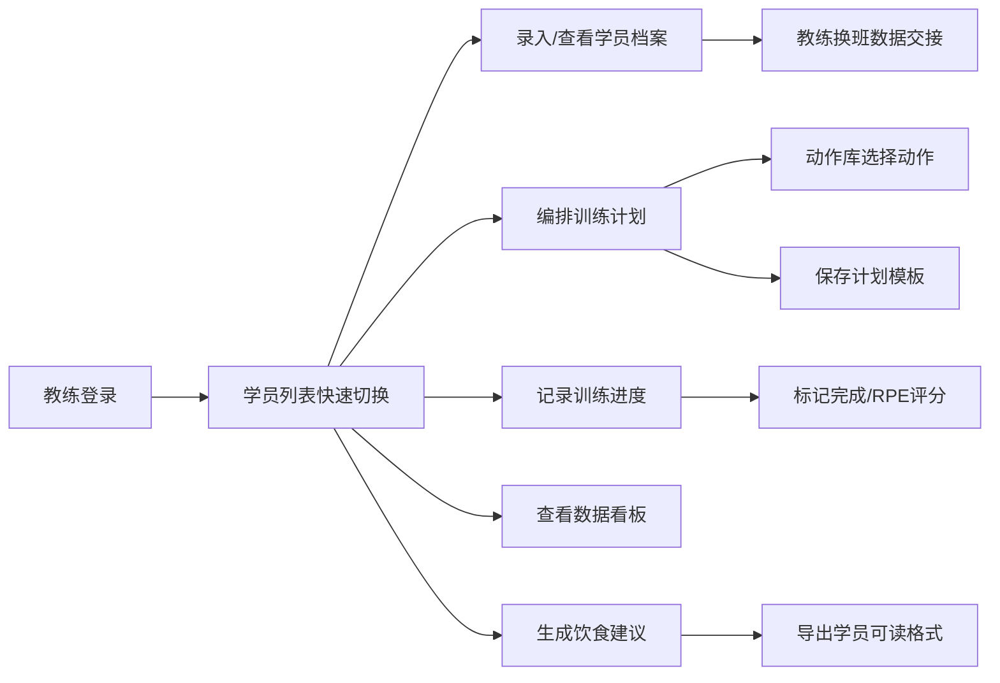

## 1. 产品概述

FitCoach Pro 是一款面向健身教练团队的私教管理系统，旨在解决 Excel 表格管理训练计划、数据分散、进度追踪困难等痛点，为800+名会员提供个性化、标准化、可视化的私教服务体验。

- 核心目标：实现学员档案数字化、训练计划标准化编排、进度数据可视化追踪，提升教练团队协作效率与会员体验
- 目标用户：健身教练团队（单人管理30-50名学员）、健身房运营者

## 2. 核心功能

### 2.1 用户角色

| 角色 | 注册方式 | 核心权限 |
|------|----------|----------|
| 健身教练 | 系统账号 | 学员管理、计划编排、数据查看、导出报表 |
| 会员（只读） | 微信链接 | 查看个人训练计划、进度数据、饮食建议 |

### 2.2 功能模块

1. **学员档案管理**：基础信息录入、体测数据记录、训练目标设定、头像/照片上传、BMI与体脂率自动评级
2. **训练计划编排器**：拖拽式周视图构建、动作库选择、组数/次数/重量/休息配置、训练容量自动计算、模板保存复用
3. **动作库管理**：300+预置标准动作、自定义动作添加、肌群/器械/难度筛选、动作说明与注意事项
4. **训练进度追踪**：每次训练记录、快速复制修改、完成状态标记、RPE主观疲劳度评分
5. **数据可视化看板**：体脂率/围度/力量趋势折线图、训练容量柱状图、目标达成环形图、时间范围筛选
6. **饮食建议模板**：按训练目标生成标准建议、自定义修改、一键导出学员可读格式

### 2.3 页面详情

| 页面名称 | 模块名称 | 功能描述 |
|----------|----------|----------|
| 学员列表页 | 虚拟滚动列表、搜索筛选、快速切换 | 千级数据流畅滚动，按姓名/标签搜索，一键切换学员上下文 |
| 学员档案页 | 基础信息卡、体测记录、照片对比、目标进度 | 表单校验身高体重范围，体测照片前后对比，自动计算BMI评级 |
| 训练计划页 | 周视图网格、拖拽排期、动作详情、模板管理 | 每日训练卡片可展开，拖拽含视觉反馈，自动计算容量与预估时长 |
| 动作库页 | 分类筛选、动作卡片、详情面板、自定义添加 | 按肌群/器械/难度多维筛选，视频链接跳转，详细说明展示 |
| 数据看板页 | 趋势折线图、容量柱状图、环形进度图、筛选器 | 响应式图表，时间范围选择，多指标对比分析 |
| 饮食建议页 | 目标模板、营养配比、自定义编辑、导出功能 | 按增肌/减脂/塑形生成模板，学员友好格式导出 |

## 3. 核心流程

教练登录系统后，从左侧快速切换学员，进入学员档案录入或查看体测数据；通过训练计划编排器拖拽构建周计划，从动作库选择动作并配置参数；每次训练后记录完成情况与RPE评分；系统自动汇总数据生成可视化看板；按需导出训练计划与饮食建议供学员微信查看。

## 4. 用户界面设计

### 4.1 设计风格

- **主色调**：深碳灰 `#0f0f12`（背景）、石墨灰 `#1a1a20`（面板）
- **强调色**：电光青 `#22d3ee`（进度指示）、活力橙 `#f97316`（关键操作）
- **辅助色**：翡翠绿 `#10b981`（完成状态）、玫红 `#f43f5e`（警告/错误）
- **按钮风格**：圆角中等（8px）、悬停发光效果、禁用态灰度
- **字体**：展示字体使用 Space Grotesk 粗体，正文字体使用 Inter 常规，数字使用 JetBrains Mono 等宽
- **布局风格**：三栏式（左侧导航固定、中间主内容自适应、右侧可展开数据面板）
- **图标**：lucide-react 线性图标，与强调色呼应

### 4.2 页面设计概览

| 页面名称 | 模块名称 | UI 元素 |
|----------|----------|---------|
| 学员列表页 | 虚拟滚动列表 | 深色卡片、头像+姓名+状态标签、悬停高亮、快速搜索框 |
| 学员档案页 | 信息卡片区 | 渐变头像框、体测指标网格、照片对比滑块、目标进度环 |
| 训练计划页 | 周视图网格 | 7列日卡片、可拖拽动作块、容量进度条、模板选择下拉 |
| 动作库页 | 动作卡片墙 | 分类标签页、缩略图卡片、悬停展开详情、收藏标记 |
| 数据看板页 | 图表区 | 渐变色面积图、分组柱状图、环形图组合、时间范围选择器 |
| 饮食建议页 | 模板编辑区 | 营养占比环形图、分餐卡片、可编辑文本块、导出按钮 |

### 4.3 响应式设计

- 桌面端（>1280px）：三栏完整布局，右侧面板可折叠
- 平板端（768-1280px）：两栏布局，右侧面板改为底部抽屉
- 移动端（<768px）：单栏堆叠，导航改为底部Tab，图表纵向排列
- 触控优化：拖拽区域≥44px，按钮点击区域适当放大

### 4.4 动效与交互

- 页面加载：骨架屏渐入 → 内容staggered淡入
- 拖拽操作：半透明跟随元素 + 放置区域高亮边框脉冲
- 图表：数据点悬停tooltip，柱形hover高度微增
- 表单校验：错误输入框抖动 + 下方文字渐显
- 面板展开/折叠：CSS transform 平滑过渡 200ms cubic-bezier
