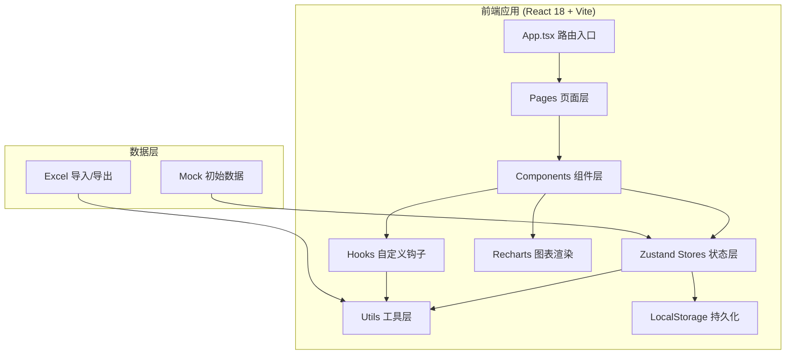
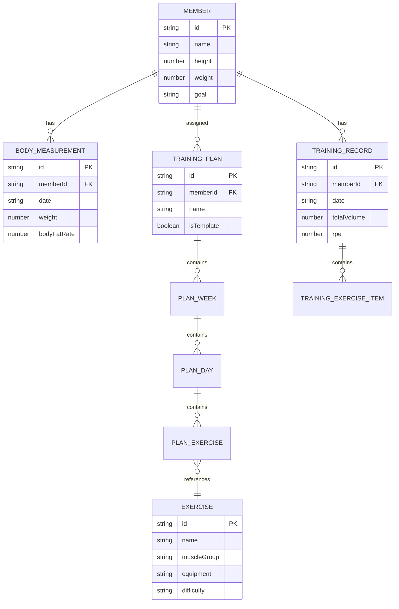

## 1. 架构设计



## 2. 技术选型说明

| 技术 | 版本 | 用途 |
|------|------|------|
| React | 18.3+ | UI 框架，并发渲染与 Suspense 支持 |
| TypeScript | 5.4+ | 类型安全开发 |
| Vite | 5.2+ | 构建工具与开发服务器 |
| React Router | 6.22+ | 客户端路由 |
| Zustand | 4.5+ | 轻量级状态管理 |
| Recharts | 2.12+ | 数据可视化图表 |
| React Hook Form | 7.51+ | 表单管理与校验 |
| TailwindCSS | 3.4+ | 原子化样式框架 |
| lucide-react | latest | 图标库 |
| @dnd-kit/core | latest | 拖拽交互（替代原生HTML5拖拽提升性能） |
| @dnd-kit/sortable | latest | 可排序列表支持 |
| @dnd-kit/utilities | latest | 拖拽工具函数 |

## 3. 路由定义

| 路由路径 | 页面组件 | 用途 |
|----------|----------|------|
| `/` | DashboardPage | 默认仪表盘，概览所有学员进度 |
| `/members` | MemberListPage | 学员列表（虚拟滚动） |
| `/members/:id` | MemberProfilePage | 学员档案详情 |
| `/members/:id/plan` | TrainingPlanPage | 训练计划编排 |
| `/members/:id/progress` | ProgressDashboardPage | 训练进度数据看板 |
| `/members/:id/diet` | DietAdvicePage | 饮食建议管理 |
| `/exercises` | ExerciseLibraryPage | 动作库管理 |
| `/templates` | PlanTemplatesPage | 训练计划模板库 |

## 4. 状态管理设计

### 4.1 memberStore.ts

```typescript
interface Member {
  id: string;
  name: string;
  avatar?: string;
  gender: 'male' | 'female';
  birthDate: string;
  height: number;
  weight: number;
  phone?: string;
  goal: 'muscle' | 'fat-loss' | 'shape' | 'strength' | 'health';
  bodyMeasurements: BodyMeasurement[];
  trainingRecords: TrainingRecord[];
  createdAt: string;
  coachId: string;
  tags: string[];
  notes?: string;
}

interface BodyMeasurement {
  id: string;
  date: string;
  weight: number;
  bodyFatRate?: number;
  muscleMass?: number;
  chest?: number;
  waist?: number;
  hip?: number;
  arm?: number;
  thigh?: number;
  bmi?: number;
  photos?: string[];
}

interface TrainingRecord {
  id: string;
  date: string;
  planId?: string;
  exercises: TrainingExerciseRecord[];
  duration: number;
  totalVolume: number;
  rpe?: number;
  completed: boolean;
  notes?: string;
}
```

### 4.2 planStore.ts

```typescript
interface TrainingPlan {
  id: string;
  memberId: string;
  name: string;
  startDate: string;
  endDate: string;
  weeks: PlanWeek[];
  isTemplate: boolean;
  createdAt: string;
}

interface PlanWeek {
  weekNumber: number;
  days: PlanDay[];
}

interface PlanDay {
  dayOfWeek: 0 | 1 | 2 | 3 | 4 | 5 | 6;
  name?: string;
  exercises: PlanExercise[];
}

interface PlanExercise {
  id: string;
  exerciseId: string;
  name: string;
  sets: number;
  reps: number;
  weight?: number;
  restSeconds: number;
  notes?: string;
}

interface Exercise {
  id: string;
  name: string;
  muscleGroup: MuscleGroup;
  equipment: Equipment;
  difficulty: 'beginner' | 'intermediate' | 'advanced';
  description: string;
  tips: string[];
  videoUrl?: string;
  isCustom: boolean;
  category: 'compound' | 'isolation' | 'cardio' | 'flexibility';
}
```

## 5. 项目目录结构

```
src/
├── App.tsx                    # 应用入口与路由配置
├── main.tsx                   # React 挂载入口
├── index.css                  # Tailwind 入口 + 全局样式
├── types/
│   └── index.ts               # 全局类型定义
├── stores/
│   ├── memberStore.ts         # 学员数据状态管理
│   ├── planStore.ts           # 训练计划状态管理
│   └── uiStore.ts             # 界面状态（右侧面板展开等）
├── pages/
│   ├── DashboardPage.tsx
│   ├── MemberListPage.tsx
│   ├── MemberProfilePage.tsx
│   ├── TrainingPlanPage.tsx
│   ├── ProgressDashboardPage.tsx
│   ├── DietAdvicePage.tsx
│   ├── ExerciseLibraryPage.tsx
│   └── PlanTemplatesPage.tsx
├── components/
│   ├── Layout/
│   │   ├── Sidebar.tsx        # 左侧导航栏
│   │   ├── MemberQuickNav.tsx # 学员快速切换
│   │   ├── RightPanel.tsx     # 右侧可展开面板
│   │   └── AppLayout.tsx      # 整体布局容器
│   ├── Member/
│   │   ├── MemberProfile.tsx  # 学员档案详情
│   │   ├── MemberCard.tsx     # 学员列表卡片
│   │   ├── BodyMeasurementForm.tsx
│   │   └── PhotoCompare.tsx   # 体测照片对比
│   ├── PlanBuilder/
│   │   ├── TrainingPlanEditor.tsx  # 训练计划编排核心
│   │   ├── WeekViewGrid.tsx
│   │   ├── DayCard.tsx
│   │   ├── ExerciseBlock.tsx
│   │   └── PlanTemplateModal.tsx
│   ├── Progress/
│   │   ├── ChartPanel.tsx     # 数据可视化面板
│   │   ├── BodyMetricsTrend.tsx
│   │   ├── VolumeBarChart.tsx
│   │   └── GoalProgressRing.tsx
│   ├── Exercise/
│   │   ├── ExerciseLibrary.tsx
│   │   ├── ExerciseCard.tsx
│   │   ├── ExerciseDetail.tsx
│   │   └── ExerciseFilter.tsx
│   ├── Diet/
│   │   ├── DietAdviceEditor.tsx
│   │   ├── MacroPieChart.tsx
│   │   └── DietExportButton.tsx
│   └── common/
│       ├── VirtualList.tsx    # 虚拟滚动列表
│       ├── StatCard.tsx
│       ├── EmptyState.tsx
│       └── LoadingSpinner.tsx
├── hooks/
│   ├── useBodyMetrics.ts      # 体测数据计算钩子
│   ├── useTrainingVolume.ts   # 训练容量计算
│   └── useVirtualScroll.ts    # 虚拟滚动钩子
├── utils/
│   ├── excelExporter.ts       # Excel/CSV导出
│   ├── dateUtils.ts
│   ├── validators.ts          # 表单校验规则
│   └── mockData.ts            # 初始Mock数据
└── assets/
    └── fonts/
```

## 6. 性能优化策略

| 优化点 | 方案 | 目标 |
|--------|------|------|
| 学员列表滚动 | Intersection Observer 虚拟滚动，仅渲染可视区±5条 | 千级数据60fps滚动 |
| 图表渲染 | Recharts isAnimationActive={false} 初次渲染后开启 | 首屏渲染<200ms |
| 拖拽操作 | @dnd-kit CSS transforms，避免频繁 re-render | 拖拽帧率≥30fps |
| 状态更新 | Zustand selectors 精细订阅，避免无效重渲染 | 组件渲染耗时<16ms |
| 本地存储 | 分片存储 + debounce 持久化，JSON 压缩可选 | 存储写入不阻塞主线程 |
| 导出功能 | Web Worker 生成 Excel Blob，进度条提示 | 导出<3秒完成 |

## 7. 数据模型 ER 图


