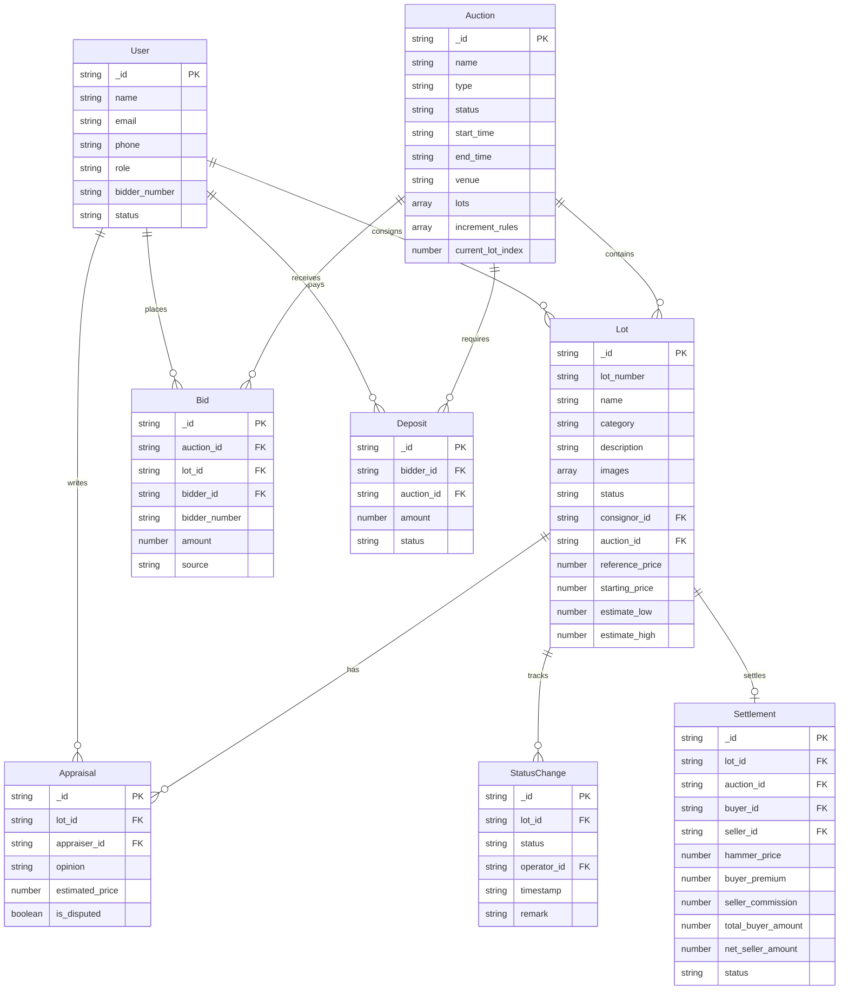

## 1. 架构设计

```mermaid
flowchart TB
    subgraph "前端层"
        "jQuery 3.7 + Bootstrap 5.3"
        "AJAX / Fetch API"
        "SortableJS 拖拽"
        "Chart.js 图表"
    end
    subgraph "后端层 - Laravel 10"
        "routes/api.php 路由"
        "JWT Auth 中间件"
        "LotController"
        "AuctionController"
        "SettlementController"
        "CatalogService"
        "AppraisalService"
        "DashboardService"
    end
    subgraph "数据层"
        "MongoDB 7.0"
        "Redis 缓存/队列"
    end
    subgraph "外部服务"
        "SMTP 邮件"
        "OSS 图片存储"
        "PDF 生成"
    end
    "jQuery 3.7 + Bootstrap 5.3" --> "AJAX / Fetch API"
    "AJAX / Fetch API" --> "routes/api.php 路由"
    "routes/api.php 路由" --> "JWT Auth 中间件"
    "JWT Auth 中间件" --> "LotController"
    "JWT Auth 中间件" --> "AuctionController"
    "JWT Auth 中间件" --> "SettlementController"
    "LotController" --> "MongoDB 7.0"
    "AuctionController" --> "MongoDB 7.0"
    "SettlementController" --> "MongoDB 7.0"
    "LotController" --> "CatalogService"
    "LotController" --> "AppraisalService"
    "AuctionController" --> "Redis 缓存/队列"
    "SettlementController" --> "Redis 缓存/队列"
    "CatalogService" --> "PDF 生成"
    "LotController" --> "OSS 图片存储"
```

## 2. 技术说明

- **前端**：jQuery 3.7 + Bootstrap 5.3 + Chart.js + SortableJS，Gulp/Webpack 构建
- **后端**：PHP 8.2 + Laravel 10，RESTful API，前后端分离
- **数据库**：MongoDB 7.0（文档型存储适合拍品多态属性），Redis 缓存与队列
- **认证**：JWT（tymon/jwt-auth），角色权限中间件
- **接口文档**：Swagger 3.0（darkaonline/l5-swagger）
- **PDF生成**：barryvdh/laravel-dompdf
- **图片存储**：本地存储 / 阿里云OSS

## 3. 路由定义

| 路由 | 方法 | 用途 | 权限 |
|------|------|------|------|
| `/api/auth/login` | POST | 用户登录 | 公开 |
| `/api/auth/register` | POST | 竞买人/委托人注册 | 公开 |
| `/api/auth/me` | GET | 获取当前用户 | JWT |
| `/api/auth/logout` | POST | 退出登录 | JWT |
| `/api/lots` | GET | 拍品列表（分页/筛选） | JWT |
| `/api/lots` | POST | 创建拍品（送拍） | JWT+运营/委托人 |
| `/api/lots/{id}` | GET | 拍品详情 | JWT |
| `/api/lots/{id}/status` | PUT | 变更拍品状态 | JWT+运营 |
| `/api/lots/{id}/appraisals` | POST | 提交鉴定意见 | JWT+鉴定师 |
| `/api/lots/{id}/appraisals/consensus` | GET | 获取会签结果 | JWT |
| `/api/auctions` | GET | 拍卖会列表 | JWT |
| `/api/auctions` | POST | 创建拍卖会 | JWT+运营 |
| `/api/auctions/{id}` | GET | 拍卖会详情 | JWT |
| `/api/auctions/{id}/lots` | GET | 拍卖会拍品列表 | JWT |
| `/api/auctions/{id}/bids` | POST | 出价 | JWT+竞买人 |
| `/api/auctions/{id}/hammer` | POST | 落槌 | JWT+拍卖师 |
| `/api/settlements` | GET | 结算列表 | JWT+运营 |
| `/api/settlements/{id}` | GET | 结算详情 | JWT |
| `/api/settlements/deposit` | POST | 缴纳保证金 | JWT+竞买人 |
| `/api/settlements/deposit/refund` | POST | 退还保证金 | JWT+系统 |
| `/api/settlements/{id}/pay` | POST | 买家付款 | JWT+竞买人 |
| `/api/catalogs/generate` | POST | 生成图录PDF | JWT+编辑 |
| `/api/catalogs/{id}/sort` | PUT | 调整图录排序 | JWT+编辑 |
| `/api/dashboard/stats` | GET | 成交率/溢价率统计 | JWT+运营 |
| `/api/dashboard/price-diff` | GET | 网络现场价差分析 | JWT+运营 |
| `/api/dashboard/commission` | GET | 佣金核算 | JWT+运营 |

## 4. API 定义

### 4.1 通用响应格式

```typescript
interface ApiResponse<T> {
  code: number
  message: string
  data: T
}

interface PaginatedResponse<T> {
  code: number
  message: string
  data: {
    items: T[]
    total: number
    page: number
    per_page: number
    last_page: number
  }
}
```

### 4.2 核心数据类型

```typescript
interface Lot {
  _id: string
  lot_number: string
  name: string
  category: "ceramics" | "painting" | "jewelry" | "antique_book" | "other"
  description: string
  images: string[]
  status: "submitted" | "appraising" | "photographed" | "cataloging" | "previewing" | "bidding" | "sold" | "passed" | "settled" | "delivered"
  consignor_id: string
  auction_id: string | null
  reference_price: number | null
  starting_price: number | null
  estimate_low: number | null
  estimate_high: number | null
  appraisals: Appraisal[]
  status_history: StatusChange[]
  created_at: string
  updated_at: string
}

interface Appraisal {
  appraiser_id: string
  appraiser_name: string
  opinion: string
  estimated_price: number
  is_disputed: boolean
  created_at: string
}

interface StatusChange {
  status: string
  operator_id: string
  operator_name: string
  timestamp: string
  remark: string
}

interface Auction {
  _id: string
  name: string
  type: "spring" | "autumn" | "monthly_online"
  status: "draft" | "preview" | "live" | "ended"
  start_time: string
  end_time: string
  venue: string
  lots: string[]
  increment_rules: IncrementRule[]
  current_lot_index: number
  created_at: string
  updated_at: string
}

interface IncrementRule {
  price_range_low: number
  price_range_high: number
  increment: number
}

interface Bid {
  _id: string
  auction_id: string
  lot_id: string
  bidder_id: string
  bidder_number: string
  amount: number
  source: "live" | "online"
  created_at: string
}

interface Settlement {
  _id: string
  lot_id: string
  auction_id: string
  buyer_id: string
  seller_id: string
  hammer_price: number
  buyer_premium: number
  seller_commission: number
  total_buyer_amount: number
  net_seller_amount: number
  deposit_amount: number
  status: "pending_payment" | "paid" | "seller_settled" | "completed" | "refunded"
  created_at: string
  updated_at: string
}

interface Deposit {
  _id: string
  bidder_id: string
  auction_id: string
  amount: number
  status: "paid" | "refunded" | "applied"
  paid_at: string
  refunded_at: string | null
}

interface User {
  _id: string
  name: string
  email: string
  phone: string
  role: "admin" | "operator" | "appraiser" | "editor" | "auctioneer" | "consignor" | "bidder"
  bidder_number: string | null
  status: "active" | "disabled"
  created_at: string
  updated_at: string
}
```

## 5. 服务端架构图

```mermaid
flowchart LR
    subgraph "Controller 层"
        "LotController"
        "AuctionController"
        "SettlementController"
        "AuthController"
        "CatalogController"
        "DashboardController"
    end
    subgraph "Service 层"
        "LotService"
        "AuctionService"
        "SettlementService"
        "CatalogService"
        "AppraisalService"
        "DashboardService"
    end
    subgraph "Model 层"
        "Lot"
        "Auction"
        "Bid"
        "Settlement"
        "Deposit"
        "User"
    end
    "LotController" --> "LotService"
    "LotController" --> "AppraisalService"
    "AuctionController" --> "AuctionService"
    "SettlementController" --> "SettlementService"
    "CatalogController" --> "CatalogService"
    "DashboardController" --> "DashboardService"
    "LotService" --> "Lot"
    "AuctionService" --> "Auction"
    "AuctionService" --> "Bid"
    "SettlementService" --> "Settlement"
    "SettlementService" --> "Deposit"
    "CatalogService" --> "Lot"
    "AppraisalService" --> "Lot"
    "DashboardService" --> "Auction"
    "DashboardService" --> "Settlement"
```

## 6. 数据模型

### 6.1 数据模型定义



### 6.2 MongoDB 索引设计

```javascript
// Lots 集合
db.lots.createIndex({ "lot_number": 1 }, { unique: true })
db.lots.createIndex({ "status": 1 })
db.lots.createIndex({ "category": 1 })
db.lots.createIndex({ "consignor_id": 1 })
db.lots.createIndex({ "auction_id": 1 })
db.lots.createIndex({ "status": 1, "category": 1 })

// Bids 集合
db.bids.createIndex({ "auction_id": 1, "lot_id": 1 })
db.bids.createIndex({ "bidder_id": 1 })
db.bids.createIndex({ "auction_id": 1, "lot_id": 1, "amount": -1 })

// Auctions 集合
db.auctions.createIndex({ "status": 1 })
db.auctions.createIndex({ "type": 1 })
db.auctions.createIndex({ "start_time": -1 })

// Settlements 集合
db.settlements.createIndex({ "lot_id": 1 })
db.settlements.createIndex({ "buyer_id": 1 })
db.settlements.createIndex({ "seller_id": 1 })
db.settlements.createIndex({ "status": 1 })

// Deposits 集合
db.deposits.createIndex({ "bidder_id": 1, "auction_id": 1 })
db.deposits.createIndex({ "status": 1 })

// Users 集合
db.users.createIndex({ "email": 1 }, { unique: true })
db.users.createIndex({ "role": 1 })
db.users.createIndex({ "bidder_number": 1 }, { sparse: true })
```

## 7. 性能设计

| 指标 | 目标 | 方案 |
|------|------|------|
| 拍品列表加载 | ≤1.5秒 | MongoDB索引+分页+Redis缓存 |
| 出价接口响应 | ≤200毫秒 | Redis原子操作+异步持久化 |
| 500人同时出价 | 稳定支持 | Redis队列+WebSocket推送 |
| 图录PDF生成 | ≤30秒 | 队列异步生成+缓存 |
| 2000笔结算对账 | 支持批量 | 批量写入+事务 |
