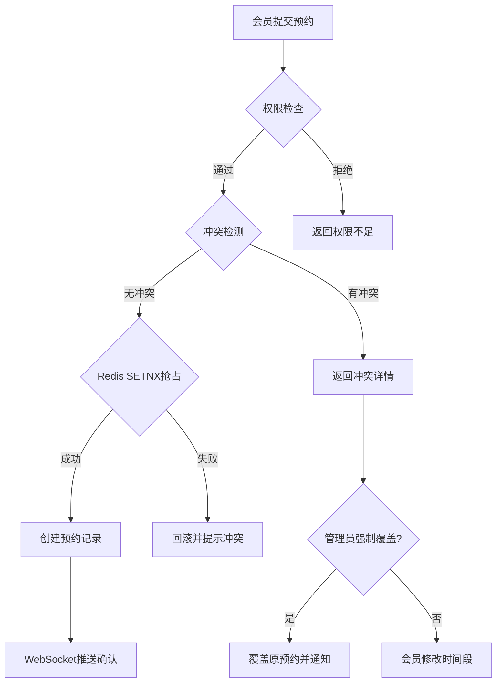
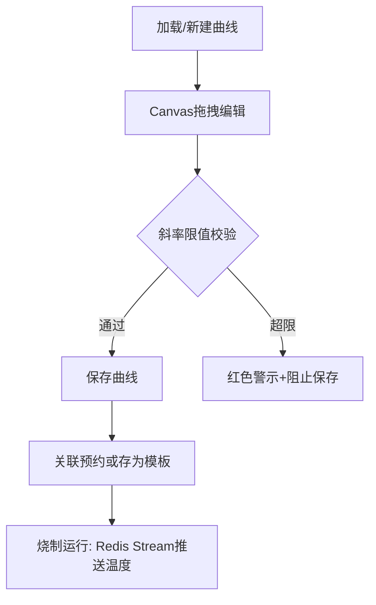

## 1. 产品概述

玻璃艺术工作室会员制运营管理系统，解决窑炉时段冲突、原料库存混乱、烧制成本难归算、冷却中作品被误开窑门等核心痛点。面向20余名活跃会员（学生、专业艺术家、短期访客）及管理员，实现窑炉智能调度、原料批次追溯、烧制成本核算与事故追溯，替代当前Excel排班与微信群抢窑位的低效模式。

## 2. 核心功能

### 2.1 用户角色

| 角色 | 注册方式 | 核心权限 |
|------|----------|----------|
| 学生会员 | 管理员邀请注册 | 预约实验窑，最长4小时/次，提前7天预约 |
| 普通会员 | 管理员邀请注册 | 预约实验窑+工作窑，最长8小时/次，提前14天预约 |
| 专业艺术家 | 管理员邀请注册 | 预约全部窑炉，最长12小时/次，提前30天预约 |
| 管理员 | 系统初始化 | 全部权限，强制覆盖排程，管理会员与设备 |

### 2.2 功能模块

1. **窑炉排程页**：24小时甘特图排程视图，拖拽预约，冲突检测，实时状态展示
2. **温度曲线编辑页**：Canvas拖拽编辑升温/保温/降温分段，斜率限值校验，模板复用
3. **原料库存页**：批次登记，FIFO出库，保质期预警，成分追溯
4. **会员管理页**：权限分级，违规记录，观察名单管理
5. **成本报表页**：烧制成本自动核算，月度财务报表PDF导出
6. **设备档案页**：窑炉健康状态，累计烧制统计，维护工单
7. **事故追溯页**：开窑记录关联作品，违规告警，事故时间线

### 2.3 页面详情

| 页面名称 | 模块名称 | 功能描述 |
|----------|----------|----------|
| 窑炉排程页 | 甘特图视图 | 横向24小时时间轴，纵向3台窑炉分组，预约块显示会员名与曲线代号，状态色区分待烧/烧制中/冷却中/已完成，冲突块红色脉冲动画，拖拽时有半透明预览 |
| 窑炉排程页 | 预约表单 | 选择窑炉、时间段、温度曲线模板，自动检测冲突，显示冷却剩余时间与装载容量 |
| 窑炉排程页 | 实时温度面板 | WebSocket推送窑温数据，ECharts实时曲线，异常温度告警 |
| 温度曲线编辑页 | Canvas编辑器 | 拖拽节点调整升温/保温/降温分段，双击节点精确设值，鼠标滚轮缩放，斜率限值实时校验 |
| 温度曲线编辑页 | 模板管理 | 保存曲线为模板，从模板加载，模板列表浏览 |
| 原料库存页 | 批次列表 | 批号、供应商、氧化成分、光谱数据，按保质期/批号筛选，临期行橙色徽章 |
| 原料库存页 | 出库操作 | FIFO自动推荐，手动选择批次，关联烧制记录 |
| 原料库存页 | 预警中心 | 过期预警，低库存预警，到货提醒 |
| 会员管理页 | 会员列表 | 姓名、角色、权限详情，预约统计，违规次数 |
| 会员管理页 | 权限配置 | 三档权限可视化编辑，可预约窑炉类型、最大提前天数、单次最长占用时长 |
| 会员管理页 | 观察名单 | 违规记录详情，自动/手动加入观察名单，观察期管理 |
| 成本报表页 | 成本明细 | 按窑炉电费曲线、原料用量、工时自动计算单件作品成本 |
| 成本报表页 | 月度报表 | 月度汇总统计，PDF导出，趋势图表 |
| 设备档案页 | 窑炉状态 | 累计烧制次数、最近维护时间、加热元件阻抗值，超阈值推送维护工单 |
| 设备档案页 | 维护工单 | 维护记录时间线，工单状态管理 |
| 事故追溯页 | 开窑记录 | 开窑门时间戳与作品关联，未达退火温度开窑自动告警 |
| 事故追溯页 | 事故时间线 | 按时间轴展示所有违规操作与告警事件 |

## 3. 核心流程

### 3.1 窑炉预约流程

1. 会员选择窑炉类型与时间段，提交预约请求
2. 系统检查会员权限（可预约窑炉类型、提前天数、占用时长）
3. 系统检测时间冲突（考虑冷却剩余时间与装载容量）
4. Redis SETNX抢占槽位，成功则创建预约，失败则回滚并提示冲突
5. WebSocket推送预约确认通知给会员
6. 如有冲突，管理员可强制覆盖排程

### 3.2 温度曲线编辑流程

1. 从模板库加载或新建曲线
2. 在Canvas编辑器中拖拽节点调整分段
3. 系统实时校验每段斜率是否超限
4. 保存为曲线模板或直接关联预约
5. 烧制运行时通过Redis Stream推送实时温度

### 3.3 事故追溯流程

1. 开窑门事件触发时间戳记录
2. 系统查询当前窑炉温度与退火曲线
3. 如温度未达退火标准，自动生成违规告警
4. 关联作品与会员，记录到事故档案
5. 重复违规会员自动进入观察名单
6. WebSocket实时推送告警给管理员

## 4. 用户界面设计

### 4.1 设计风格

- **主色**：熔岩橙 `#E8602C`，传递窑炉炽热感
- **辅色**：钢蓝 `#3B6FA0`，体现工艺精密感
- **中性色**：石墨灰 `#2D2D2D` / 暖白 `#F7F5F2`
- **状态色**：待烧 `#8C8C8C`，烧制中 `#E8602C`，冷却中 `#3B6FA0`，已完成 `#52C41A`，冲突 `#FF4D4F`
- **按钮风格**：圆角4px，hover时200ms过渡，主按钮熔岩橙底白字
- **字体**：标题用 DM Sans（600/700），正文用 Noto Sans SC（400/500），数据用 JetBrains Mono
- **布局风格**：左侧固定导航栏 + 右侧工作区，卡片式模块分组
- **图标风格**：Lucide线性图标，20px尺寸

### 4.2 页面设计概览

| 页面名称 | 模块名称 | UI元素 |
|----------|----------|--------|
| 窑炉排程页 | 甘特图视图 | 全屏甘特图，24h时间轴横向滚动，3行窑炉分组，预约块圆角卡片，冲突块红色脉冲动画，拖拽半透明预览 |
| 窑炉排程页 | 实时温度面板 | 右侧抽屉，ECharts实时折线图，温度数值大字显示，异常闪烁 |
| 温度曲线编辑页 | Canvas编辑器 | 全宽Canvas画布，网格背景，节点圆形可拖拽，连接线渐变色，悬停tooltip显示精确值 |
| 温度曲线编辑页 | 斜率校验 | 超限段红色高亮，右下角校验状态徽章 |
| 原料库存页 | 批次表格 | Ant Design表格，临期行橙色徽章，筛选器顶部固定，操作列右对齐 |
| 会员管理页 | 会员列表 | 卡片式列表，角色标签色区分，违规次数徽章 |
| 成本报表页 | 报表仪表盘 | 统计卡片顶部，ECharts柱状图+饼图，PDF导出按钮 |
| 设备档案页 | 窑炉卡片 | 3列卡片布局，健康度环形进度条，维护工单时间线 |

### 4.3 响应式设计

- **≥1440px**：三栏布局，左侧导航 + 中间工作区 + 右侧详情面板
- **1024-1440px**：两栏折叠，右侧详情面板收起为抽屉
- **<1024px**：移动端只读模式，简化审批流程，底部Tab导航

### 4.4 动效设计

- 按钮hover：200ms过渡
- 页面切换：fade-in 300ms
- 冲突块：红色脉冲动画（1.5s循环）
- 预约块拖拽：半透明预览 + 阴影提升
- 温度异常：闪烁动画
- 列表加载：骨架屏
