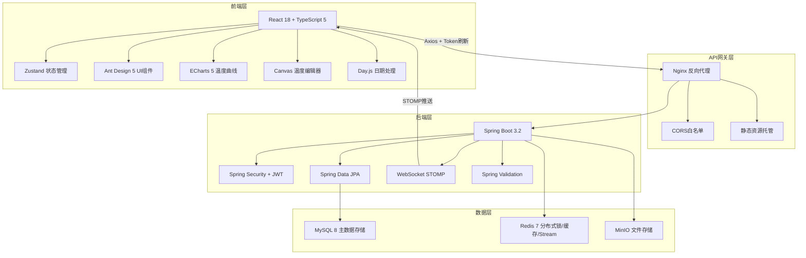
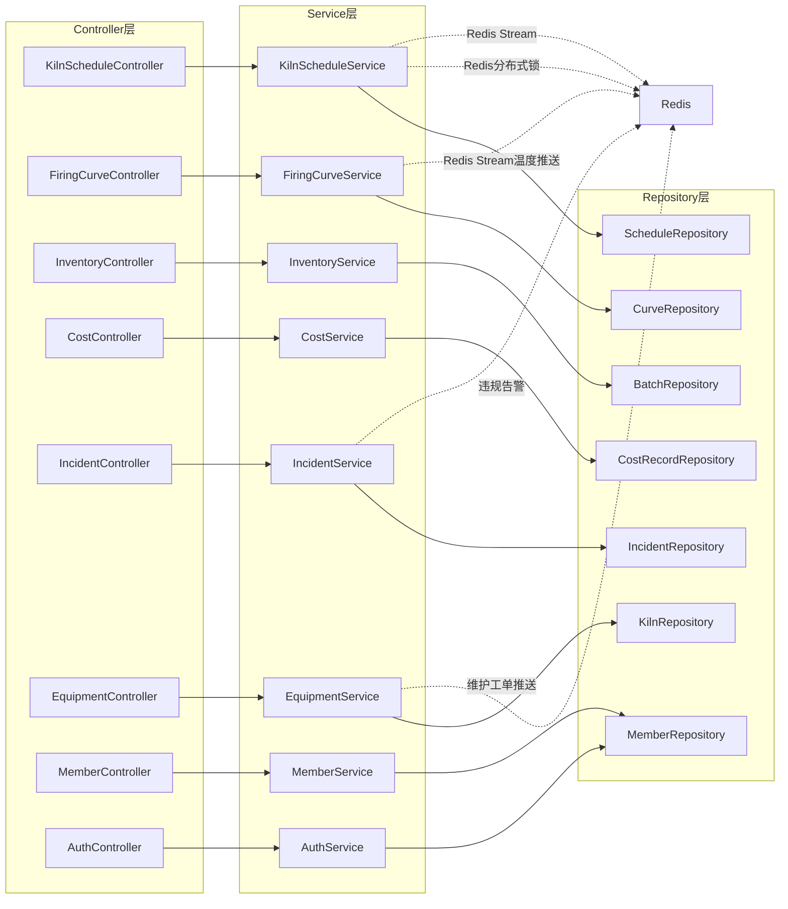
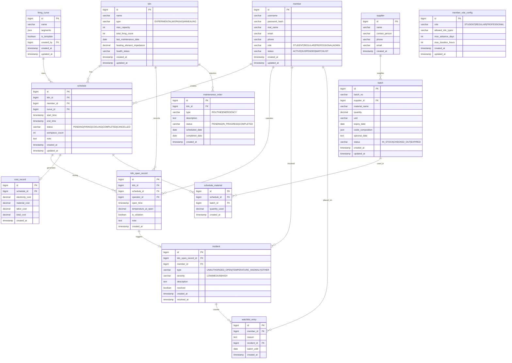

## 1. 架构设计



## 2. 技术说明

- **前端**：React@18 + TypeScript@5 + Vite@5，状态管理Zustand，UI库Ant Design@5，ECharts@5温度曲线，Day.js日期处理
- **初始化工具**：Vite + react-ts模板
- **后端**：Java 17 + Spring Boot@3.2
- **数据库**：MySQL@8（主存储），Redis@7（分布式锁/缓存/Stream实时数据）
- **文件存储**：MinIO（分块上传，单文件≤10MB）

## 3. 路由定义

| 路由 | 用途 |
|------|------|
| `/schedule` | 窑炉排程页，甘特图视图与拖拽排程 |
| `/curves` | 温度曲线编辑页，Canvas编辑器与模板管理 |
| `/inventory` | 原料库存页，批次管理与FIFO出库 |
| `/members` | 会员管理页，权限配置与观察名单 |
| `/reports` | 成本报表页，烧制成本核算与PDF导出 |
| `/equipment` | 设备档案页，窑炉健康状态与维护工单 |
| `/incidents` | 事故追溯页，开窑记录与违规告警 |
| `/settings` | 系统设置页，基础配置与通知偏好 |

## 4. API定义

### 4.1 窑炉排程 API

```typescript
interface KilnScheduleAPI {
  // GET /api/v1/schedules?kilnId=&date=&status=
  listSchedules(params: ScheduleQuery): Promise<PageResult<ScheduleVO>>;
  // POST /api/v1/schedules
  createSchedule(data: ScheduleCreateDTO): Promise<ScheduleVO>;
  // PUT /api/v1/schedules/{id}
  updateSchedule(id: number, data: ScheduleUpdateDTO): Promise<ScheduleVO>;
  // DELETE /api/v1/schedules/{id}
  deleteSchedule(id: number): Promise<void>;
  // POST /api/v1/schedules/{id}/override
  overrideSchedule(id: number, reason: string): Promise<ScheduleVO>;
}

interface ScheduleCreateDTO {
  kilnId: number;
  memberId: number;
  curveId: number;
  startTime: string;
  endTime: string;
  workpieceCount: number;
  note?: string;
}

interface ScheduleVO {
  id: number;
  kilnName: string;
  memberName: string;
  curveName: string;
  startTime: string;
  endTime: string;
  status: 'PENDING' | 'FIRING' | 'COOLING' | 'COMPLETED' | 'CONFLICT';
  workpieceCount: number;
  coolDownRemaining?: number;
  note?: string;
}
```

### 4.2 温度曲线 API

```typescript
interface FiringCurveAPI {
  // GET /api/v1/curves?keyword=
  listCurves(params: CurveQuery): Promise<PageResult<CurveVO>>;
  // POST /api/v1/curves
  createCurve(data: CurveCreateDTO): Promise<CurveVO>;
  // PUT /api/v1/curves/{id}
  updateCurve(id: number, data: CurveUpdateDTO): Promise<CurveVO>;
  // DELETE /api/v1/curves/{id}
  deleteCurve(id: number): Promise<void>;
  // POST /api/v1/curves/{id}/duplicate
  duplicateCurve(id: number, name: string): Promise<CurveVO>;
  // GET /api/v1/curves/templates
  listTemplates(): Promise<CurveVO[]>;
}

interface CurveCreateDTO {
  name: string;
  segments: CurveSegment[];
  isTemplate: boolean;
}

interface CurveSegment {
  phase: 'HEAT_UP' | 'HOLD' | 'COOL_DOWN';
  targetTemp: number;
  duration: number;
  maxSlope: number;
}
```

### 4.3 原料库存 API

```typescript
interface InventoryAPI {
  // GET /api/v1/inventories/batches?expiryWarning=&keyword=
  listBatches(params: BatchQuery): Promise<PageResult<BatchVO>>;
  // POST /api/v1/inventories/batches
  createBatch(data: BatchCreateDTO): Promise<BatchVO>;
  // PUT /api/v1/inventories/batches/{id}
  updateBatch(id: number, data: BatchUpdateDTO): Promise<BatchVO>;
  // POST /api/v1/inventories/batches/{id}/checkout
  checkoutBatch(id: number, data: CheckoutDTO): Promise<void>;
  // GET /api/v1/inventories/warnings
  listWarnings(): Promise<WarningVO[]>;
}

interface BatchCreateDTO {
  batchNo: string;
  supplierId: number;
  materialName: string;
  quantity: number;
  unit: string;
  expiryDate: string;
  oxideComposition: Record<string, number>;
  spectralData?: string;
}
```

### 4.4 烧制成本 API

```typescript
interface CostAPI {
  // GET /api/v1/costs/schedule/{scheduleId}
  getScheduleCost(scheduleId: number): Promise<CostVO>;
  // GET /api/v1/costs/monthly?year=&month=
  getMonthlyReport(params: MonthlyReportQuery): Promise<MonthlyReportVO>;
  // POST /api/v1/costs/monthly/export
  exportMonthlyPdf(params: MonthlyReportQuery): Promise<Blob>;
}

interface CostVO {
  electricityCost: number;
  materialCost: number;
  laborCost: number;
  totalCost: number;
  costPerWorkpiece: number;
}
```

### 4.5 事故追溯 API

```typescript
interface IncidentAPI {
  // GET /api/v1/incidents?date=&type=
  listIncidents(params: IncidentQuery): Promise<PageResult<IncidentVO>>;
  // POST /api/v1/incidents
  reportIncident(data: IncidentCreateDTO): Promise<IncidentVO>;
  // GET /api/v1/incidents/kiln-opens?kilnId=
  listKilnOpens(params: KilnOpenQuery): Promise<PageResult<KilnOpenVO>>;
  // POST /api/v1/incidents/kiln-opens
  recordKilnOpen(data: KilnOpenDTO): Promise<KilnOpenVO>;
}

interface KilnOpenDTO {
  kilnId: number;
  scheduleId: number;
  openTime: string;
  temperatureAtOpen: number;
  operatorId: number;
}
```

### 4.6 设备健康 API

```typescript
interface EquipmentAPI {
  // GET /api/v1/equipments/kilns
  listKilns(): Promise<KilnVO[]>;
  // GET /api/v1/equipments/kilns/{id}
  getKilnDetail(id: number): Promise<KilnDetailVO>;
  // POST /api/v1/equipments/kilns/{id}/maintenance
  createMaintenanceOrder(id: number, data: MaintenanceDTO): Promise<MaintenanceVO>;
  // GET /api/v1/equipments/kilns/{id}/maintenance
  listMaintenanceHistory(id: number): Promise<MaintenanceVO[]>;
}

interface KilnDetailVO {
  id: number;
  name: string;
  type: 'EXPERIMENTAL' | 'WORKING' | 'ANNEALING';
  maxCapacity: number;
  totalFiringCount: number;
  lastMaintenanceDate: string;
  heatingElementImpedance: number;
  healthStatus: 'HEALTHY' | 'WARNING' | 'CRITICAL';
  currentTemperature?: number;
}
```

### 4.7 会员管理 API

```typescript
interface MemberAPI {
  // GET /api/v1/members?role=&status=
  listMembers(params: MemberQuery): Promise<PageResult<MemberVO>>;
  // POST /api/v1/members
  createMember(data: MemberCreateDTO): Promise<MemberVO>;
  // PUT /api/v1/members/{id}
  updateMember(id: number, data: MemberUpdateDTO): Promise<MemberVO>;
  // PUT /api/v1/members/{id}/role
  updateRole(id: number, role: MemberRole): Promise<MemberVO>;
  // GET /api/v1/members/watchlist
  listWatchlist(): Promise<WatchlistEntryVO[]>;
  // POST /api/v1/members/{id}/watchlist
  addToWatchlist(id: number, reason: string): Promise<void>;
  // DELETE /api/v1/members/{id}/watchlist
  removeFromWatchlist(id: number): Promise<void>;
}

type MemberRole = 'STUDENT' | 'REGULAR' | 'PROFESSIONAL' | 'ADMIN';
```

### 4.8 WebSocket 通道

```typescript
interface WSChannels {
  // /topic/temperature/{kilnId} - 窑温实时数据
  temperatureUpdate: { kilnId: number; temperature: number; timestamp: string };
  // /topic/schedule/update - 排程变更通知
  scheduleUpdate: { scheduleId: number; status: string; message: string };
  // /topic/alert - 告警通知
  alert: { type: 'TEMPERATURE_ANOMALY' | 'UNAUTHORIZED_OPEN' | 'MAINTENANCE_DUE'; message: string };
  // /user/queue/notifications - 个人通知
  personalNotification: { type: string; title: string; content: string };
}
```

## 5. 后端架构图



## 6. 数据模型

### 6.1 数据模型定义



### 6.2 数据定义语言

```sql
CREATE TABLE member_role_config (
    id BIGINT AUTO_INCREMENT PRIMARY KEY,
    role VARCHAR(20) NOT NULL UNIQUE,
    allowed_kiln_types VARCHAR(100) NOT NULL,
    max_advance_days INT NOT NULL,
    max_duration_hours INT NOT NULL,
    created_at TIMESTAMP DEFAULT CURRENT_TIMESTAMP,
    updated_at TIMESTAMP DEFAULT CURRENT_TIMESTAMP ON UPDATE CURRENT_TIMESTAMP
);

INSERT INTO member_role_config (role, allowed_kiln_types, max_advance_days, max_duration_hours) VALUES
('STUDENT', 'EXPERIMENTAL', 7, 4),
('REGULAR', 'EXPERIMENTAL,WORKING', 14, 8),
('PROFESSIONAL', 'EXPERIMENTAL,WORKING,ANNEALING', 30, 12);

CREATE TABLE kiln (
    id BIGINT AUTO_INCREMENT PRIMARY KEY,
    name VARCHAR(50) NOT NULL,
    type VARCHAR(20) NOT NULL,
    max_capacity INT NOT NULL,
    total_firing_count INT DEFAULT 0,
    last_maintenance_date DATE,
    heating_element_impedance DECIMAL(8,2),
    health_status VARCHAR(10) DEFAULT 'HEALTHY',
    created_at TIMESTAMP DEFAULT CURRENT_TIMESTAMP,
    updated_at TIMESTAMP DEFAULT CURRENT_TIMESTAMP ON UPDATE CURRENT_TIMESTAMP
);

INSERT INTO kiln (name, type, max_capacity, heating_element_impedance) VALUES
('实验窑', 'EXPERIMENTAL', 5, 12.50),
('工作窑', 'WORKING', 15, 8.30),
('退火窑', 'ANNEALING', 10, 10.20);

CREATE TABLE member (
    id BIGINT AUTO_INCREMENT PRIMARY KEY,
    username VARCHAR(50) NOT NULL UNIQUE,
    password_hash VARCHAR(255) NOT NULL,
    real_name VARCHAR(50) NOT NULL,
    email VARCHAR(100),
    phone VARCHAR(20),
    role VARCHAR(20) NOT NULL DEFAULT 'STUDENT',
    status VARCHAR(20) NOT NULL DEFAULT 'ACTIVE',
    created_at TIMESTAMP DEFAULT CURRENT_TIMESTAMP,
    updated_at TIMESTAMP DEFAULT CURRENT_TIMESTAMP ON UPDATE CURRENT_TIMESTAMP
);

CREATE TABLE firing_curve (
    id BIGINT AUTO_INCREMENT PRIMARY KEY,
    name VARCHAR(100) NOT NULL,
    segments JSON NOT NULL,
    is_template BOOLEAN DEFAULT FALSE,
    created_by BIGINT,
    created_at TIMESTAMP DEFAULT CURRENT_TIMESTAMP,
    updated_at TIMESTAMP DEFAULT CURRENT_TIMESTAMP ON UPDATE CURRENT_TIMESTAMP,
    FOREIGN KEY (created_by) REFERENCES member(id)
);

CREATE TABLE schedule (
    id BIGINT AUTO_INCREMENT PRIMARY KEY,
    kiln_id BIGINT NOT NULL,
    member_id BIGINT NOT NULL,
    curve_id BIGINT NOT NULL,
    start_time TIMESTAMP NOT NULL,
    end_time TIMESTAMP NOT NULL,
    status VARCHAR(20) NOT NULL DEFAULT 'PENDING',
    workpiece_count INT DEFAULT 1,
    note TEXT,
    created_at TIMESTAMP DEFAULT CURRENT_TIMESTAMP,
    updated_at TIMESTAMP DEFAULT CURRENT_TIMESTAMP ON UPDATE CURRENT_TIMESTAMP,
    FOREIGN KEY (kiln_id) REFERENCES kiln(id),
    FOREIGN KEY (member_id) REFERENCES member(id),
    FOREIGN KEY (curve_id) REFERENCES firing_curve(id),
    INDEX idx_schedule_kiln_time (kiln_id, start_time, end_time),
    INDEX idx_schedule_member (member_id),
    INDEX idx_schedule_status (status)
);

CREATE TABLE supplier (
    id BIGINT AUTO_INCREMENT PRIMARY KEY,
    name VARCHAR(100) NOT NULL,
    contact_person VARCHAR(50),
    phone VARCHAR(20),
    email VARCHAR(100),
    created_at TIMESTAMP DEFAULT CURRENT_TIMESTAMP
);

CREATE TABLE batch (
    id BIGINT AUTO_INCREMENT PRIMARY KEY,
    batch_no VARCHAR(50) NOT NULL UNIQUE,
    supplier_id BIGINT,
    material_name VARCHAR(100) NOT NULL,
    quantity DECIMAL(10,2) NOT NULL,
    unit VARCHAR(20) NOT NULL,
    expiry_date DATE,
    oxide_composition JSON,
    spectral_data TEXT,
    status VARCHAR(20) NOT NULL DEFAULT 'IN_STOCK',
    created_at TIMESTAMP DEFAULT CURRENT_TIMESTAMP,
    updated_at TIMESTAMP DEFAULT CURRENT_TIMESTAMP ON UPDATE CURRENT_TIMESTAMP,
    FOREIGN KEY (supplier_id) REFERENCES supplier(id),
    INDEX idx_batch_status (status),
    INDEX idx_batch_expiry (expiry_date)
);

CREATE TABLE schedule_material (
    id BIGINT AUTO_INCREMENT PRIMARY KEY,
    schedule_id BIGINT NOT NULL,
    batch_id BIGINT NOT NULL,
    quantity_used DECIMAL(10,2) NOT NULL,
    created_at TIMESTAMP DEFAULT CURRENT_TIMESTAMP,
    FOREIGN KEY (schedule_id) REFERENCES schedule(id),
    FOREIGN KEY (batch_id) REFERENCES batch(id)
);

CREATE TABLE kiln_open_record (
    id BIGINT AUTO_INCREMENT PRIMARY KEY,
    kiln_id BIGINT NOT NULL,
    schedule_id BIGINT,
    operator_id BIGINT NOT NULL,
    open_time TIMESTAMP NOT NULL,
    temperature_at_open DECIMAL(8,2),
    is_violation BOOLEAN DEFAULT FALSE,
    note TEXT,
    created_at TIMESTAMP DEFAULT CURRENT_TIMESTAMP,
    FOREIGN KEY (kiln_id) REFERENCES kiln(id),
    FOREIGN KEY (schedule_id) REFERENCES schedule(id),
    FOREIGN KEY (operator_id) REFERENCES member(id),
    INDEX idx_kiln_open_time (kiln_id, open_time)
);

CREATE TABLE incident (
    id BIGINT AUTO_INCREMENT PRIMARY KEY,
    kiln_open_record_id BIGINT,
    member_id BIGINT NOT NULL,
    type VARCHAR(30) NOT NULL,
    severity VARCHAR(10) NOT NULL DEFAULT 'MEDIUM',
    description TEXT,
    resolved BOOLEAN DEFAULT FALSE,
    created_at TIMESTAMP DEFAULT CURRENT_TIMESTAMP,
    resolved_at TIMESTAMP,
    FOREIGN KEY (kiln_open_record_id) REFERENCES kiln_open_record(id),
    FOREIGN KEY (member_id) REFERENCES member(id),
    INDEX idx_incident_member (member_id),
    INDEX idx_incident_type (type)
);

CREATE TABLE maintenance_order (
    id BIGINT AUTO_INCREMENT PRIMARY KEY,
    kiln_id BIGINT NOT NULL,
    type VARCHAR(20) NOT NULL,
    description TEXT,
    status VARCHAR(20) NOT NULL DEFAULT 'PENDING',
    scheduled_date DATE,
    completed_date DATE,
    created_at TIMESTAMP DEFAULT CURRENT_TIMESTAMP,
    FOREIGN KEY (kiln_id) REFERENCES kiln(id),
    INDEX idx_maintenance_kiln (kiln_id)
);

CREATE TABLE cost_record (
    id BIGINT AUTO_INCREMENT PRIMARY KEY,
    schedule_id BIGINT NOT NULL,
    electricity_cost DECIMAL(10,2) NOT NULL,
    material_cost DECIMAL(10,2) NOT NULL,
    labor_cost DECIMAL(10,2) NOT NULL,
    total_cost DECIMAL(10,2) NOT NULL,
    created_at TIMESTAMP DEFAULT CURRENT_TIMESTAMP,
    FOREIGN KEY (schedule_id) REFERENCES schedule(id)
);

CREATE TABLE watchlist_entry (
    id BIGINT AUTO_INCREMENT PRIMARY KEY,
    member_id BIGINT NOT NULL,
    reason TEXT NOT NULL,
    incident_id BIGINT,
    watch_until DATE,
    created_at TIMESTAMP DEFAULT CURRENT_TIMESTAMP,
    FOREIGN KEY (member_id) REFERENCES member(id),
    FOREIGN KEY (incident_id) REFERENCES incident(id)
);
```
