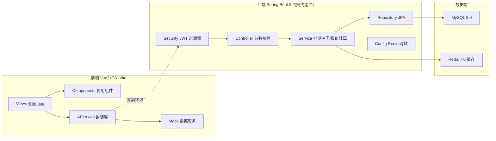
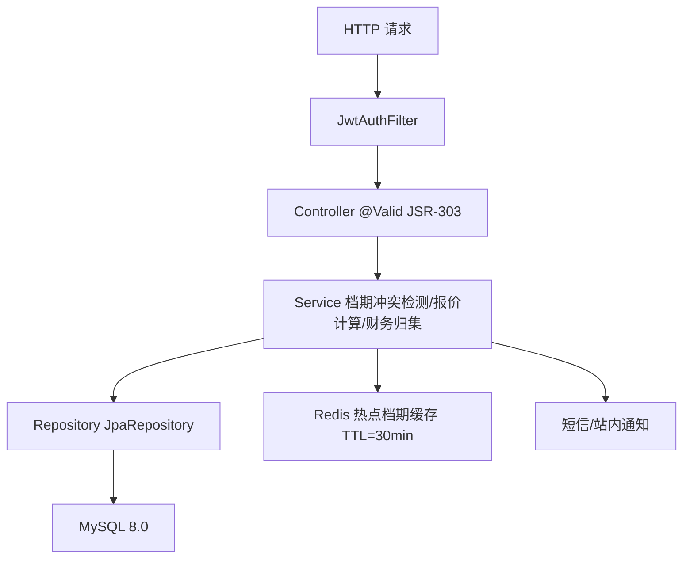
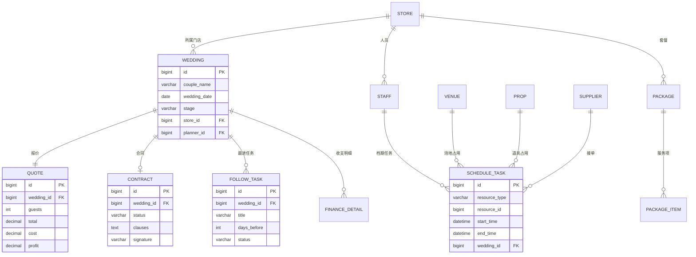

# 婚庆服务全流程数字化管理系统 — 技术架构文档

## 1. 架构设计

本系统采用前后端分离架构。前端为 Vue 3.4 + TypeScript 5.0 + Vite 5.0 单页应用；后端为 Java 17 + Spring Boot 3.2（Spring Security + Spring Data JPA + Redis 7.0 + MySQL 8.0）。本次交付以前端为主，通过 mock 数据层完整模拟后端 API 契约，保证前端全功能可运行，并保留与真实 Java 后端无缝对接的接口定义。



## 2. 技术说明

- **前端**：Vue@3.4 + TypeScript@5.0 + Vite@5.0，Vue Router@4，Pinia 状态管理，Axios 请求封装，Tailwind CSS@3 原子化样式（配合 CSS 变量主题），ECharts 图表，VueUse 工具集，unplugin 自动导入。
- **初始化工具**：vite-init（`npm create vite@latest`，vue-ts 模板）。
- **后端（契约定义，本次以 mock 实现）**：Java 17 + Spring Boot 3.2 + Spring Security + Spring Data JPA + Redis 7.0 + MySQL 8.0 + Maven 3.9。
- **数据**：前端内置 mock 数据（localStorage 持久化），结构对齐 MySQL 表设计；后端真实环境使用 MySQL 8.0 + Redis 7.0 缓存热点档期（TTL 30 分钟）。
- **认证**：JWT（前端拦截器携带 Bearer Token，mock 层模拟签发与角色权限）。

## 3. 路由定义

| 路由 | 页面 | 访问角色 | 说明 |
|------|------|----------|------|
| `/login` | 登录页 | 全部 | 主系统登录，选择角色 |
| `/supplier-login` | 供应商登录 | 供应商 | 供应商门户独立入口 |
| `/dashboard` | 工作台 | 主系统 | KPI 总览 |
| `/schedule` | 档期日历 | 主系统 | 资源档期与冲突检测 |
| `/weddings` | 婚礼列表 | 主系统 | 婚礼项目列表 |
| `/weddings/create` | 创建婚礼向导 | 主系统 | 分步创建 |
| `/weddings/:id` | 婚礼详情 | 主系统 | 6 阶段详情 |
| `/packages` | 套餐模板库 | 主系统 | 套餐模板管理 |
| `/pricing` | 报价计算器 | 主系统 | 动态报价 |
| `/contracts` | 合同列表 | 主系统 | 合同管理 |
| `/contracts/:id` | 合同编辑签署 | 主系统 | 在线签署 |
| `/followup` | 客户跟进 | 主系统 | 倒计时任务清单 |
| `/finance` | 财务核算 | 主系统 | 收支与预警 |
| `/reports` | 报表统计 | 主系统 | 统计与导出 |
| `/settings` | 基础设置 | 主系统 | 字典维护 |
| `/portal/dashboard` | 供应商工作台 | 供应商 | 档期与接单 |
| `/portal/orders` | 供应商订单 | 供应商 | 已接订单与凭证 |

## 4. API 定义

前端 Axios 封装统一前缀 `/api`，mock 层按下列契约返回。真实环境对应 Spring Boot Controller。

```typescript
// 通用响应
interface ApiResponse<T> { code: number; message: string; data: T }

// 认证
POST /api/auth/login          { username, password, role } -> { token, user }
POST /api/auth/supplier-login { phone, code } -> { token, supplier }

// 档期
GET  /api/schedule?resourceType=STAFF|VENUE|PROP&storeId&from&to -> ScheduleTask[]
POST /api/schedule/check { resourceType, resourceId, start, end } -> { conflict: boolean, alternatives: Resource[] }
PUT  /api/schedule/:taskId/move { start, end } -> ScheduleTask

// 婚礼
GET  /api/weddings?stage&storeId&date -> Wedding[]
POST /api/weddings { couple, weddingDate, storeId, packageId, resources } -> Wedding
GET  /api/weddings/:id -> Wedding
PUT  /api/weddings/:id/stage { stage } -> Wedding

// 套餐与报价
GET  /api/packages -> Package[]
POST /api/pricing/calc { packageId, guests, serviceIds[], addons[], storeId } -> Quote{ items[], cost, profit, total }

// 合同
GET  /api/contracts?status -> Contract[]
POST /api/contracts/draft { weddingId, packageId } -> Contract
PUT  /api/contracts/:id { clauses[] } -> Contract
POST /api/contracts/:id/sign { signature } -> Contract

// 客户跟进
GET  /api/followup/:weddingId -> { countdown, tasks[], timeline[], files[] }
PUT  /api/followup/tasks/:id { status } -> Task

// 财务
GET  /api/finance/wedding/:id -> FinanceDetail
GET  /api/finance/monthly?storeId&month -> MonthlyStat
GET  /api/finance/overdue -> OverdueItem[]

// 报表
GET  /api/reports/revenue?from&to&storeId -> RevenuePoint[]
GET  /api/reports/funnel?storeId -> FunnelData
GET  /api/reports/satisfaction?storeId -> ScoreData

// 供应商门户
GET  /api/portal/schedule -> ScheduleTask[]
GET  /api/portal/orders -> SupplierOrder[]
POST /api/portal/orders/:id/confirm -> SupplierOrder
POST /api/portal/orders/:id/voucher { fileUrl } -> SupplierOrder
```

## 5. 后端服务架构图（契约）



## 6. 数据模型

### 6.1 数据模型定义



### 6.2 数据定义语言（核心表，对齐后端 MySQL）

```sql
CREATE TABLE store (
  id BIGINT PRIMARY KEY AUTO_INCREMENT,
  name VARCHAR(64) NOT NULL,
  discount_coefficient DECIMAL(4,2) DEFAULT 1.00,
  created_at DATETIME DEFAULT CURRENT_TIMESTAMP
);

CREATE TABLE staff (
  id BIGINT PRIMARY KEY AUTO_INCREMENT,
  store_id BIGINT NOT NULL,
  name VARCHAR(32) NOT NULL,
  role VARCHAR(32) NOT NULL,
  phone VARCHAR(20),
  KEY idx_store (store_id)
);

CREATE TABLE wedding (
  id BIGINT PRIMARY KEY AUTO_INCREMENT,
  couple_name VARCHAR(64) NOT NULL,
  wedding_date DATE NOT NULL,
  stage VARCHAR(32) NOT NULL,
  store_id BIGINT NOT NULL,
  planner_id BIGINT,
  created_at DATETIME DEFAULT CURRENT_TIMESTAMP,
  KEY idx_store_date (store_id, wedding_date)
);

CREATE TABLE schedule_task (
  id BIGINT PRIMARY KEY AUTO_INCREMENT,
  resource_type VARCHAR(16) NOT NULL,
  resource_id BIGINT NOT NULL,
  wedding_id BIGINT,
  start_time DATETIME NOT NULL,
  end_time DATETIME NOT NULL,
  KEY idx_resource_time (resource_type, resource_id, start_time, end_time)
);

CREATE TABLE package (
  id BIGINT PRIMARY KEY AUTO_INCREMENT,
  name VARCHAR(64) NOT NULL,
  base_price DECIMAL(10,2) NOT NULL
);

CREATE TABLE quote (
  id BIGINT PRIMARY KEY AUTO_INCREMENT,
  wedding_id BIGINT NOT NULL,
  guests INT NOT NULL,
  total DECIMAL(10,2) NOT NULL,
  cost DECIMAL(10,2) NOT NULL,
  profit DECIMAL(10,2) NOT NULL
);

CREATE TABLE contract (
  id BIGINT PRIMARY KEY AUTO_INCREMENT,
  wedding_id BIGINT NOT NULL,
  status VARCHAR(16) NOT NULL,
  clauses TEXT,
  signature VARCHAR(255),
  signed_at DATETIME
);
```

### 6.3 前端目录结构

```
src/
├── api/              # Axios 封装与各模块接口
│   ├── request.ts
│   ├── auth.ts schedule.ts weddings.ts packages.ts pricing.ts
│   ├── contracts.ts followup.ts finance.ts reports.ts portal.ts
├── mock/             # mock 数据服务（模拟后端契约）
│   ├── index.ts db.ts data.ts handlers.ts
├── views/            # 业务页面（按模块组织）
│   ├── dashboard/ schedule/ weddings/ packages/ pricing/
│   ├── contracts/ followup/ finance/ reports/ settings/ portal/ login/
├── components/       # 可复用组件
│   ├── layout/ ui/ charts/ calendar/ common/
├── router/           # 路由
├── stores/           # Pinia
├── types/            # TS 类型定义
├── utils/            # 工具（档期冲突检测算法、报价计算）
└── assets/ styles/   # 样式与资源
```
