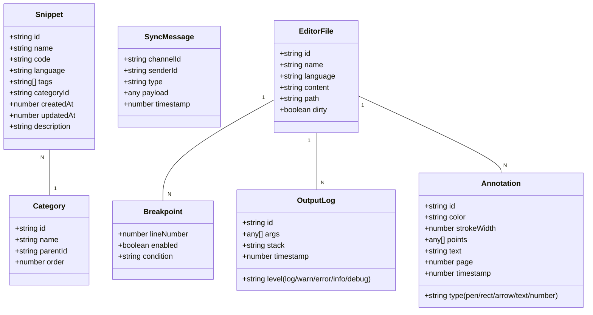

## 1. 架构设计

```mermaid
flowchart TB
    subgraph "表示层 (Views)"
        App["App.vue 根组件"]
        MainLayout["MainLayout.vue 主布局"]
        PresentationView["PresentationView.vue 演示模式视图"]
    end

    subgraph "组件层 (Components)"
        CodeEditor["CodeEditor.vue 编辑器"]
        StepRunner["StepRunner.vue 分步执行"]
        SnippetPanel["SnippetPanel.vue 片段面板"]
        LiveAnnotation["LiveAnnotation.vue 标注层"]
        SyncBoard["SyncBoard.vue 同步面板"]
        OutputConsole["OutputConsole.vue 输出控制台"]
        StatusBar["StatusBar.vue 状态栏"]
        ToolBar["ToolBar.vue 顶部工具栏"]
    end

    subgraph "状态层 (Stores)"
        EditorStore["editorStore 编辑器状态"]
        SnippetStore["snippetStore 片段状态"]
        StepStore["stepStore 执行状态"]
        AnnotationStore["annotationStore 标注状态"]
        SyncStore["syncStore 同步状态"]
        OutputStore["outputStore 输出状态"]
        ThemeStore["themeStore 主题状态"]
    end

    subgraph "组合层 (Composables)"
        UseMonaco["useMonaco 编辑器封装"]
        UseStepRunner["useStepRunner 执行引擎"]
        UseAnnotation["useAnnotation 绘制逻辑"]
        UseSync["useSync 通道管理"]
        UseExecution["useExecution JS执行沙箱"]
    end

    subgraph "工具层 (Utils)"
        Storage["storage 本地存储封装"]
        Validator["validator 表单校验"]
        Highlight["highlight 语法高亮工具"]
        Anim["anim GSAP动画辅助"]
    end

    subgraph "类型层 (Types)"
        Types["types/index.ts 全局类型定义"]
    end

    App --> MainLayout
    App --> PresentationView
    MainLayout --> CodeEditor
    MainLayout --> StepRunner
    MainLayout --> SnippetPanel
    MainLayout --> LiveAnnotation
    MainLayout --> SyncBoard
    MainLayout --> OutputConsole
    MainLayout --> StatusBar
    MainLayout --> ToolBar

    CodeEditor --> UseMonaco
    StepRunner --> UseStepRunner
    LiveAnnotation --> UseAnnotation
    SyncBoard --> UseSync
    OutputConsole --> UseExecution

    EditorStore --> UseMonaco
    SnippetStore --> Storage
    AnnotationStore --> UseAnnotation
    SyncStore --> UseSync
    OutputStore --> UseExecution

    Validator --> SnippetStore
    Highlight --> UseMonaco
    Anim --> CodeEditor
    Anim --> StepRunner
    Anim --> LiveAnnotation
```



## 2. 技术选型说明

| 层级   | 技术              | 版本      | 用途                      |
| ---- | --------------- | ------- | ----------------------- |
| 框架   | Vue             | 3.4.x   | 响应式UI框架，Composition API |
| 语言   | TypeScript      | 5.3.x   | 静态类型检查                  |
| 构建   | Vite            | 5.0.x   | 开发构建工具，HMR              |
| 编辑器  | Monaco Editor   | 0.45.x  | VSCode同款代码编辑器核心         |
| 语法高亮 | highlight.js    | 11.9.x  | 代码导出/预览高亮               |
| 动画   | GSAP            | 3.12.x  | 高性能动画引擎                 |
| 状态管理 | Pinia           | 2.1.x   | Vue官方状态管理               |
| 样式   | Tailwind CSS    | 3.4.x   | 原子化CSS                  |
| 图标   | Lucide Vue Next | 0.312.x | 现代线条图标库                 |

## 3. 目录结构

```
src/
├── components/              # 组件目录
│   ├── editor/             # 编辑器相关
│   │   ├── CodeEditor.vue
│   │   ├── EditorTabs.vue
│   │   └── EditorToolbar.vue
│   ├── step-runner/        # 分步执行
│   │   ├── StepRunner.vue
│   │   ├── StepControls.vue
│   │   └── BreakpointMarker.vue
│   ├── snippets/           # 代码片段
│   │   ├── SnippetPanel.vue
│   │   ├── SnippetList.vue
│   │   ├── SnippetForm.vue
│   │   └── CategoryTree.vue
│   ├── annotation/         # 实时标注
│   │   ├── LiveAnnotation.vue
│   │   ├── AnnotationToolbar.vue
│   │   └── AnnotationPresets.vue
│   ├── sync/               # 多标签同步
│   │   └── SyncBoard.vue
│   ├── output/             # 输出控制台
│   │   ├── OutputConsole.vue
│   │   └── OutputLogItem.vue
│   ├── layout/             # 布局组件
│   │   ├── MainLayout.vue
│   │   ├── StatusBar.vue
│   │   ├── ToolBar.vue
│   │   ├── ResizableSidebar.vue
│   │   └── ResizablePanel.vue
│   └── common/             # 通用组件
│       ├── BaseDialog.vue
│       ├── BaseButton.vue
│       ├── BaseInput.vue
│       └── BaseTag.vue
├── composables/            # 组合函数
│   ├── useMonaco.ts
│   ├── useStepRunner.ts
│   ├── useAnnotation.ts
│   ├── useSync.ts
│   ├── useExecution.ts
│   ├── usePresentation.ts
│   └── useShortcuts.ts
├── stores/                 # Pinia stores
│   ├── editor.ts
│   ├── snippets.ts
│   ├── step.ts
│   ├── annotation.ts
│   ├── sync.ts
│   ├── output.ts
│   └── theme.ts
├── utils/                  # 工具函数
│   ├── storage.ts
│   ├── validator.ts
│   ├── highlight.ts
│   ├── anim.ts
│   └── file.ts
├── types/                  # 类型定义
│   └── index.ts
├── App.vue
├── main.ts
└── style.css
```

## 4. 核心数据模型



## 5. 核心模块设计

### 5.1 useStepRunner 分步执行引擎

```typescript
// 执行状态机
type RunnerState = 'idle' | 'running' | 'paused' | 'finished' | 'error'

interface StepRunnerAPI {
  // 状态
  state: Ref<RunnerState>
  currentLine: Ref<number>
  breakpoints: Ref<Breakpoint[]>
  
  // 控制
  start(): void
  pause(): void
  resume(): void
  reset(): void
  stepOver(): void      // F10 逐行
  stepContinue(): void  // F8 跳到下一断点
  runSelection(): void  // 执行选中区域
  
  // 断点管理
  toggleBreakpoint(line: number): void
  clearBreakpoints(): void
}
```

**实现要点：**

* 将代码按行分割，构建AST分析语句边界（处理多行语句如for循环、函数定义）

* 使用异步生成器（async generator）实现可暂停的逐行执行

* 通过微任务队列（queueMicrotask）控制执行节奏，确保UI有足够时间渲染高亮

* 行高亮延迟：设置CSS class → GSAP动画，实测需控制在50ms内

### 5.2 useSync 多标签同步

```typescript
// BroadcastChannel 封装
interface SyncChannel {
  channelId: string
  role: 'editor' | 'viewer'
  isConnected: boolean
  clients: { id: string; role: string }[]
}

interface SyncAPI {
  createChannel(id: string): Promise<void>
  joinChannel(id: string): Promise<void>
  leaveChannel(): void
  broadcast(type: string, payload: any): void
  onMessage<T>(type: string, handler: (msg: T) => void): () => void
}
```

**同步消息类型：**

```typescript
type SyncType = 
  | 'code:change'      // 代码变更
  | 'cursor:change'    // 光标位置
  | 'line:highlight'   // 执行行高亮
  | 'breakpoint:toggle' // 断点切换
  | 'theme:change'     // 主题变更
  | 'file:switch'      // 切换文件
  | 'step:control'     // 分步执行控制
```

### 5.3 useExecution JS执行沙箱

```typescript
// 基于 iframe + Proxy 的安全沙箱
interface ExecutionAPI {
  run(code: string, options: ExecutionOptions): Promise<ExecutionResult>
  runAsync(code: string, options: ExecutionOptions): Promise<void>
  mockApi(url: string, response: any): void
  clearMocks(): void
}

interface ExecutionResult {
  success: boolean
  returnValue?: any
  error?: Error
  logs: OutputLog[]
  duration: number
}
```

**实现要点：**

* 创建隐藏iframe作为隔离执行上下文，通过Proxy拦截全局对象

* 重写console方法捕获输出，保留调用栈信息

* 拦截fetch/XMLHttpRequest实现API mock

* 使用setTimeout强制超时（默认5s），防止无限循环

### 5.4 useAnnotation 标注绘制

```typescript
type ToolType = 'pen' | 'rect' | 'arrow' | 'text' | 'number' | 'eraser'

interface DrawState {
  currentTool: ToolType
  currentColor: string
  strokeWidth: number
  fontSize: number
  isDrawing: boolean
}

interface AnnotationAPI {
  // 绘制
  startDraw(x: number, y: number): void
  draw(x: number, y: number): void
  endDraw(): void
  
  // 管理
  undo(): void
  redo(): void
  clear(): void
  savePreset(name: string): string
  applyPreset(id: string): void
  export(): Annotation[]
  import(items: Annotation[]): void
}
```

## 6. Provide/Inject 跨组件通信

```typescript
// keys.ts - 注入键定义
export const EditorContextKey = Symbol('editor-context')
export const RunnerContextKey = Symbol('runner-context')
export const AnnotationContextKey = Symbol('annotation-context')

// 提供方（MainLayout.vue）
provide(EditorContextKey, {
  editorRef: Ref<monaco.editor.IStandaloneCodeEditor | null>,
  getContent: () => string,
  setContent: (code: string) => void,
  focus: () => void,
  getSelection: () => string,
  addAction: (action: MonacoAction) => void,
})

// 使用方（任意子组件）
const editorCtx = inject<EditorContext>(EditorContextKey)!
```

## 7. 主题系统

三种主题定义：

```typescript
type ThemeName = 'dark' | 'light' | 'high-contrast'

interface ThemeConfig {
  name: ThemeName
  label: string
  monacoTheme: string  // 'vs-dark' | 'vs' | 'hc-black'
  colors: {
    bgPrimary: string
    bgSecondary: string
    bgTertiary: string
    textPrimary: string
    textSecondary: string
    border: string
    accent: string
    lineHighlight: string
    breakpoint: string
    annotation: string[]
  }
}
```

通过 CSS 变量 + Pinia store 实现动态切换。
