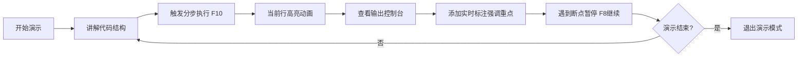

## 1. 产品概述

CodeStage 是一款面向技术布道师和培训讲师的纯前端代码演示工作台，致力于解决技术大会、直播和内部培训中代码演示体验不佳的问题。通过集成专业级代码编辑器、分步执行引擎、实时标注系统和多标签同步能力，让演示过程流畅连贯、节奏可控、视觉突出。

- 目标用户：技术布道师、培训讲师、技术博主、会议演讲者
- 核心价值：消除PPT与IDE切换的割裂感，提供沉浸式、可交互的代码演示体验
- 产品定位：专业级纯前端代码演示工作台，无需后端部署，开箱即用

## 2. 核心功能

### 2.1 用户角色

| 角色 | 使用场景 | 核心诉求 |
|------|----------|----------|
| 演示者 | 技术大会、直播、内部培训 | 流畅演示、节奏把控、视觉效果、快速操作 |
| 观众 | 观看演示、跟随学习 | 代码清晰、同步及时、重点突出 |

### 2.2 功能模块

1. **主工作台**：全局布局、主题切换、演示模式、状态栏
2. **代码编辑器**：Monaco Editor封装、多语言高亮、代码折叠、查找替换
3. **分步执行引擎**：断点管理、逐行/逐段执行、实时高亮、执行进度
4. **代码片段管理**：分类存储、标签搜索、全文检索、导入导出
5. **实时标注系统**：自由绘制、文字注释、矩形框、箭头、序号标记
6. **多标签同步**：BroadcastChannel同源同步、编辑/观看模式
7. **输出控制台**：JS/TS执行引擎、console输出捕获、API模拟

### 2.3 功能详情

| 模块名称 | 子功能 | 功能描述 |
|----------|--------|----------|
| 代码编辑器 | 语法高亮 | 支持JS/TS/Python/Go/Java等主流语言语法高亮 |
| | 主题切换 | 深色/浅色/高对比度三种演示场景主题 |
| | 编辑功能 | 代码折叠、行号显示、查找替换(Ctrl+F) |
| | 文件管理 | 新建标签页、切换文件、关闭标签 |
| 分步执行 | 断点设置 | 双击行号添加/移除断点，支持多断点 |
| | 执行控制 | 开始/暂停/重置、逐行执行(F10)、跳转到下一断点(F8) |
| | 选中执行 | 选中代码区域后快捷键执行选中内容 |
| | 高亮效果 | 当前执行行高亮动画(GSAP)，延迟<50ms |
| 代码片段 | CRUD操作 | 新增、编辑、删除、复制片段 |
| | 分类管理 | 支持多级分类文件夹结构 |
| | 搜索 | 标签搜索、标题搜索、全文检索 |
| | 导入导出 | 从JSON文件导入、导出为JSON、导入文件大小<10MB |
| | 持久化 | localStorage存储，支持≥500个条目 |
| 实时标注 | 绘制工具 | 自由画笔、矩形框、箭头、文字注释、序号标记 |
| | 颜色管理 | 6种预设颜色，自定义颜色选择器 |
| | 标注管理 | 撤销/重做、显示/隐藏、保存为预设、删除 |
| | 复用 | 标注预设库，一键应用常用标注组合 |
| 多标签同步 | 频道创建 | 创建/加入同步频道，输入频道名称 |
| | 模式切换 | 编辑者模式(可编辑+广播)、观看者模式(只读) |
| | 同步内容 | 代码内容、光标位置、当前行、断点、主题 |
| | 延迟要求 | 标签页间同步延迟<100ms |
| 演示模式 | 全屏展示 | 全屏代码展示，F11快捷键切换 |
| | 字体缩放 | Ctrl+/Ctrl-调整字体，支持自适应放大 |
| | UI精简 | 隐藏侧边栏、状态栏等非核心UI |
| | 快捷键 | 键盘快捷键翻页、执行下一步、切换主题 |
| 执行环境 | 代码执行 | 内置JS/TS沙箱执行引擎 |
| | 输出捕获 | 拦截console.log/warn/error/info输出 |
| | API模拟 | 模拟fetch/axios调用返回预设数据 |
| | 错误处理 | 捕获异常并友好展示错误栈 |

## 3. 核心流程

### 3.1 演示准备流程

### 3.2 现场演示流程

### 3.3 多人同步流程

## 4. 用户界面设计

### 4.1 设计风格

**整体基调：专业深色科技风**
- 主色：深蓝紫色系 `#6366F1` (Indigo-500) — 代表技术与专业
- 辅助色：青绿 `#10B981` (成功/输出)、橙红 `#F59E0B` (警告/断点)、洋红 `#EC4899` (标注重点)
- 背景色：深色 `#0F172A` (Slate-900)、次深色 `#1E293B` (Slate-800)
- 文字色：主文本 `#F8FAFC` (Slate-50)、次文本 `#94A3B8` (Slate-400)
- 字体：展示字体 `JetBrains Mono` + `Space Grotesk` 组合（代码等宽+UI现代感）

**设计细节：**
- 按钮：微圆角(6px)、深色渐变边框、hover时发光效果
- 卡片：玻璃拟态半透明、细边框、柔和阴影
- 图标：Lucide线条图标，统一尺寸16/18px
- 分隔：细线条 `#334155`，不使用生硬分割

### 4.2 页面布局

| 区域 | 模块 | UI元素与交互 |
|------|------|-------------|
| 左侧边栏(240px) | 片段面板 | 分类树、搜索框、片段卡片列表、拖拽排序 |
| | 标注预设 | 预设缩略图网格、点击应用、管理按钮 |
| 中间主区域(70%) | 标签页栏 | 文件标签、关闭按钮、拖拽切换、新增按钮 |
| | 代码编辑器 | 行号栏、编辑区、 minimap、断点标记、行高亮 |
| | 标注层 | Canvas覆盖层、工具栏悬浮、绘制元素 |
| 右侧面板(30%可折叠) | 输出控制台 | 日志列表、级别过滤、清空按钮、自动滚动 |
| | 分步控制器 | 执行进度条、播放/暂停/下一步/重置、速度控制 |
| 底部状态栏 | 状态信息 | 行:列、语言模式、编码、主题名称、同步状态 |
| | 快捷操作 | 演示模式切换、全屏、字体缩放、主题切换 |
| 顶部工具栏 | 全局操作 | Logo、文件操作、片段导入导出、同步频道 |

**动画效果（GSAP）：**
- 侧边栏展开/收起：`width: 240px → 0` + `opacity`，ease: `power2.inOut`，duration: 0.3s
- 右侧面板折叠：`flex: 0 0 30% → 0 0 0`，同步调整编辑器宽度
- 代码行高亮：`backgroundColor` 渐变 + 轻微 `scaleY`，duration: 0.25s
- 标注绘制完成：`strokeDashoffset` 动画模拟绘制过程
- 进入演示模式：全屏过渡 + 非核心UI `opacity: 0` 淡出

### 4.3 响应式断点

| 断点 | 适用设备 | 适配策略 |
|------|----------|----------|
| ≥1920×1080 | 投影仪/大屏显示器 | 标准布局，侧边栏280px，字体基准15px |
| 1366×768 ~ 1919×1079 | 笔记本电脑 | 侧边栏200px，字体基准14px，减少边距 |
| <1366×768 | 小型设备 | 侧边栏可折叠默认收起，控制台底部放置 |

## 5. 性能与质量指标

| 指标项 | 目标值 | 测量方式 |
|--------|--------|----------|
| 编辑器加载2000行 | ≤800ms | 从挂载到首次渲染完成 |
| 分步行高亮延迟 | ≤50ms | 触发事件到视觉变化 |
| 片段存储能力 | ≥500条 | localStorage容量测试 |
| 多标签同步延迟 | ≤100ms | BroadcastChannel广播到接收 |
| 演示模式GPU占用 | ≤15% | Chrome DevTools Performance |
| 首屏加载时间 | ≤2s | LCP指标 |
| 组件单文件行数 | ≤300行 | Vue SFC代码行数 |
